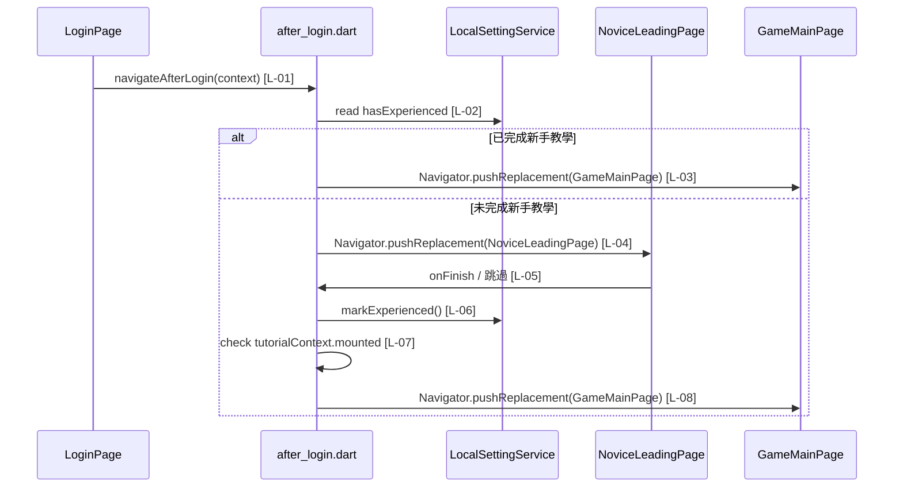

# after_login.dart 邏輯追蹤表

## 檔案簡介

`after_login.dart` 集中處理登入、註冊或第三方登入成功後的下一步導航。它負責讀取本地新手教學狀態，決定要直接進入 `GameMainPage`，或先顯示 `NoviceLeadingPage`。它不負責驗證帳號、建立使用者資料或載入使用者收藏，這些仍由登入/註冊流程原本的 controller 處理。通常由 `login_page.dart`、`register_page.dart` 等認證成功的 UI 入口呼叫。

## 檔案類型判斷

主要類型：導航流程工具檔案 / Action Helper。

次要類型：本地設定讀寫協調檔案，因為它會讀取並更新 `LocalSettingService.noviceTeaching`。

## 使用方式或呼叫方式

在登入、註冊或 Google 登入成功，且必要的使用者資料載入完成後呼叫：

```dart
navigateAfterLogin(context);
```

| 參數名稱 | 型別 | 必填 | 作用 | 注意事項 |
|---|---|---|---|---|
| context | BuildContext | 是 | 提供 Navigator 導航所需的頁面上下文 | 呼叫時頁面必須仍 mounted；若教學頁完成後會使用教學頁自己的 context 繼續導航 |

此函式不回傳結果。完成過新手教學時會直接以 `Navigator.pushReplacement` 進入 `GameMainPage`；未完成時會先以 `Navigator.pushReplacement` 進入 `NoviceLeadingPage`，並在結束或跳過後標記本地狀態再進入 `GameMainPage`。

## 邏輯對照表

<table>
  <thead>
    <tr>
      <th>ID</th>
      <th>目的標籤</th>
      <th>邏輯描述</th>
      <th>函數為單位</th>
    </tr>
  </thead>
  <tbody>
    <tr>
      <td>[L-01]</td>
      <td>[導航入口]</td>
      <td>宣告公開函式 <code>navigateAfterLogin</code>，接收 <code>context</code> [來自呼叫端 BuildContext]，作為登入後統一導頁入口。</td>
      <td rowspan="4">【功能函數】(Action Performer)<br>Purpose: 導航/本地狀態判斷。<br>Action: 讀取本地新手教學狀態；若已完成則直接替換到主遊戲頁；若未完成則替換到新手教學頁，並注入完成 callback。</td>
    </tr>
    <tr>
      <td>[L-02]</td>
      <td>[本地狀態判斷]</td>
      <td>讀取 <code>LocalSettingService.noviceTeaching.hasExperienced</code> [來自 Hive 本地設定服務]，判斷此裝置是否已完成新手教學。</td>
    </tr>
    <tr>
      <td>[L-03]</td>
      <td>[直接進入主頁]</td>
      <td>當 <code>hasExperienced</code> [來自 Hive 本地設定服務] 為 true 時，使用 <code>Navigator.pushReplacement</code> [來自 Flutter Navigator] 將目前頁替換為 <code>GameMainPage</code>。</td>
    </tr>
    <tr>
      <td>[L-04]</td>
      <td>[顯示新手教學]</td>
      <td>當 <code>hasExperienced</code> [來自 Hive 本地設定服務] 為 false 時，使用 <code>Navigator.pushReplacement</code> [來自 Flutter Navigator] 推入 <code>NoviceLeadingPage</code>，並將 <code>tutorialContext</code> [來自 MaterialPageRoute builder] 傳給完成 callback。</td>
    </tr>
    <tr>
      <td>[L-05]</td>
      <td>[完成流程入口]</td>
      <td>宣告私有非同步函式 <code>_finishNoviceTeaching</code>，接收 <code>tutorialContext</code> [來自 NoviceLeadingPage route builder]，供教學結束或跳過時呼叫。</td>
      <td rowspan="4">【功能函數】(Action Performer)<br>Purpose: 狀態更新/導航/生命週期檢查。<br>Action: 等待本地設定寫入完成；確認教學頁 context 仍有效；最後替換到主遊戲頁。</td>
    </tr>
    <tr>
      <td>[L-06]</td>
      <td>[本地狀態寫入]</td>
      <td>等待 <code>LocalSettingService.noviceTeaching.markExperienced()</code> [來自 Hive 本地設定服務] 完成，將「已經歷新手教學」寫入本地儲存。</td>
    </tr>
    <tr>
      <td>[L-07]</td>
      <td>[生命週期檢查]</td>
      <td>檢查 <code>tutorialContext.mounted</code> [來自 BuildContext]，若教學頁已被移除則提前 return，避免使用失效 context 導航。</td>
    </tr>
    <tr>
      <td>[L-08]</td>
      <td>[完成後進入主頁]</td>
      <td>在本地狀態寫入完成且 <code>tutorialContext</code> [來自 BuildContext] 仍有效時，以 <code>Navigator.pushReplacement</code> 進入 <code>GameMainPage</code>。</td>
    </tr>
  </tbody>
</table>

## 場景時序圖



## 測資建議表

| ID | 測試狀態或極端值 | 預期結果 |
|---|---|---|
| [L-01] | 從 `LoginPage` 與 `RegisterPage` 各呼叫一次 | 兩個入口都走同一個登入後導航流程 |
| [L-02] | Hive 中 `has_experienced_novice_teaching = true` | 不顯示新手教學 |
| [L-03] | 已完成教學且登入成功 | 直接 `pushReplacement` 到 `GameMainPage` |
| [L-04] | Hive 中 `has_experienced_novice_teaching = false` | 先 `pushReplacement` 到 `NoviceLeadingPage` |
| [L-05] | 在教學最後一頁按「結束教學」或非最後頁按「跳過」 | 兩者都觸發同一個完成流程 |
| [L-06] | 模擬 Hive 寫入延遲 | 導航到主頁前會等待本地狀態寫入完成 |
| [L-07] | 教學頁完成前被外部移除 | 不使用失效 context 導航，不拋出 context 相關例外 |
| [L-08] | 教學完成且 context 仍 mounted | 進入 `GameMainPage` |
