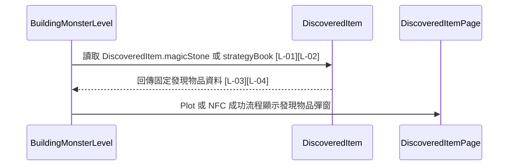

# discovered_item.dart 邏輯追蹤表

## 目前版本邏輯對照表

<table>
  <thead>
    <tr>
      <th>ID</th>
      <th>目的標籤</th>
      <th>邏輯描述</th>
      <th>函數為單位</th>
    </tr>
  </thead>
  <tbody>
    <tr>
      <td>[L-01]</td>
      <td>目的[預設資料]</td>
      <td>宣告 <code>strategyBook</code>[來自 DiscoveredItem 靜態常數]，集中保存攻略秘集發現彈窗所需的標題、疊字、圖片、按鈕文字與 fallback 圖示。</td>
      <td rowspan="2">【回傳函數】(Data Transformer) Input: 無。 Process: 以靜態常數描述固定會出現的發現物品，讓呼叫端不用重複填寫文字與資產路徑。 Output: <code>DiscoveredItem</code> 靜態常數，供 Plot 或 NFC 成功流程顯示共用彈窗。</td>
    </tr>
    <tr>
      <td>[L-02]</td>
      <td>目的[預設資料]</td>
      <td>宣告 <code>magicStone</code>[來自 DiscoveredItem 靜態常數]，集中保存魔法石發現彈窗所需的標題、描述、空圖片路徑、按鈕文字與鑽石 fallback 圖示。</td>
    </tr>
    <tr>
      <td>[L-03]</td>
      <td>目的[資料模型]</td>
      <td>宣告 <code>title</code>、<code>noteText</code>、<code>imagePath</code>、<code>buttonText</code>、<code>fallbackIcon</code>[皆來自建構子輸入並保存為 final 欄位]，作為發現物品彈窗的顯示資料。</td>
      <td rowspan="2">【回傳函數】(Data Transformer) Input: <code>title: String</code> 顯示彈窗標題；<code>noteText: String</code> 顯示圖片上方疊字；<code>imagePath: String</code> 顯示物品圖片；<code>buttonText: String</code> 顯示繼續按鈕文字；<code>fallbackIcon: IconData</code> 作為缺圖或無圖時的替代圖示。 Process: 將呼叫端傳入值保存成不可變欄位。 Output: <code>DiscoveredItem</code>，供 <code>DiscoveredItemPage</code> 渲染共用發現物品彈窗。</td>
    </tr>
    <tr>
      <td>[L-04]</td>
      <td>目的[物件建構]</td>
      <td>透過 const 建構子建立發現物品資料，要求呼叫端提供所有顯示欄位，避免頁面端推測內容。</td>
    </tr>
  </tbody>
</table>

## 場景時序圖

## 測資建議表

| ID | 測試時應輸入的極端值或狀態 |
| --- | --- |
| [L-01] | 使用 <code>DiscoveredItem.strategyBook</code>，確認圖片路徑為書本資產且按鈕文字正確。 |
| [L-02] | 使用 <code>DiscoveredItem.magicStone</code>，確認圖片路徑為空時會走 fallback 圖示。 |
| [L-03] | 傳入超長 <code>title</code>、空白 <code>noteText</code>、不存在的 <code>imagePath</code>，確認模型能保存原值並交由頁面處理。 |
| [L-04] | 使用自訂 <code>DiscoveredItem</code>，確認所有 required 欄位都必須提供。 |
