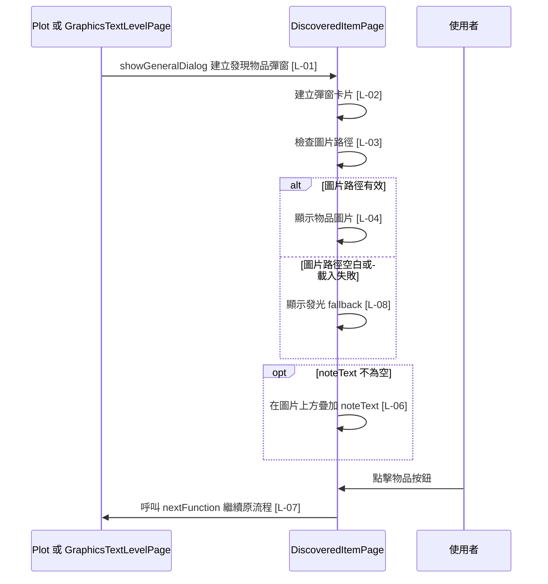

# discovered_item_page.dart 邏輯追蹤表

## 目前版本邏輯對照表

<table>
  <thead>
    <tr>
      <th>ID</th>
      <th>目的標籤</th>
      <th>邏輯描述</th>
      <th>函數為單位</th>
    </tr>
  </thead>
  <tbody>
    <tr>
      <td>[L-01]</td>
      <td>目的[Overlay UI 建構]</td>
      <td>回傳可放入 <code>showGeneralDialog</code>[Flutter Dialog API] 的發現物品內容，使用 <code>item</code>[來自建構子] 與 <code>nextFunction</code>[來自建構子 callback] 建立含 Material 環境、置中且可捲動的彈窗；結構見 <a href="#build-widget-tree">Build Widget 結構圖</a>。</td>
      <td>【Build 函數 / Widget 返回函數】(UI Tree) Input: <code>context: BuildContext</code>，提供 Widget 建構環境。 Process: 建立透明 Material、安全區、置中容器與捲動容器，讓彈窗可疊在 Plot 或掃描關卡上。 回傳 Widget: 見 <a href="#build-widget-tree">Build Widget 結構圖</a>。</td>
    </tr>
    <tr>
      <td>[L-02]</td>
      <td>目的[視窗內容]</td>
      <td>建立彈窗卡片，顯示 <code>item.title</code>[來自建構子 item]、物品圖片區與繼續按鈕；結構見 <a href="#dialog-card-widget-tree">Dialog Card Widget 結構圖</a>。</td>
      <td>【Build 函數 / Widget 返回函數】(UI Tree) Input: 無顯式參數，讀取 <code>item</code>[來自建構子]。 Process: 將標題、帶疊字圖片與按鈕組合成單一彈窗卡片。 回傳 Widget: 見 <a href="#dialog-card-widget-tree">Dialog Card Widget 結構圖</a>。</td>
    </tr>
    <tr>
      <td>[L-03]</td>
      <td>目的[邊界檢查]</td>
      <td>檢查 <code>imagePath</code>[區域變數，來自 <code>item.imagePath.trim()</code>] 是否為空字串；若為空則以 fallback 作為圖片內容。</td>
      <td rowspan="2">【Build 函數 / Widget 返回函數】(UI Tree) Input: 無顯式參數，讀取 <code>item.imagePath</code>[來自建構子 item]。 Process: 清理圖片路徑；空路徑時使用 fallback；有效路徑時建立 asset 圖片，載入失敗也使用 fallback。 回傳 Widget: 見 <a href="#item-image-widget-tree">Item Image Widget 結構圖</a>。</td>
    </tr>
    <tr>
      <td>[L-04]</td>
      <td>目的[圖片載入]</td>
      <td>使用 <code>imagePath</code>[區域變數] 建立物品資產圖片，並在 <code>errorBuilder</code>[Image.asset callback] 中呼叫 <code>_buildImageFallback()</code>[本類別方法] 處理載入失敗。</td>
    </tr>
    <tr>
      <td>[L-05]</td>
      <td>目的[疊層呈現]</td>
      <td>建立物品圖片框，將 <code>child</code>[參數] 作為底層圖片或 fallback，並保留疊加提示文字的位置。</td>
      <td rowspan="2">【Build 函數 / Widget 返回函數】(UI Tree) Input: <code>child: Widget</code>，代表圖片或 fallback 內容。 Process: 以 Stack 疊合圖片內容，並在 <code>item.noteText</code>[來自建構子 item] 不為空時加上上方提示文字。 回傳 Widget: 見 <a href="#item-image-frame-widget-tree">Item Image Frame Widget 結構圖</a>。</td>
    </tr>
    <tr>
      <td>[L-06]</td>
      <td>目的[條件提示]</td>
      <td>當 <code>item.noteText.trim().isNotEmpty</code>[來自建構子 item] 為 true 時，在圖片上方疊加提示文字；空字串時不顯示疊字區。</td>
    </tr>
    <tr>
      <td>[L-07]</td>
      <td>目的[流程推進]</td>
      <td>建立按鈕，顯示 <code>item.buttonText</code>[來自建構子 item]；使用者點擊時呼叫 <code>nextFunction</code>[來自建構子 callback]，讓外層 dialog 關閉並繼續任務。</td>
      <td>【Build 函數 / Widget 返回函數】(UI Tree) Input: 無顯式參數，讀取 <code>item.buttonText</code>[來自建構子 item] 與 <code>nextFunction</code>[來自建構子 callback]。 Process: 將按鈕文字與任務推進 callback 綁定到主要操作按鈕。 回傳 Widget: 見 <a href="#continue-button-widget-tree">Continue Button Widget 結構圖</a>。</td>
    </tr>
    <tr>
      <td>[L-08]</td>
      <td>目的[異常替代 UI]</td>
      <td>建立圖片缺失或載入失敗時的替代 UI，使用 <code>item.fallbackIcon</code>[來自建構子 item] 顯示發光圖示，讓魔法石這類無圖片物品也能視覺化。</td>
      <td>【Build 函數 / Widget 返回函數】(UI Tree) Input: 無。 Process: 建立圖片 fallback 容器與發光圖示，讓缺圖狀態仍可穩定渲染。 回傳 Widget: 見 <a href="#image-fallback-widget-tree">Image Fallback Widget 結構圖</a>。</td>
    </tr>
  </tbody>
</table>

## Widget 視覺化結構圖

### Build Widget 結構圖

Material // [L-01]  
└── SafeArea  
&nbsp;&nbsp;&nbsp;&nbsp;└── Center  
&nbsp;&nbsp;&nbsp;&nbsp;&nbsp;&nbsp;&nbsp;&nbsp;└── SingleChildScrollView (捲動頁面)  
&nbsp;&nbsp;&nbsp;&nbsp;&nbsp;&nbsp;&nbsp;&nbsp;&nbsp;&nbsp;&nbsp;&nbsp;└── Dialog Card (視窗卡片) // [L-02]

### Dialog Card Widget 結構圖

Container // [L-02]  
└── Column (垂直容器)  
&nbsp;&nbsp;&nbsp;&nbsp;├── Text (標題文字)  
&nbsp;&nbsp;&nbsp;&nbsp;├── Item Image (物品圖片) // [L-03][L-04]  
&nbsp;&nbsp;&nbsp;&nbsp;└── Continue Button (繼續按鈕) // [L-07]

### Item Image Widget 結構圖

{ IF: imagePath.isEmpty } // [L-03]  
└── Item Image Frame (圖片疊字框) // [L-05]  
&nbsp;&nbsp;&nbsp;&nbsp;└── Image Fallback (缺圖替代) // [L-08]  
{ ELSE }  
└── Item Image Frame (圖片疊字框) // [L-05]  
&nbsp;&nbsp;&nbsp;&nbsp;└── Image.asset (資產圖片) // [L-04]

### Item Image Frame Widget 結構圖

Container // [L-05]  
└── Stack (堆疊容器)  
&nbsp;&nbsp;&nbsp;&nbsp;├── child (圖片內容)  
&nbsp;&nbsp;&nbsp;&nbsp;└── { IF: item.noteText 不為空 } // [L-06]  
&nbsp;&nbsp;&nbsp;&nbsp;&nbsp;&nbsp;&nbsp;&nbsp;└── Align (上方對齊容器)  
&nbsp;&nbsp;&nbsp;&nbsp;&nbsp;&nbsp;&nbsp;&nbsp;&nbsp;&nbsp;&nbsp;&nbsp;└── Text (提示文字)

### Continue Button Widget 結構圖

SizedBox // [L-07]  
└── FilledButton (主要操作按鈕)  
&nbsp;&nbsp;&nbsp;&nbsp;└── Text (按鈕文字)

### Image Fallback Widget 結構圖

Container // [L-08]  
└── Center  
&nbsp;&nbsp;&nbsp;&nbsp;└── Icon (發光缺圖圖示)

## 場景時序圖

## 測資建議表

| ID | 測試時應輸入的極端值或狀態 |
| --- | --- |
| [L-01] | 使用極小螢幕高度渲染 dialog，確認內容可捲動、FilledButton 不缺 Material ancestor，且不 overflow。 |
| [L-02] | 傳入很長的 <code>item.title</code>，確認標題仍在視窗卡片內換行。 |
| [L-03] | 傳入空字串或只有空白的 <code>item.imagePath</code>，確認仍顯示帶疊字的 fallback。 |
| [L-04] | 傳入不存在的 asset 路徑，確認 <code>errorBuilder</code> 會顯示 fallback。 |
| [L-05] | 傳入超高圖片或 fallback，確認內容仍被圖片框管理。 |
| [L-06] | 傳入空白 <code>item.noteText</code>，確認不渲染上方疊字區。 |
| [L-07] | 點擊按鈕，確認外層 callback 被呼叫並能讓任務繼續。 |
| [L-08] | 使用魔法石資料，確認空圖片路徑會顯示發光鑽石圖示。 |
