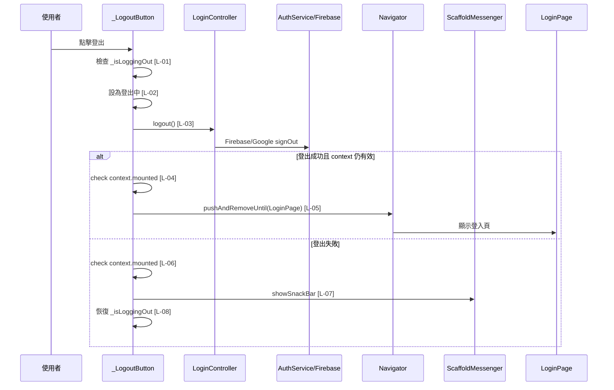

# drawer_button_group.dart 邏輯追蹤表

## Task 0: 檔案用途與使用方式

### 0-1. 檔案簡介

`drawer_button_group.dart` 負責組合遊戲主畫面側邊抽屜中的使用者資訊、功能入口與登出按鈕。它會讀取 GetX 中的 `UserController` 顯示目前使用者暱稱與頭像，並提供新手教學、校園全景地圖、問題回報與登出流程。它不負責登入表單、Firebase 認證細節、地圖頁內容或新手教學頁內容，這些由對應頁面與 controller 處理。通常由包含 Drawer 或 HUD 抽屜區塊的父層 Widget 直接放入抽屜內容區。

### 0-2. 檔案類型判斷

主要類型：B. 可重用 Widget 檔案 Reusable Widget / Component

次要類型：導航流程協調元件，因為內部按鈕會使用 `Navigator` 前往其他頁面或登出後回到 `LoginPage`。

### 使用方式或呼叫方式

此 Widget 適合放在 `Drawer`、側邊選單或遊戲 HUD 的抽屜內容中。公開入口為 `DrawerButtonGroup`，父層不需要傳入參數；若要顯示使用者資料，需確保 `UserController` 已透過 GetX 註冊。登出按鈕會自行管理 `_isLoggingOut` 狀態，避免使用者連續點擊造成重複登出或重複導航。

```dart
Drawer(
  child: DrawerButtonGroup(),
);
```

| 參數名稱 | 型別 | 必填 | 作用 | 注意事項 |
|---|---|---|---|---|
| 無 | 無 | 否 | `DrawerButtonGroup` 不需要外部參數 | 使用者資料依賴 GetX 中的 `UserController` |

## 邏輯對照表

| ID | 目的標籤 | 邏輯描述 |
|---|---|---|
| [L-01] | 目的[連點防護] | 檢查 `_isLoggingOut` [來自 `_LogoutButtonState` 私有狀態]，若已在登出流程中則直接 return，避免重複呼叫登出與導航。 |
| [L-02] | 目的[狀態更新] | 使用 `setState` [來自 `State<_LogoutButton>`] 將 `_isLoggingOut` [來自 `_LogoutButtonState` 私有狀態] 設為 true，讓 UI 進入登出中且停用按鈕。 |
| [L-03] | 目的[登出認證] | 等待 `LoginController().logout()` [來自登入流程 controller] 完成 Firebase/Google 登出與 `UserController.userModel` 清空。 |
| [L-04] | 目的[生命週期檢查] | 檢查 `context.mounted` [來自函數參數 `BuildContext`]，若 Widget 已卸載則停止後續導航，避免使用失效 context。 |
| [L-05] | 目的[登出後導航] | 將 `didNavigate` [區域變數] 設為 true，並使用 `Navigator.pushAndRemoveUntil` [來自 Flutter Navigator] 導向 `LoginPage`，同時清空既有 route stack。 |
| [L-06] | 目的[錯誤後生命週期檢查] | 在 catch 區塊內再次檢查 `context.mounted` [來自函數參數 `BuildContext`]，避免登出失敗後對已卸載畫面顯示 SnackBar。 |
| [L-07] | 目的[錯誤回饋] | 取得 `ScaffoldMessenger` [來自目前 `BuildContext`]，清除既有 SnackBar 後顯示「登出失敗，請稍後再試」。 |
| [L-08] | 目的[狀態復原] | 在 finally 區塊檢查 `mounted` [來自 `State` 生命週期] 與 `didNavigate` [區域變數]，只有未成功導航且元件仍存在時才將 `_isLoggingOut` 復原為 false。 |
| [L-09] | 目的[登出按鈕建構] | 在 `build` 中回傳 `ElevatedButton.icon`，作為抽屜底部的登出操作入口。 |
| [L-10] | 目的[按鈕可用狀態] | 根據 `_isLoggingOut` [來自 `_LogoutButtonState` 私有狀態] 決定 `onPressed` [來自 ElevatedButton 參數] 為 null 或呼叫 `_logout(context)`，登出中停用按鈕。 |
| [L-11] | 目的[按鈕文字] | 建立登出按鈕的 `Text` label，讓使用者辨識此按鈕會執行登出。 |

## 函數為單位對照表

| 函數名稱 | 目的標籤 | 包含範圍 | 函數功能介紹 |
|---|---|---|---|
| `_logout` | 目的[登出/導航/錯誤處理] | [L-01] ~ [L-08] | 【功能函數】(Action Performer)<br>Purpose: 登出、連點防護、導航與錯誤回饋。<br>Action: 先檢查登出中狀態；進入登出中後等待 `LoginController.logout()`；確認 context 仍有效後清空 route stack 並回到 `LoginPage`；若發生例外則顯示 SnackBar；最後在未導航時恢復按鈕狀態。 |
| `build` | 目的[UI 建構] | [L-09] ~ [L-11] | 【Build 函數 / Widget 返回函數】(UI Tree)<br>Input: `context: BuildContext`，用於觸發 `_logout(context)`。<br>Process: 根據 `_isLoggingOut` 判斷按鈕是否可點擊；登出中時停用按鈕，非登出中時綁定登出流程。 |

## 視覺化結構圖

[DrawerButtonGroup]  
└── [SafeArea (安全區域)]  
&nbsp;&nbsp;&nbsp;&nbsp;└── [Column (垂直容器)]  
&nbsp;&nbsp;&nbsp;&nbsp;&nbsp;&nbsp;&nbsp;&nbsp;├── [_DrawerUserHeader (使用者資訊)]  
&nbsp;&nbsp;&nbsp;&nbsp;&nbsp;&nbsp;&nbsp;&nbsp;├── [Expanded (填滿剩餘空間)]  
&nbsp;&nbsp;&nbsp;&nbsp;&nbsp;&nbsp;&nbsp;&nbsp;│   └── [SingleChildScrollView (捲動頁面)]  
&nbsp;&nbsp;&nbsp;&nbsp;&nbsp;&nbsp;&nbsp;&nbsp;│       └── [Column (垂直容器)]  
&nbsp;&nbsp;&nbsp;&nbsp;&nbsp;&nbsp;&nbsp;&nbsp;│           ├── [_TutorialButton (新手教學入口)]  
&nbsp;&nbsp;&nbsp;&nbsp;&nbsp;&nbsp;&nbsp;&nbsp;│           ├── [_PanoramaMapButton (校園全景地圖入口)]  
&nbsp;&nbsp;&nbsp;&nbsp;&nbsp;&nbsp;&nbsp;&nbsp;│           └── [_IssueReportButton (問題回報入口)]  
&nbsp;&nbsp;&nbsp;&nbsp;&nbsp;&nbsp;&nbsp;&nbsp;└── [_LogoutButton (登出按鈕)] // [L-09]  
&nbsp;&nbsp;&nbsp;&nbsp;&nbsp;&nbsp;&nbsp;&nbsp;&nbsp;&nbsp;&nbsp;&nbsp;├── { IF: _isLoggingOut } // [L-10]  
&nbsp;&nbsp;&nbsp;&nbsp;&nbsp;&nbsp;&nbsp;&nbsp;&nbsp;&nbsp;&nbsp;&nbsp;│   └── [Disabled Button (停用按鈕)]  
&nbsp;&nbsp;&nbsp;&nbsp;&nbsp;&nbsp;&nbsp;&nbsp;&nbsp;&nbsp;&nbsp;&nbsp;└── { ELSE } // [L-10]  
&nbsp;&nbsp;&nbsp;&nbsp;&nbsp;&nbsp;&nbsp;&nbsp;&nbsp;&nbsp;&nbsp;&nbsp;&nbsp;&nbsp;&nbsp;&nbsp;└── [Logout Action (登出流程)] // [L-01] ~ [L-08]

## 場景時序圖



## 測資建議表

| ID | 測試狀態或極端值 | 預期結果 |
|---|---|---|
| [L-01] | 在登出 API 尚未完成時快速連點登出按鈕 | 第二次點擊不會再次呼叫 logout，也不會重複導航 |
| [L-02] | 第一次點擊登出按鈕 | `_isLoggingOut` 變為 true，按鈕進入停用狀態 |
| [L-03] | Firebase 使用 email/password 或 Google 登入後按登出 | 等待認證服務登出完成，使用者資料被清空 |
| [L-04] | 登出等待期間抽屜來源頁被移除 | 不執行 Navigator，不拋出 context 已失效錯誤 |
| [L-05] | 登出成功且目前 route stack 有多個登入後頁面 | 導向 `LoginPage`，返回鍵不會回到登入後頁面 |
| [L-06] | 登出失敗且畫面已卸載 | 不顯示 SnackBar，也不使用失效 context |
| [L-07] | 模擬 `LoginController.logout()` 拋出例外 | 顯示「登出失敗，請稍後再試」SnackBar |
| [L-08] | 登出失敗但畫面仍存在 | `_isLoggingOut` 回復 false，使用者可以再次嘗試登出 |
| [L-09] | 打開 Drawer | 底部顯示登出按鈕 |
| [L-10] | `_isLoggingOut = true` 與 false 各測一次 | true 時按鈕不可點；false 時可觸發 `_logout(context)` |
| [L-11] | 檢查本地化文字 | 按鈕顯示「登出」 |
