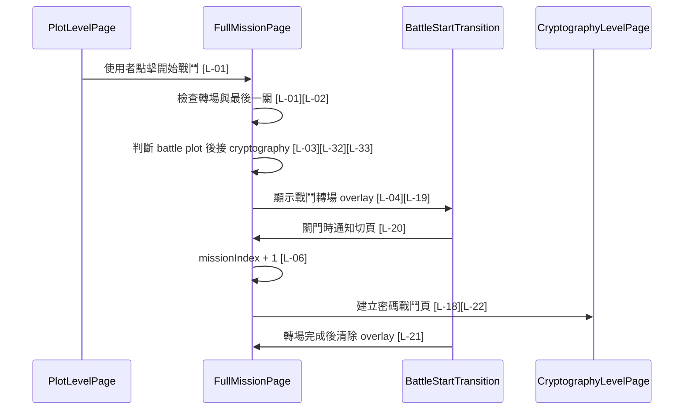
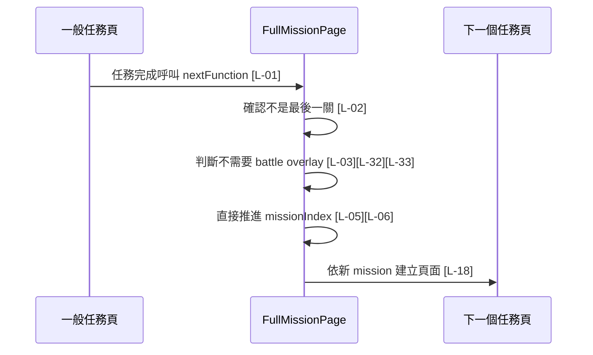
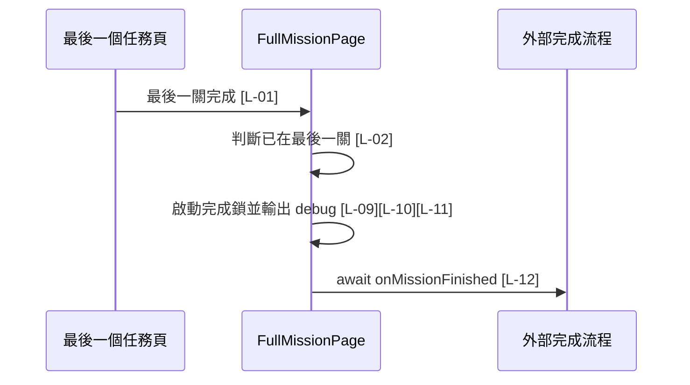

# full_mission_page.dart 邏輯追蹤表

> 本文件依據 `Documentation_Guidelines.md` 新版格式撰寫，對應 `full_mission_page.dart` 中既有的 `[L-01]` ~ `[L-35]` 原地標記。

## 目前版本邏輯對照表

<table>
  <thead>
    <tr>
      <th>ID</th>
      <th>目的標籤</th>
      <th>邏輯描述</th>
      <th>函數為單位</th>
    </tr>
  </thead>
  <tbody>
    <tr>
      <td>[L-01]</td>
      <td>目的[重入防護]</td>
      <td>檢查 <code>_isTransitioning</code>[State 欄位]；若戰鬥轉場正在執行，直接返回以避免任務重複前進。</td>
      <td rowspan="5">【功能函數】(Action Performer) Purpose: [任務推進/轉場決策/重入防護] Action: 檢查轉場鎖；判斷目前是否最後一關；若不是最後一關，判斷是否需要播放 battle plot 到 cryptography 的轉場；需要時開啟 overlay 並鎖住流程；不需要時直接推進 mission index。</td>
    </tr>
    <tr>
      <td>[L-02]</td>
      <td>目的[邊界檢查]</td>
      <td>使用 <code>_missionIndex</code>[State 欄位] 與 <code>widget.missions.length</code>[來自建構子 missions] 判斷是否已在最後一關，避免讀取不存在的下一關。</td>
    </tr>
    <tr>
      <td>[L-03]</td>
      <td>目的[轉場決策]</td>
      <td>將 <code>widget.missions[_missionIndex]</code>[來自建構子 missions 與 State 欄位] 傳入 <code>_shouldPlayBattleTransition</code>[State 方法]，判斷是否播放戰鬥開始動畫。</td>
    </tr>
    <tr>
      <td>[L-04]</td>
      <td>目的[狀態更新]</td>
      <td>透過 setState 將 <code>_showBattleTransition</code>[State 欄位] 與 <code>_isTransitioning</code>[State 欄位] 設為 true，顯示 overlay 並鎖住流程。</td>
    </tr>
    <tr>
      <td>[L-05]</td>
      <td>目的[任務推進]</td>
      <td>若不需要戰鬥轉場，呼叫 <code>_advanceMission()</code>[State 方法] 進入下一個任務。</td>
    </tr>
    <tr>
      <td>[L-06]</td>
      <td>目的[狀態更新]</td>
      <td>透過 setState 將 <code>_missionIndex</code>[State 欄位] 加 1，讓底層任務頁切換成下一個 mission。</td>
      <td>【功能函數】(Action Performer) Purpose: [狀態更新] Action: 更新 mission index；觸發 build 重新依照新 index 建立目前任務頁；同時支援一般直接切頁與 overlay 閉合後切頁。</td>
    </tr>
    <tr>
      <td>[L-07]</td>
      <td>目的[失敗回呼]</td>
      <td>呼叫 <code>widget.onMissionFailed</code>[來自建構子 callback]，讓外部同步任務失敗狀態。</td>
      <td rowspan="2">【功能函數】(Action Performer) Purpose: [失敗處理/導航] Action: 先通知外部任務失敗；再使用 Navigator 將目前任務頁替換為 CatchingFaildPage，避免返回到失敗前流程。</td>
    </tr>
    <tr>
      <td>[L-08]</td>
      <td>目的[導航]</td>
      <td>使用 <code>Navigator.pushReplacement</code>[Flutter 導航 API] 與 <code>context</code>[State BuildContext] 將頁面替換為 CatchingFaildPage。</td>
    </tr>
    <tr>
      <td>[L-09]</td>
      <td>目的[重入防護]</td>
      <td>檢查 <code>_isFinishing</code>[State 欄位]；若已進入完成流程則直接返回，避免重複捕捉或重複 pop。</td>
      <td rowspan="4">【功能函數】(Action Performer) Purpose: [完成結算/重入防護/非同步回呼] Action: 檢查完成鎖；設定完成狀態；輸出捕捉成功 debug 訊息；等待外部 onMissionFinished callback 完成，讓捕捉資料更新、Navigator pop 與 SnackBar 能串接。</td>
    </tr>
    <tr>
      <td>[L-10]</td>
      <td>目的[狀態鎖定]</td>
      <td>將 <code>_isFinishing</code>[State 欄位] 設為 true，鎖住後續完成流程。</td>
    </tr>
    <tr>
      <td>[L-11]</td>
      <td>目的[除錯追蹤]</td>
      <td>使用 <code>widget.monsterModelCry.name</code>[來自建構子 monsterModelCry] 輸出成功捕捉訊息。</td>
    </tr>
    <tr>
      <td>[L-12]</td>
      <td>目的[非同步回呼]</td>
      <td>等待 <code>widget.onMissionFinished</code>[來自建構子 callback] 完成，讓外部流程可接續處理捕捉結果。</td>
    </tr>
    <tr>
      <td>[L-13]</td>
      <td>目的[空資料判斷]</td>
      <td>檢查 <code>widget.missions</code>[來自建構子 missions] 是否為空；若為空，走無關卡 fallback；結構見 <a href="#empty-missions-widget-tree">Empty Missions Widget Tree</a>。</td>
      <td rowspan="9">【Build 函數 / Widget 返回函數】(UI Tree) Input: <code>context: BuildContext</code>，提供 widget tree 建構環境。 Process: 如果 missions 為空，排程完成流程並回傳 <a href="#empty-missions-widget-tree">Empty Missions Widget Tree</a>；否則回傳 <a href="#active-mission-widget-tree">Active Mission Widget Tree</a>，底層任務頁依 mission index 建立，battle overlay 只在 _showBattleTransition 為 true 時出現。</td>
    </tr>
    <tr>
      <td>[L-14]</td>
      <td>目的[生命週期排程]</td>
      <td>使用 <code>WidgetsBinding.instance.addPostFrameCallback</code>[Flutter frame callback] 在本輪 build 後才執行完成流程，避免 build 期間產生副作用。</td>
    </tr>
    <tr>
      <td>[L-15]</td>
      <td>目的[生命週期防護]</td>
      <td>檢查 <code>mounted</code>[State 生命週期屬性]；頁面仍掛載才呼叫 finishFunction，避免卸載後操作 callback。</td>
    </tr>
    <tr>
      <td>[L-16]</td>
      <td>目的[Fallback UI]</td>
      <td>回傳禁用返回的無關卡頁面；結構見 <a href="#empty-missions-widget-tree">Empty Missions Widget Tree</a>。</td>
    </tr>
    <tr>
      <td>[L-17]</td>
      <td>目的[UI 建構]</td>
      <td>回傳主要任務容器，使用 PopScope 禁止任務流程中途返回；結構見 <a href="#active-mission-widget-tree">Active Mission Widget Tree</a>。</td>
    </tr>
    <tr>
      <td>[L-18]</td>
      <td>目的[底層頁面]</td>
      <td>以 <code>widget.missions[_missionIndex]</code>[來自建構子 missions 與 State 欄位] 建立目前任務頁，作為 overlay 下方的可切換內容。</td>
    </tr>
    <tr>
      <td>[L-19]</td>
      <td>目的[條件式 Overlay]</td>
      <td>只有 <code>_showBattleTransition</code>[State 欄位] 為 true 時顯示 BattleStartTransition，並傳入 <code>widget.monsterModelCry.imageUrl</code>[來自建構子 monsterModelCry]、<code>widget.monsterModelCry.type</code>[來自建構子 monsterModelCry] 與 <code>AssetPaths.squirrel</code>[靜態資源路徑]。</td>
    </tr>
    <tr>
      <td>[L-20]</td>
      <td>目的[閉合切頁]</td>
      <td>將 <code>_advanceMission</code>[State 方法] 傳給 <code>onClosed</code>[BattleStartTransition 建構子參數]，讓動畫完全關起來時才切換底層頁面。</td>
    </tr>
    <tr>
      <td>[L-21]</td>
      <td>目的[轉場收尾]</td>
      <td><code>onFinished</code>[BattleStartTransition 建構子參數] 中清除 <code>_showBattleTransition</code>[State 欄位] 與 <code>_isTransitioning</code>[State 欄位]，移除 overlay 並解鎖流程。</td>
    </tr>
    <tr>
      <td>[L-22]</td>
      <td>目的[關卡分流]</td>
      <td>若 <code>mission</code>[參數] 為 cryptography mission，回傳 CryptographyLevelPage；結構見 <a href="#mission-page-widget-tree">Mission Page Widget Tree</a>。</td>
      <td rowspan="5">【Build 函數 / Widget 返回函數】(UI Tree) Input: <code>mission: FullMission</code>，代表目前要顯示的一個關卡資料。 Process: 如果 mission 是 cryptography，回傳密碼戰鬥頁；如果是 graphicsText，回傳圖文任務頁；如果是 plot，回傳劇情頁；如果是 camara 或 trace，回傳禁用頁；否則回傳錯誤頁。Widget 結構見 <a href="#mission-page-widget-tree">Mission Page Widget Tree</a>。</td>
    </tr>
    <tr>
      <td>[L-23]</td>
      <td>目的[關卡分流]</td>
      <td>若 <code>mission</code>[參數] 為 graphicsText mission，回傳 GraphicsTextLevelPage，並接上成功與失敗 callback；若該 level 含 <code>strategyBookLevel</code>[mission.graphicsText 欄位]，攻略秘集 overlay 由 GraphicsTextLevelPage 內部處理。</td>
    </tr>
    <tr>
      <td>[L-24]</td>
      <td>目的[關卡分流]</td>
      <td>若 <code>mission</code>[參數] 為 plot mission，回傳 PlotLevelPage，並將 nextFunction 傳入劇情頁。</td>
    </tr>
    <tr>
      <td>[L-25]</td>
      <td>目的[禁用分流]</td>
      <td>若 <code>mission</code>[參數] 為 camara 或 trace mission，回傳禁用頁，避免尚未支援頁面直接崩潰。</td>
    </tr>
    <tr>
      <td>[L-26]</td>
      <td>目的[未知類型防護]</td>
      <td>若 mission 類型無法辨識，回傳 ErrorWidget，並顯示 <code>mission.levelType</code>[參數 mission 欄位]。</td>
    </tr>
    <tr>
      <td>[L-27]</td>
      <td>目的[類型判斷]</td>
      <td>使用 <code>mission.isCryptography</code>[參數 mission 計算屬性] 或 <code>mission.levelType</code>[參數 mission 欄位] 判斷是否為密碼關卡。</td>
      <td>【回傳函數】(Data Transformer) Input: <code>mission: FullMission</code>，待判斷的任務資料。 Process: 比對強型別欄位與字串 levelType。 Output: <code>bool</code>，是否為 cryptography mission。</td>
    </tr>
    <tr>
      <td>[L-28]</td>
      <td>目的[類型判斷]</td>
      <td>將 <code>mission.levelType</code>[參數 mission 欄位] 轉小寫為 <code>levelType</code>[區域變數]，再判斷是否為 graphicsText mission。</td>
      <td>【回傳函數】(Data Transformer) Input: <code>mission: FullMission</code>，待判斷的任務資料。 Process: 正規化 levelType 並比對 graphics text 別名。 Output: <code>bool</code>，是否為 graphicsText mission。</td>
    </tr>
    <tr>
      <td>[L-29]</td>
      <td>目的[類型判斷]</td>
      <td>將 <code>mission.levelType</code>[參數 mission 欄位] 轉小寫，並搭配 <code>mission.isPlot</code>[參數 mission 計算屬性] 判斷是否為劇情關卡。</td>
      <td>【回傳函數】(Data Transformer) Input: <code>mission: FullMission</code>，待判斷的任務資料。 Process: 正規化 levelType 並比對 plot 別名。 Output: <code>bool</code>，是否為 plot mission。</td>
    </tr>
    <tr>
      <td>[L-30]</td>
      <td>目的[類型判斷]</td>
      <td>將 <code>mission.levelType</code>[參數 mission 欄位] 轉小寫，判斷是否為 camara 或 camera 類型。</td>
      <td>【回傳函數】(Data Transformer) Input: <code>mission: FullMission</code>，待判斷的任務資料。 Process: 正規化 levelType 並比對 camara/camera 別名。 Output: <code>bool</code>，是否為 camera mission。</td>
    </tr>
    <tr>
      <td>[L-31]</td>
      <td>目的[類型判斷]</td>
      <td>將 <code>mission.levelType</code>[參數 mission 欄位] 轉小寫，判斷是否為 trace、vr 或 ar 類型。</td>
      <td>【回傳函數】(Data Transformer) Input: <code>mission: FullMission</code>，待判斷的任務資料。 Process: 正規化 levelType 並比對 trace/vr/ar 別名。 Output: <code>bool</code>，是否為 trace mission。</td>
    </tr>
    <tr>
      <td>[L-32]</td>
      <td>目的[下一關取得]</td>
      <td>以 <code>_missionIndex + 1</code>[State 欄位計算值] 從 <code>widget.missions</code>[來自建構子 missions] 取得 <code>nextMission</code>[區域變數]；呼叫前已由 [L-02] 保證不是最後一關。</td>
      <td rowspan="2">【回傳函數】(Data Transformer) Input: <code>mission: FullMission</code>，目前完成的任務資料。 Process: 取得下一關；確認目前任務是 battle plot；確認下一關是 cryptography。 Output: <code>bool</code>，是否要播放戰鬥開始轉場。</td>
    </tr>
    <tr>
      <td>[L-33]</td>
      <td>目的[轉場條件]</td>
      <td>同時檢查 <code>mission.isPlot</code>[參數 mission 計算屬性]、<code>mission.plot.type</code>[參數 mission 的 plot 資料] 與 <code>nextMission</code>[區域變數] 是否為 cryptography，限定 battle plot 到密碼戰鬥才播放動畫。</td>
    </tr>
    <tr>
      <td>[L-34]</td>
      <td>目的[除錯追蹤]</td>
      <td>進入禁用頁時輸出 debug 訊息，協助追查尚未啟用的 mission 類型。</td>
      <td rowspan="2">【Build 函數 / Widget 返回函數】(UI Tree) Input: <code>mission: FullMission</code>，被禁用的任務資料。 Process: 輸出 debug 訊息；回傳包含 mission.levelType 的錯誤頁。Widget 結構見 <a href="#disabled-page-widget-tree">Disabled Page Widget Tree</a>。</td>
    </tr>
    <tr>
      <td>[L-35]</td>
      <td>目的[Fallback UI]</td>
      <td>回傳包含 <code>mission.levelType</code>[參數 mission 欄位] 的 ErrorWidget，讓畫面明確顯示禁用類型。</td>
    </tr>
  </tbody>
</table>

## 視覺化結構圖

### Empty Missions Widget Tree

[PopScope(返回攔截容器)] // [L-16]  
└── [Scaffold(頁面骨架)]  
&nbsp;&nbsp;&nbsp;&nbsp;└── [Center(置中容器)]  
&nbsp;&nbsp;&nbsp;&nbsp;&nbsp;&nbsp;&nbsp;&nbsp;└── [Text(文字)]

### Active Mission Widget Tree

[PopScope(返回攔截容器)] // [L-17]  
└── [Stack(堆疊容器)]  
&nbsp;&nbsp;&nbsp;&nbsp;├── [MissionPage(目前任務頁)] // [L-18]  
&nbsp;&nbsp;&nbsp;&nbsp;└── [BattleStartTransition(戰鬥開始轉場)] // [L-19]

### Mission Page Widget Tree

[MissionBranch(任務分流)]  
├── [CryptographyLevelPage(密碼戰鬥頁)] // [L-22]  
├── [GraphicsTextLevelPage(圖文任務頁)] // [L-23]  
├── [PlotLevelPage(劇情頁)] // [L-24]  
├── [DisabledPage(禁用頁)] // [L-25]  
└── [ErrorWidget(錯誤頁)] // [L-26]

### Disabled Page Widget Tree

[ErrorWidget(錯誤頁)] // [L-35]

## 場景時序圖

## 測資建議表

| ID | 測試時應輸入的極端值或狀態 |
| --- | --- |
| [L-01] | 轉場期間連續觸發 nextFunction 10 次，確認不重複推進。 |
| [L-02] | <code>missions</code> 只有 1 筆時呼叫 nextFunction，確認進入 finishFunction。 |
| [L-03] | 建立 battle plot 後接 cryptography、battle plot 後接 graphicsText、trace plot 後接 graphicsText 三組任務。 |
| [L-04] | 觸發轉場後確認 Stack 中有 BattleStartTransition。 |
| [L-05] | trace plot 完成後確認直接進入 graphicsText。 |
| [L-06] | 呼叫後確認 <code>_missionIndex</code> 增加且頁面切換。 |
| [L-07] | 提供 mock onMissionFailed，確認失敗時被呼叫一次。 |
| [L-08] | 密碼關卡 HP 歸零時觸發，確認頁面替換為 CatchingFaildPage。 |
| [L-09] | 最後一題答對後連續觸發 finishFunction，確認只完成一次。 |
| [L-10] | callback 尚未完成前再次呼叫 finishFunction，確認不重入。 |
| [L-11] | 怪物名稱為空字串或超長字串，確認不影響完成流程。 |
| [L-12] | 提供延遲 callback，確認 finishFunction 會 await。 |
| [L-13] | 傳入空 missions，確認不讀取 index 0。 |
| [L-14] | 空 missions 時 pump 一幀，確認 finishFunction 在 frame 後執行。 |
| [L-15] | 空 missions 後立即移除頁面，確認不再呼叫 finishFunction。 |
| [L-16] | 空 missions 狀態下按返回鍵，確認 PopScope 阻止返回。 |
| [L-17] | 任務進行中按返回鍵，確認無法離開 FullMissionPage。 |
| [L-18] | 切換 index 前後確認顯示對應任務頁。 |
| [L-19] | battle plot 切 cryptography 時確認 overlay 出現。 |
| [L-20] | 動畫關門時確認才呼叫 _advanceMission。 |
| [L-21] | 轉場完成後確認 overlay 移除且可再次互動。 |
| [L-22] | 傳入 cryptographyLevel，確認顯示 CryptographyLevelPage。 |
| [L-23] | 傳入含 strategyBookLevel 的 graphicsTextLevel，確認攻略 overlay 由 GraphicsTextLevelPage 顯示。 |
| [L-24] | 傳入 battle plot，點擊後確認 nextFunction 能啟動轉場。 |
| [L-25] | 傳入 camaraLevel 或 traceLevel，確認顯示禁用錯誤頁。 |
| [L-26] | 傳入未知 levelType，確認 ErrorWidget 顯示類型。 |
| [L-27] | levelType 為 <code>cryptography</code> 且 cryptographyLevel 存在時確認 true。 |
| [L-28] | levelType 分別為 <code>graphics_text</code>、<code>graphicsText</code>、<code>GRAPHICS_TEXT</code>。 |
| [L-29] | levelType 為 <code>plotLevel</code> 且 plotLevel 存在時確認 true。 |
| [L-30] | levelType 為 <code>camera</code>，確認兼容 camara/camera。 |
| [L-31] | levelType 分別為 <code>trace</code>、<code>vr</code>、<code>ar</code>。 |
| [L-32] | 在倒數第二關觸發，確認取得最後一關不越界。 |
| [L-33] | battle plot 後接非密碼關卡時，確認回傳 false。 |
| [L-34] | 傳入 camara mission，確認 console 有禁用頁訊息。 |
| [L-35] | 傳入 trace mission，確認錯誤頁文字包含 trace 類型。 |
