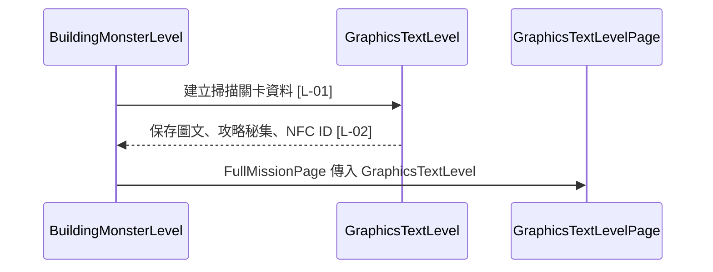

# graphics_text_level.dart 邏輯追蹤表

## 目前版本邏輯對照表

<table>
  <thead>
    <tr>
      <th>ID</th>
      <th>目的標籤</th>
      <th>邏輯描述</th>
      <th>函數為單位</th>
    </tr>
  </thead>
  <tbody>
    <tr>
      <td>[L-01]</td>
      <td>目的[物件建構]</td>
      <td>透過建構子接收 <code>firstTracePhoto</code>、<code>descriptionText</code>、<code>strategyBookLevel</code>、<code>nfcId</code>[皆來自呼叫端]，建立掃描關卡資料。</td>
      <td rowspan="2">【回傳函數】(Data Transformer) Input: <code>firstTracePhoto: String?</code> 顯示線索圖片；<code>descriptionText: String?</code> 顯示線索文字；<code>strategyBookLevel: StrategyBookLevel?</code> 控制 NFC 成功後是否顯示攻略秘集 overlay；<code>nfcId: String</code> 作為 NFC 驗證答案。 Process: 將呼叫端資料保存成不可變欄位，讓頁面層依欄位決定 UI 與流程。 Output: <code>GraphicsTextLevel</code>，供 <code>GraphicsTextLevelPage</code> 渲染掃描關卡。</td>
    </tr>
    <tr>
      <td>[L-02]</td>
      <td>目的[資料模型]</td>
      <td>宣告 <code>firstTracePhoto</code>、<code>descriptionText</code>、<code>strategyBookLevel</code>、<code>nfcId</code>[皆來自建構子並保存為 final 欄位]，支援圖文線索、攻略秘集彈窗與 NFC 驗證。</td>
    </tr>
  </tbody>
</table>

## 場景時序圖

## 測資建議表

| ID | 測試時應輸入的極端值或狀態 |
| --- | --- |
| [L-01] | 傳入 <code>strategyBookLevel = null</code> 與非 null 兩種狀態，確認頁面流程分流。 |
| [L-02] | 傳入空圖片、空文字、空 NFC ID，確認模型仍保存原始資料並交由頁面處理。 |
