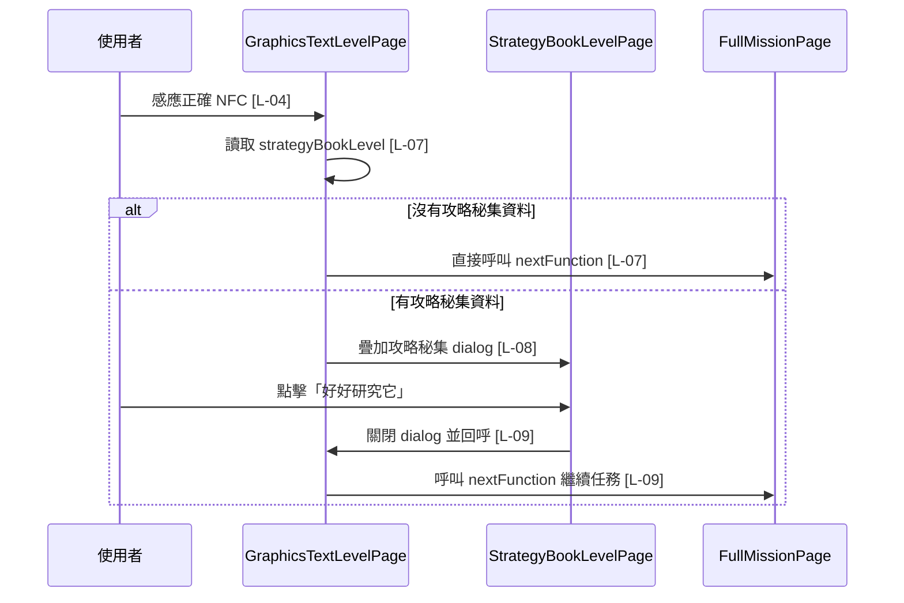

# graphics_text_level_page.dart 邏輯追蹤表

## 目前版本邏輯對照表

<table>
  <thead>
    <tr>
      <th>ID</th>
      <th>目的標籤</th>
      <th>邏輯描述</th>
      <th>函數為單位</th>
    </tr>
  </thead>
  <tbody>
    <tr>
      <td>[L-01]</td>
      <td>目的[資料判斷]</td>
      <td>檢查 <code>widget.level.firstTracePhoto</code>[來自建構子 level] 是否存在且去除空白後不為空，產生 <code>hasImage</code>[區域變數] 供內容區分流。</td>
      <td rowspan="4">【Build 函數 / Widget 返回函數】(UI Tree) Input: <code>context: BuildContext</code>，提供 Widget 建構環境。 Process: 先判斷圖片與文字是否存在，再建立掃描關卡主畫面，並將 NFC 成功事件接到 <code>_handleNfcSuccess</code>。 回傳 Widget: 見 <a href="#build-widget-tree">Build Widget 結構圖</a>。</td>
    </tr>
    <tr>
      <td>[L-02]</td>
      <td>目的[資料判斷]</td>
      <td>檢查 <code>widget.level.descriptionText</code>[來自建構子 level] 是否存在且去除空白後不為空，產生 <code>hasText</code>[區域變數] 供內容區分流。</td>
    </tr>
    <tr>
      <td>[L-03]</td>
      <td>目的[UI 建構]</td>
      <td>回傳掃描關卡頁面，顯示標題、NFC 教學按鈕、圖文線索、NFC 按鈕與放棄捕捉按鈕；結構見 <a href="#build-widget-tree">Build Widget 結構圖</a>。</td>
    </tr>
    <tr>
      <td>[L-04]</td>
      <td>目的[NFC 回呼接線]</td>
      <td>建立 <code>NfcButton1</code>[NFC 按鈕元件]，傳入 <code>widget.level.nfcId</code>[來自建構子 level] 作為答案，並在成功時呼叫 <code>_handleNfcSuccess</code>[State 方法]。</td>
    </tr>
    <tr>
      <td>[L-05]</td>
      <td>目的[教學入口]</td>
      <td>建立 NFC 教學按鈕；點擊時呼叫 <code>_showNfcTeachingDialog</code>[State 方法] 顯示教學 GIF。</td>
      <td>【Build 函數 / Widget 返回函數】(UI Tree) Input: 無顯式參數。 Process: 建立可點擊的教學 IconButton，將 onPressed 接到教學彈窗。 回傳 Widget: 見 <a href="#teaching-button-widget-tree">Teaching Button Widget 結構圖</a>。</td>
    </tr>
    <tr>
      <td>[L-06]</td>
      <td>目的[教學 Overlay]</td>
      <td>呼叫 <code>showGeneralDialog</code>[Flutter Dialog API] 疊加 NFC 教學視窗，允許點擊背景關閉，並在 GIF 載入失敗時呼叫 <code>_buildImageFallback()</code>[State 方法]。</td>
      <td>【功能函數】(Action Performer) Purpose: [教學顯示/Overlay] Action: 開啟可關閉的教學 dialog；載入 NFC 教學 GIF；設定淡入縮放轉場；圖片載入失敗時顯示 fallback。</td>
    </tr>
    <tr>
      <td>[L-07]</td>
      <td>目的[流程分流]</td>
      <td>讀取 <code>strategyBookLevel</code>[區域變數，來自 <code>widget.level.strategyBookLevel</code>]；若為 null，直接呼叫 <code>widget.nextFunction</code>[來自建構子 callback]，維持一般掃描關卡完成流程。</td>
      <td rowspan="3">【功能函數】(Action Performer) Purpose: [NFC 成功處理/Overlay/任務推進] Action: NFC 成功後先檢查是否有攻略秘集資料；沒有資料則直接前進；有資料則在原掃描頁上方顯示攻略秘集 dialog；使用者按下按鈕後關閉 dialog 並呼叫外部 nextFunction。</td>
    </tr>
    <tr>
      <td>[L-08]</td>
      <td>目的[攻略 Overlay]</td>
      <td>在 <code>strategyBookLevel</code>[區域變數] 不為 null 時呼叫 <code>showGeneralDialog</code>[Flutter Dialog API]，將 <code>StrategyBookLevelPage</code> 疊在原掃描關卡上，營造突然發現攻略秘集的效果。</td>
    </tr>
    <tr>
      <td>[L-09]</td>
      <td>目的[彈窗收尾]</td>
      <td>攻略秘集按鈕觸發時，先使用 <code>Navigator.of(dialogContext).pop()</code>[Flutter 導航 API 與 dialogContext 區域參數] 關閉 dialog，再呼叫 <code>widget.nextFunction</code>[來自建構子 callback] 繼續後續任務。</td>
    </tr>
    <tr>
      <td>[L-10]</td>
      <td>目的[內容分流]</td>
      <td>若 <code>hasImage</code>[參數] 與 <code>hasText</code>[參數] 皆為 true，同時顯示圖片線索與文字線索。</td>
      <td rowspan="4">【Build 函數 / Widget 返回函數】(UI Tree) Input: <code>hasImage: bool</code> 表示圖片是否存在；<code>hasText: bool</code> 表示文字是否存在。 Process: 依圖片與文字可用狀態選擇顯示雙區塊、單圖片、單文字或空狀態。 回傳 Widget: 見 <a href="#body-widget-tree">Body Widget 結構圖</a>。</td>
    </tr>
    <tr>
      <td>[L-11]</td>
      <td>目的[內容分流]</td>
      <td>若只有 <code>hasImage</code>[參數] 為 true，顯示 <code>widget.level.firstTracePhoto</code>[來自建構子 level] 對應圖片線索。</td>
    </tr>
    <tr>
      <td>[L-12]</td>
      <td>目的[內容分流]</td>
      <td>若只有 <code>hasText</code>[參數] 為 true，顯示 <code>widget.level.descriptionText</code>[來自建構子 level] 對應文字線索。</td>
    </tr>
    <tr>
      <td>[L-13]</td>
      <td>目的[空狀態]</td>
      <td>當圖片與文字都不存在時回傳空內容提示，避免掃描關卡主區域空白。</td>
    </tr>
    <tr>
      <td>[L-14]</td>
      <td>目的[圖片來源判斷]</td>
      <td>將 <code>imagePath</code>[參數] 去除前後空白得到 <code>trimmedPath</code>[區域變數]，並檢查是否以 http 或 https 開頭得到 <code>isNetworkImage</code>[區域變數]。</td>
      <td rowspan="2">【Build 函數 / Widget 返回函數】(UI Tree) Input: <code>imagePath: String</code>，代表要顯示的圖片路徑。 Process: 清理路徑並判斷網路圖或資產圖，再建立對應 Image；載入失敗時回傳 fallback。 回傳 Widget: 見 <a href="#adaptive-image-widget-tree">Adaptive Image Widget 結構圖</a>。</td>
    </tr>
    <tr>
      <td>[L-15]</td>
      <td>目的[圖片載入]</td>
      <td>依 <code>isNetworkImage</code>[區域變數] 建立 <code>Image.network</code> 或 <code>Image.asset</code>，並在 errorBuilder 中呼叫 <code>_buildImageFallback()</code>[State 方法]。</td>
    </tr>
    <tr>
      <td>[L-16]</td>
      <td>目的[文字內容]</td>
      <td>建立可捲動文字區，顯示 <code>text</code>[參數] 作為掃描關卡描述內容；結構見 <a href="#text-section-widget-tree">Text Section Widget 結構圖</a>。</td>
      <td>【Build 函數 / Widget 返回函數】(UI Tree) Input: <code>text: String</code>，代表要顯示的線索描述。 Process: 建立文字區並支援內容捲動。 回傳 Widget: 見 <a href="#text-section-widget-tree">Text Section Widget 結構圖</a>。</td>
    </tr>
    <tr>
      <td>[L-17]</td>
      <td>目的[空狀態 UI]</td>
      <td>建立無圖片也無文字時的提示區，顯示固定提示文字；結構見 <a href="#empty-section-widget-tree">Empty Section Widget 結構圖</a>。</td>
      <td>【Build 函數 / Widget 返回函數】(UI Tree) Input: 無。 Process: 建立空內容提示區，避免主區域沒有任何可見內容。 回傳 Widget: 見 <a href="#empty-section-widget-tree">Empty Section Widget 結構圖</a>。</td>
    </tr>
    <tr>
      <td>[L-18]</td>
      <td>目的[異常替代 UI]</td>
      <td>建立圖片載入失敗時的替代 UI，顯示固定圖示；結構見 <a href="#image-fallback-widget-tree">Image Fallback Widget 結構圖</a>。</td>
      <td>【Build 函數 / Widget 返回函數】(UI Tree) Input: 無。 Process: 建立圖片 fallback 容器與圖示，讓圖片錯誤不會中斷頁面渲染。 回傳 Widget: 見 <a href="#image-fallback-widget-tree">Image Fallback Widget 結構圖</a>。</td>
    </tr>
  </tbody>
</table>

## Widget 視覺化結構圖

### Build Widget 結構圖

Scaffold // [L-03]  
└── Container  
&nbsp;&nbsp;&nbsp;&nbsp;└── SafeArea  
&nbsp;&nbsp;&nbsp;&nbsp;&nbsp;&nbsp;&nbsp;&nbsp;└── Column (垂直容器)  
&nbsp;&nbsp;&nbsp;&nbsp;&nbsp;&nbsp;&nbsp;&nbsp;&nbsp;&nbsp;&nbsp;&nbsp;├── Container  
&nbsp;&nbsp;&nbsp;&nbsp;&nbsp;&nbsp;&nbsp;&nbsp;&nbsp;&nbsp;&nbsp;&nbsp;│   └── Column (垂直容器)  
&nbsp;&nbsp;&nbsp;&nbsp;&nbsp;&nbsp;&nbsp;&nbsp;&nbsp;&nbsp;&nbsp;&nbsp;│       ├── Row (橫向容器)  
&nbsp;&nbsp;&nbsp;&nbsp;&nbsp;&nbsp;&nbsp;&nbsp;&nbsp;&nbsp;&nbsp;&nbsp;│       │   ├── Text (標題文字)  
&nbsp;&nbsp;&nbsp;&nbsp;&nbsp;&nbsp;&nbsp;&nbsp;&nbsp;&nbsp;&nbsp;&nbsp;│       │   └── Teaching Button (教學按鈕) // [L-05]  
&nbsp;&nbsp;&nbsp;&nbsp;&nbsp;&nbsp;&nbsp;&nbsp;&nbsp;&nbsp;&nbsp;&nbsp;│       ├── Text (提示文字)  
&nbsp;&nbsp;&nbsp;&nbsp;&nbsp;&nbsp;&nbsp;&nbsp;&nbsp;&nbsp;&nbsp;&nbsp;│       └── Body (內容區) // [L-10]  
&nbsp;&nbsp;&nbsp;&nbsp;&nbsp;&nbsp;&nbsp;&nbsp;&nbsp;&nbsp;&nbsp;&nbsp;├── NfcButton1 (NFC 按鈕) // [L-04]  
&nbsp;&nbsp;&nbsp;&nbsp;&nbsp;&nbsp;&nbsp;&nbsp;&nbsp;&nbsp;&nbsp;&nbsp;└── ClickAndAcceptButton (放棄按鈕)

### Teaching Button Widget 結構圖

SizedBox // [L-05]  
└── IconButton (圖示按鈕)

### Body Widget 結構圖

{ IF: hasImage && hasText } // [L-10]  
└── Column (垂直容器)  
&nbsp;&nbsp;&nbsp;&nbsp;├── Image Section (圖片區)  
&nbsp;&nbsp;&nbsp;&nbsp;└── Text Section (文字區) // [L-16]  
{ ELSE IF: hasImage } // [L-11]  
└── Image Section (圖片區)  
{ ELSE IF: hasText } // [L-12]  
└── Text Section (文字區) // [L-16]  
{ ELSE } // [L-13]  
└── Empty Section (空狀態) // [L-17]

### Adaptive Image Widget 結構圖

SizedBox  
└── { IF: isNetworkImage } // [L-14]  
&nbsp;&nbsp;&nbsp;&nbsp;└── Image.network (網路圖片) // [L-15]  
└── { ELSE }  
&nbsp;&nbsp;&nbsp;&nbsp;└── Image.asset (資產圖片) // [L-15]

### Text Section Widget 結構圖

Container // [L-16]  
└── SingleChildScrollView (捲動頁面)  
&nbsp;&nbsp;&nbsp;&nbsp;└── Center  
&nbsp;&nbsp;&nbsp;&nbsp;&nbsp;&nbsp;&nbsp;&nbsp;└── Text (描述文字)

### Empty Section Widget 結構圖

Container // [L-17]  
└── Center  
&nbsp;&nbsp;&nbsp;&nbsp;└── Text (空狀態文字)

### Image Fallback Widget 結構圖

Container // [L-18]  
└── Center  
&nbsp;&nbsp;&nbsp;&nbsp;└── Icon (缺圖圖示)

## 場景時序圖

## 測資建議表

| ID | 測試時應輸入的極端值或狀態 |
| --- | --- |
| [L-01] | <code>firstTracePhoto</code> 為 null、空字串、只有空白，確認 <code>hasImage</code> 為 false。 |
| [L-02] | <code>descriptionText</code> 為 null、空字串、只有空白，確認 <code>hasText</code> 為 false。 |
| [L-03] | 使用窄螢幕與長線索文字，確認頁面不 overflow。 |
| [L-04] | NFC 成功時確認呼叫 <code>_handleNfcSuccess</code> 而非直接跳下一關。 |
| [L-05] | 點擊教學按鈕，確認 NFC 教學 dialog 顯示。 |
| [L-06] | 教學 GIF 路徑失效，確認 fallback 顯示且 dialog 可關閉。 |
| [L-07] | <code>strategyBookLevel = null</code>，確認 NFC 成功後直接呼叫 <code>nextFunction</code>。 |
| [L-08] | <code>strategyBookLevel</code> 不為 null，確認 dialog 疊在掃描頁上方且背景仍可辨識。 |
| [L-09] | 點擊「好好研究它」，確認 dialog 關閉後才進入下一個 mission。 |
| [L-10] | 圖片與文字皆存在，確認上下兩區都顯示。 |
| [L-11] | 只有圖片存在，確認只顯示圖片區。 |
| [L-12] | 只有文字存在，確認只顯示文字區。 |
| [L-13] | 圖片與文字都缺失，確認顯示空狀態文字。 |
| [L-14] | 路徑分別為 http、https、asset，確認來源判斷正確。 |
| [L-15] | 圖片載入失敗，確認 errorBuilder 顯示 fallback。 |
| [L-16] | 傳入超長描述文字，確認文字區可捲動。 |
| [L-17] | 空內容狀態下確認提示文字可見。 |
| [L-18] | 強制圖片失敗，確認缺圖圖示可見。 |
