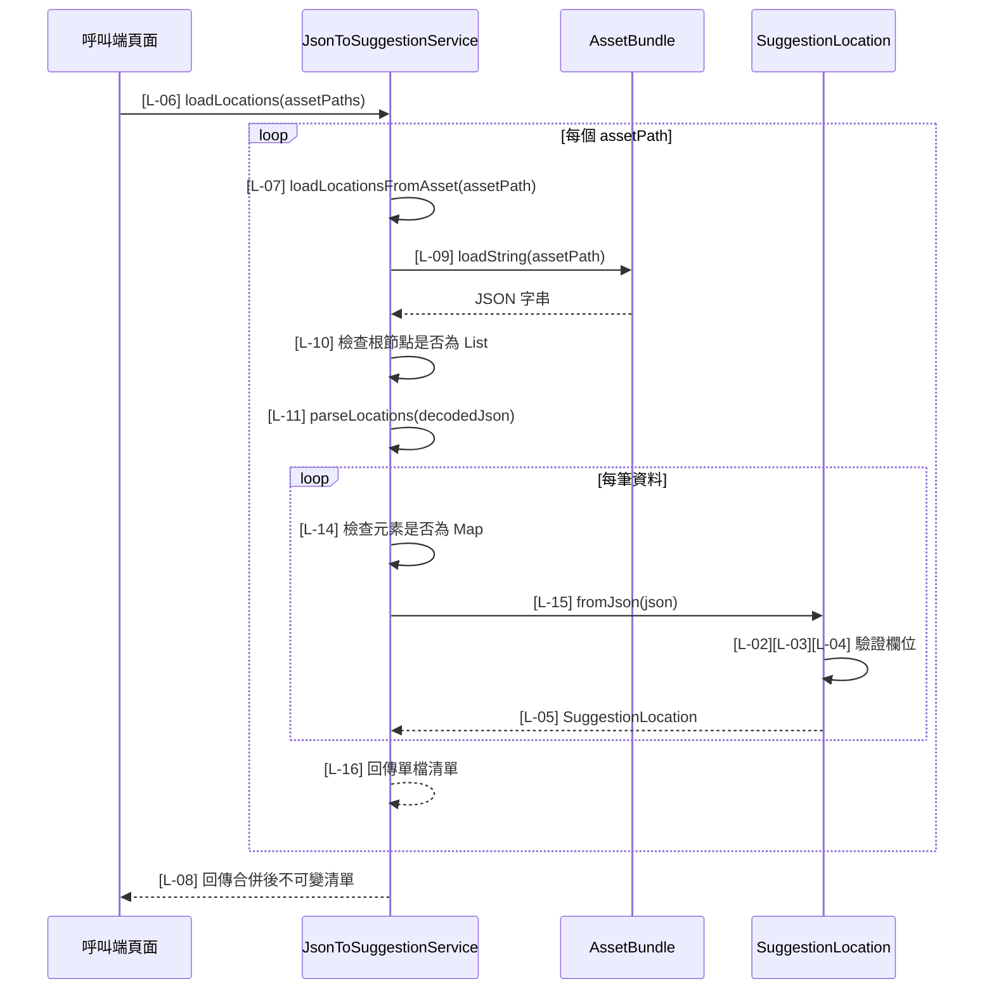

# json_to_suggestion.dart 邏輯追蹤表

## Task 0: 檔案用途與使用方式

### 0-1. 檔案簡介

`json_to_suggestion.dart` 負責將地景 JSON asset 轉換成 Dart 可使用的 `SuggestionLocation` 清單。它集中處理中文欄位 key、必要欄位驗證、JSON 根節點格式檢查與多檔 asset 載入。此檔案不負責 UI 顯示、不負責 GPS 座標轉圖片座標，也不負責決定哪些分類要顯示。通常由 `map_suggestions.dart` 或未來其他地景建議頁呼叫。

### 0-2. 檔案類型判斷

主要類型：D. API / Service / Repository 檔案  
次要類型：E. Model / Data Class 檔案，因為同檔定義 `SuggestionLocation`。

### 使用方式或呼叫方式

一般頁面可建立 service 後傳入 asset 路徑清單：

```dart
final service = JsonToSuggestionService();
final locations = await service.loadLocations([
  'assets/json/locations/NCU10view.json',
]);
```

測試時可注入自訂 `AssetBundle`：

```dart
final service = JsonToSuggestionService(assetBundle: fakeBundle);
```

### 方法表

| 方法名稱 | 作用 | 輸入 | 輸出 | 是否需要 await | 可能錯誤 |
|---|---|---|---|---|---|
| `SuggestionLocation.fromJson` | 將單筆 JSON map 轉成地景 model | `json: Map<String, dynamic>` | `SuggestionLocation` | 否 | `FormatException` |
| `JsonToSuggestionService.loadLocations` | 載入多個 asset JSON 並合併結果 | `assetPaths: List<String>` | `Future<List<SuggestionLocation>>` | 是 | asset 不存在、JSON 格式錯誤 |
| `JsonToSuggestionService.loadLocationsFromAsset` | 載入單一 asset JSON | `assetPath: String` | `Future<List<SuggestionLocation>>` | 是 | asset 不存在、JSON 根節點不是陣列 |
| `JsonToSuggestionService.parseLocations` | 將已解碼 JSON 陣列轉成地景清單 | `rawLocations: List<dynamic>`、`sourceName: String` | `List<SuggestionLocation>` | 否 | 陣列元素不是物件、欄位格式錯誤 |

### 欄位表

| 欄位名稱 | 型別 | 是否可為 null | 作用 | 注意事項 |
|---|---|---|---|---|
| `name` | `String` | 否 | 地景名稱 | 來源 JSON key 為 `名稱` |
| `category` | `String` | 否 | 地景種類 | 來源 JSON key 為 `種類` |
| `latitude` | `double` | 否 | GPS 緯度 | 來源 JSON key 為 `緯度`，必須是 num |
| `longitude` | `double` | 否 | GPS 經度 | 來源 JSON key 為 `經度`，必須是 num |

## 目前版本邏輯對照表

<table>
  <thead>
    <tr>
      <th>ID</th>
      <th>目的標籤</th>
      <th>邏輯描述</th>
      <th>函數為單位</th>
    </tr>
  </thead>
  <tbody>
    <tr><td>[L-01]</td><td>目的[JSON 讀取]</td><td>在 <code>SuggestionLocation.fromJson</code> 中讀取 <code>名稱</code>、<code>種類</code>、<code>緯度</code>、<code>經度</code>[皆來自函數參數 json]。</td><td rowspan="5">【回傳函數】(Data Transformer)<br>Input: <code>json: Map&lt;String, dynamic&gt;</code>，代表單筆地景 JSON。<br>Process: 讀取中文欄位；逐一驗證名稱、種類與座標型別；清理字串並將 num 轉 double。<br>Output: <code>SuggestionLocation</code>，有效地景模型；格式錯誤時丟出 <code>FormatException</code>。</td></tr>
    <tr><td>[L-02]</td><td>目的[欄位驗證]</td><td>檢查 <code>name</code>[區域變數] 是否為非空 String，不符合時丟出 <code>FormatException</code>。</td></tr>
    <tr><td>[L-03]</td><td>目的[欄位驗證]</td><td>檢查 <code>category</code>[區域變數] 是否為非空 String，不符合時丟出 <code>FormatException</code>。</td></tr>
    <tr><td>[L-04]</td><td>目的[欄位驗證]</td><td>檢查 <code>latitude</code> 與 <code>longitude</code>[區域變數] 是否為 num，不符合時丟出 <code>FormatException</code>。</td></tr>
    <tr><td>[L-05]</td><td>目的[模型建立]</td><td>使用通過驗證的 <code>name</code>、<code>category</code>、<code>latitude</code>、<code>longitude</code>[區域變數] 建立 <code>SuggestionLocation</code>。</td></tr>

    <tr><td>[L-06]</td><td>目的[多檔載入]</td><td>在 <code>loadLocations</code> 中建立 <code>locations</code>[區域變數]，準備合併多個 asset 的地景資料。</td><td rowspan="3">【功能函數】(Action Performer)<br>Purpose: 多來源地景載入。<br>Action: 依序讀取 asset 路徑清單；委派單檔載入函數解析；合併所有地景後回傳不可變清單。</td></tr>
    <tr><td>[L-07]</td><td>目的[資料合併]</td><td>逐一使用 <code>assetPath</code>[區域變數] 呼叫 <code>loadLocationsFromAsset</code>，並將結果加入 <code>locations</code>[區域變數]。</td></tr>
    <tr><td>[L-08]</td><td>目的[不可變回傳]</td><td>回傳 <code>List.unmodifiable(locations)</code>，避免呼叫端意外修改 service 輸出。</td></tr>

    <tr><td>[L-09]</td><td>目的[Asset 讀取]</td><td>在 <code>loadLocationsFromAsset</code> 中使用 <code>assetBundle.loadString(assetPath)</code>[AssetBundle API 與函數參數] 讀取 JSON 字串並解碼。</td><td rowspan="3">【功能函數】(Action Performer)<br>Purpose: 單一 JSON asset 載入。<br>Action: 讀取 asset 文字；解碼 JSON；確認根節點是陣列；將陣列交給 parseLocations 轉成模型清單。</td></tr>
    <tr><td>[L-10]</td><td>目的[格式防護]</td><td>檢查 <code>decodedJson</code>[區域變數] 是否為 List；若不是，丟出包含 <code>assetPath</code>[函數參數] 的 <code>FormatException</code>。</td></tr>
    <tr><td>[L-11]</td><td>目的[解析委派]</td><td>呼叫 <code>parseLocations(decodedJson, sourceName: assetPath)</code>，讓單筆資料解析集中在同一流程。</td></tr>

    <tr><td>[L-12]</td><td>目的[清單解析]</td><td>在 <code>parseLocations</code> 中建立 <code>locations</code>[區域變數]，準備保存解析後模型。</td><td rowspan="5">【回傳函數】(Data Transformer)<br>Input: <code>rawLocations: List&lt;dynamic&gt;</code>，已解碼 JSON 陣列；<code>sourceName: String</code>，錯誤訊息來源名稱。<br>Process: 逐筆檢查陣列元素是 JSON 物件；轉成 <code>Map&lt;String, dynamic&gt;</code>；呼叫 <code>SuggestionLocation.fromJson</code> 建立模型。<br>Output: <code>List&lt;SuggestionLocation&gt;</code> 不可變地景清單。</td></tr>
    <tr><td>[L-13]</td><td>目的[逐筆處理]</td><td>使用 index 逐筆讀取 <code>rawLocations</code>[函數參數]，讓錯誤訊息能指出第幾筆資料。</td></tr>
    <tr><td>[L-14]</td><td>目的[格式防護]</td><td>檢查 <code>rawLocation</code>[區域變數] 是否為 Map；若不是，丟出包含筆數與 <code>sourceName</code>[函數參數] 的 <code>FormatException</code>。</td></tr>
    <tr><td>[L-15]</td><td>目的[模型轉換]</td><td>將 <code>rawLocation</code>[區域變數] 轉為 <code>Map&lt;String, dynamic&gt;</code>，並呼叫 <code>SuggestionLocation.fromJson</code> 後加入 <code>locations</code>[區域變數]。</td></tr>
    <tr><td>[L-16]</td><td>目的[不可變回傳]</td><td>回傳 <code>List.unmodifiable(locations)</code>，提供穩定不可變的解析結果。</td></tr>
  </tbody>
</table>

## 視覺化結構圖

此檔案沒有 Widget Tree。

## Task 3: 場景時序圖



## Task 4: 測資建議表

| ID | 建議測試極端值或狀態 |
|---|---|
| [L-01] | JSON 包含完整中文 key |
| [L-02] | `名稱` 缺少、為空字串或不是 String |
| [L-03] | `種類` 缺少、為空字串或不是 String |
| [L-04] | `緯度` 或 `經度` 為字串、null 或缺少 |
| [L-05] | `緯度` 與 `經度` 為 int，確認轉 double |
| [L-06] | 傳入空 asset 路徑清單 |
| [L-07] | 傳入兩個 asset，確認結果合併 |
| [L-08] | 呼叫端嘗試修改回傳清單，確認不可變 |
| [L-09] | asset 路徑不存在 |
| [L-10] | JSON 根節點為物件而非陣列 |
| [L-11] | 正常陣列交給 parseLocations |
| [L-12] | 傳入空陣列 |
| [L-13] | 第二筆資料格式錯誤，確認錯誤指向第 2 筆 |
| [L-14] | 陣列元素為字串或數字 |
| [L-15] | Map 含多餘欄位，確認仍可解析必要欄位 |
| [L-16] | 呼叫端嘗試修改 parse 結果 |
