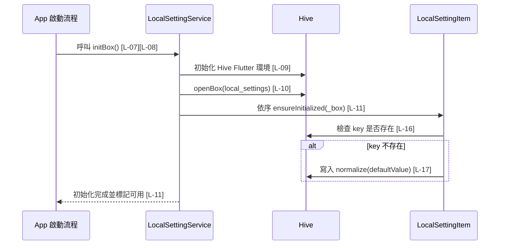
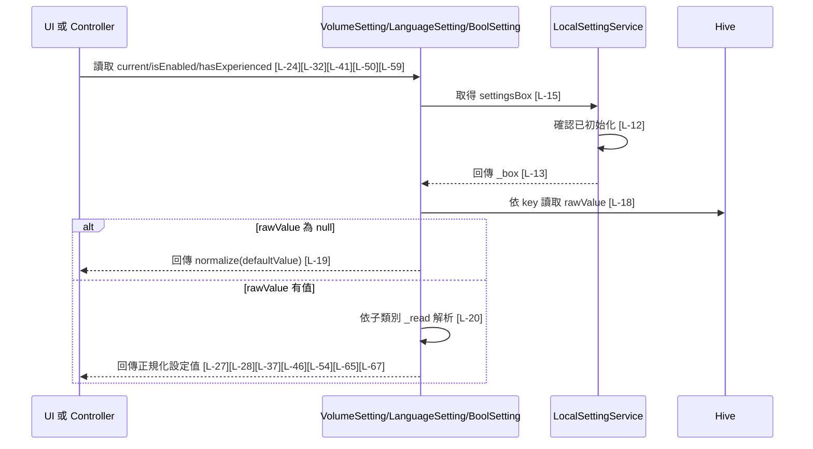
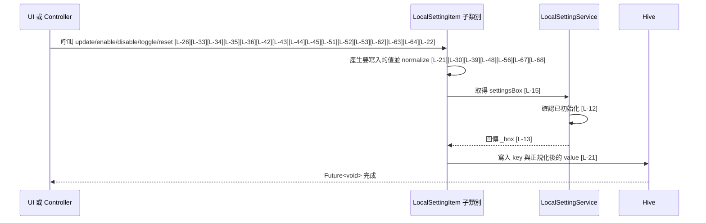

# local_setting.dart 邏輯追蹤表

## Task 0: 檔案用途與使用方式

### 0-1. 檔案簡介

`local_setting.dart` 負責用 Hive 保存 App 的本地設定資料，例如音量、振動、自動跳過劇情、語言與新手教學狀態。它提供 `LocalSettingService` 作為統一初始化入口，並透過各個 `LocalSettingItem<T>` 子類別封裝讀取、寫入、重置與資料正規化邏輯。此檔案不負責 UI 顯示、不負責 Provider 通知畫面更新，也不處理遠端同步。通常會由 App 啟動流程先呼叫初始化，再由頁面、控制器或遊戲流程讀寫設定。

### 0-2. 檔案類型判斷

主要類型：F. 本地儲存檔案 Local Storage / Cache / Preferences  
次要類型：D. API / Service / Repository 檔案，因為它以 Service 形式包裝 Hive 本地資料來源。

### 使用方式或呼叫方式

使用前必須先初始化 Hive box：

```dart
await LocalSettingService.initBox();
```

初始化完成後，可以透過靜態設定項目讀取或寫入：

```dart
final volume = LocalSettingService.volume.current;
await LocalSettingService.volume.update(80);

final vibrationEnabled = LocalSettingService.vibration.isEnabled;
await LocalSettingService.vibration.toggle();

final language = LocalSettingService.language.current;
await LocalSettingService.language.useEnglish();
```

若尚未呼叫 `LocalSettingService.initBox()` 就讀取或寫入設定，`settingsBox` 會丟出 `StateError`。`initBox()` 會重複使用同一個 `_initFuture`，因此多個呼叫端同時初始化時會共用同一段初始化流程。

### Key 表

| Key | 型別 | 預設值 | 寫入時機 | 讀取時機 | 用途 |
|---|---|---|---|---|---|
| `volume` | `int` | `100` | 呼叫 `LocalSettingService.volume.update(value)` 或 `reset()` | UI 或音效系統需要音量值時 | 保存音量百分比，會限制在 0 到 100 |
| `vibration_enabled` | `bool` | `true` | 呼叫 `update()`、`enable()`、`disable()`、`toggle()` 或 `reset()` | 觸發震動前檢查 | 判斷是否允許震動 |
| `auto_skip_story` | `bool` | `false` | 呼叫 `update()`、`enable()`、`disable()`、`toggle()` 或 `reset()` | 劇情流程判斷是否跳過時 | 判斷是否自動跳過劇情 |
| `has_experienced_novice_teaching` | `bool` | `false` | 呼叫 `update()`、`markExperienced()`、`resetExperience()` 或 `reset()` | App 或關卡流程判斷是否顯示新手教學時 | 保存使用者是否已完成新手教學 |
| `language` | `String` | `zh` | 呼叫 `update(language)`、`useEnglish()`、`useChinese()` 或 `reset()` | 顯示文字或語系判斷時 | 保存語言代碼，只接受 `en` 或 `zh` |

### 公開方法表

| 方法名稱 | 作用 | 輸入 | 輸出 | 是否需要 await | 可能錯誤 |
|---|---|---|---|---|---|
| `LocalSettingService.initBox()` | 初始化 Hive 並補齊所有本地設定預設值 | 無 | `Future<void>` | 是 | Hive 初始化或開 box 失敗 |
| `LocalSettingService.settingsBox` | 取得已初始化的 Hive box | 無 | `Box<dynamic>` | 否 | 尚未初始化時丟出 `StateError` |
| `LocalSettingItem.ensureInitialized(box)` | 若 key 不存在，寫入預設值 | `box: Box<dynamic>` | `Future<void>` | 是 | Hive 寫入失敗 |
| `LocalSettingItem.getValue()` | 讀取並正規化單一設定值 | 無 | `T` | 否 | 尚未初始化時丟出 `StateError` |
| `LocalSettingItem.setValue(value)` | 正規化後寫入單一設定值 | `value: T` | `Future<void>` | 是 | 尚未初始化或 Hive 寫入失敗 |
| `LocalSettingItem.reset()` | 將設定恢復為預設值 | 無 | `Future<void>` | 是 | 尚未初始化或 Hive 寫入失敗 |

## 目前版本邏輯對照表

<table>
  <thead>
    <tr>
      <th>ID</th>
      <th>目的標籤</th>
      <th>邏輯描述</th>
      <th>函數為單位</th>
    </tr>
  </thead>
  <tbody>
    <tr>
      <td>[L-01]</td>
      <td>目的[封裝建構]</td>
      <td>將 <code>LocalSettingService</code>[來自類別本身] 建構子設為私有，避免外部建立服務實例，強制使用靜態入口存取本地設定。</td>
      <td rowspan="6">【回傳函數】(Data Transformer)<br>Input: 無。<br>Process: 宣告本地設定服務的靜態儲存欄位與各設定項目的單例入口。<br>Output: <code>LocalSettingService</code> 類別層級設定入口，供 App 啟動流程與呼叫端共用。</td>
    </tr>
    <tr>
      <td>[L-02]</td>
      <td>目的[儲存鍵值]</td>
      <td>宣告 <code>_boxName</code>[來自 LocalSettingService 靜態常數] 為 Hive box 名稱，集中指定本地設定資料儲存位置。</td>
    </tr>
    <tr>
      <td>[L-03]</td>
      <td>目的[本地資料來源]</td>
      <td>宣告 <code>_box</code>[來自 LocalSettingService 靜態欄位] 保存初始化後的 Hive box，供所有設定項目共用。</td>
    </tr>
    <tr>
      <td>[L-04]</td>
      <td>目的[初始化狀態]</td>
      <td>宣告 <code>_isInitialized</code>[來自 LocalSettingService 靜態欄位] 記錄 Hive box 是否已完成初始化。</td>
    </tr>
    <tr>
      <td>[L-05]</td>
      <td>目的[並發控制]</td>
      <td>宣告 <code>_initFuture</code>[來自 LocalSettingService 靜態欄位] 保存正在執行的初始化 Future，避免重複啟動初始化流程。</td>
    </tr>
    <tr>
      <td>[L-06]</td>
      <td>目的[設定入口]</td>
      <td>建立 <code>volume</code>、<code>vibration</code>、<code>autoSkipStory</code>、<code>language</code>、<code>noviceTeaching</code>[皆來自 LocalSettingService 靜態欄位]，作為外部讀寫設定的固定入口。</td>
    </tr>
    <tr>
      <td>[L-07]</td>
      <td>目的[初始化快取]</td>
      <td>檢查 <code>_isInitialized</code>[來自 LocalSettingService 靜態欄位]，若已完成初始化則立即回傳完成的 <code>Future</code>，避免重複開啟 Hive box。</td>
      <td rowspan="2">【功能函數】(Action Performer)<br>Purpose: 初始化控制/並發保護。<br>Action: 檢查服務是否已初始化；若尚未初始化，重用或建立初始化 Future，讓多個呼叫端等待同一個初始化流程。</td>
    </tr>
    <tr>
      <td>[L-08]</td>
      <td>目的[並發保護]</td>
      <td>回傳 <code>_initFuture</code>[來自 LocalSettingService 靜態欄位]，若尚不存在則指派 <code>_initialize()</code>[來自 LocalSettingService 私有函數]，確保同時間只執行一次初始化。</td>
    </tr>
    <tr>
      <td>[L-09]</td>
      <td>目的[Hive 初始化]</td>
      <td>等待 <code>Hive.initFlutter()</code>[來自 hive_flutter 套件] 完成，準備 Flutter 環境下的 Hive 本地儲存。</td>
      <td rowspan="3">【功能函數】(Action Performer)<br>Purpose: 本地儲存初始化/預設值補齊。<br>Action: 初始化 Hive；開啟指定 box；依序呼叫每個設定項目的 <code>ensureInitialized</code> 補齊預設值；最後標記服務已可使用。</td>
    </tr>
    <tr>
      <td>[L-10]</td>
      <td>目的[開啟資料表]</td>
      <td>使用 <code>_boxName</code>[來自 LocalSettingService 靜態常數] 開啟 Hive box，並將結果保存到 <code>_box</code>[來自 LocalSettingService 靜態欄位]。</td>
    </tr>
    <tr>
      <td>[L-11]</td>
      <td>目的[預設值補齊]</td>
      <td>依序呼叫各設定項目 <code>ensureInitialized(_box)</code>，其中 <code>_box</code>[來自 LocalSettingService 靜態欄位] 是已開啟的 Hive box，確保缺少的 key 會被寫入預設值，最後將 <code>_isInitialized</code>[來自 LocalSettingService 靜態欄位] 設為 true。</td>
    </tr>
    <tr>
      <td>[L-12]</td>
      <td>目的[安全性檢查]</td>
      <td>檢查 <code>_isInitialized</code>[來自 LocalSettingService 靜態欄位]，若尚未初始化則丟出 <code>StateError</code>，避免呼叫端讀寫未準備好的 Hive box。</td>
      <td rowspan="2">【回傳函數】(Data Transformer)<br>Input: 無。<br>Process: 驗證本地設定服務已完成初始化。<br>Output: 已開啟的 <code>Box&lt;dynamic&gt;</code>；若未初始化則丟出 <code>StateError</code>。</td>
    </tr>
    <tr>
      <td>[L-13]</td>
      <td>目的[資料來源回傳]</td>
      <td>回傳 <code>_box</code>[來自 LocalSettingService 靜態欄位]，讓設定項目可以進行實際讀寫。</td>
    </tr>
    <tr>
      <td>[L-14]</td>
      <td>目的[抽象模型]</td>
      <td>透過 <code>key</code>、<code>defaultValue</code>[皆來自建構子輸入] 建立泛型設定項目，讓子類別只需定義 key、預設值與正規化規則。</td>
      <td rowspan="2">【回傳函數】(Data Transformer)<br>Input: <code>key: String</code> 對應 Hive key；<code>defaultValue: T</code> 對應缺值或非法值時的預設設定。<br>Process: 保存單一設定項目的識別鍵與預設值，並提供共用 Hive box 取用入口。<br>Output: 可被子類別繼承的 <code>LocalSettingItem&lt;T&gt;</code> 基底能力。</td>
    </tr>
    <tr>
      <td>[L-15]</td>
      <td>目的[資料來源取得]</td>
      <td>透過 <code>LocalSettingService.settingsBox</code>[來自本地設定服務] 取得共用 Hive box，讓設定項目不用自行管理初始化狀態。</td>
    </tr>
    <tr>
      <td>[L-16]</td>
      <td>目的[缺值檢查]</td>
      <td>使用 <code>box</code>[來自函數參數] 檢查是否包含 <code>key</code>[來自建構子欄位]，只在 key 缺少時補寫預設值。</td>
      <td rowspan="2">【功能函數】(Action Performer)<br>Purpose: 預設值補齊。<br>Action: 檢查指定 Hive box 是否已有此設定 key；若沒有，將預設值先正規化再寫入 box。</td>
    </tr>
    <tr>
      <td>[L-17]</td>
      <td>目的[預設寫入]</td>
      <td>將 <code>defaultValue</code>[來自建構子欄位] 經 <code>normalize</code>[來自子類別實作] 處理後寫入 <code>box</code>[來自函數參數]。</td>
    </tr>
    <tr>
      <td>[L-18]</td>
      <td>目的[資料讀取]</td>
      <td>使用 <code>key</code>[來自建構子欄位] 從 <code>_box</code>[來自 LocalSettingService.settingsBox] 讀取原始值並保存為 <code>rawValue</code>[區域變數]。</td>
      <td rowspan="3">【回傳函數】(Data Transformer)<br>Input: 無。<br>Process: 從 Hive 讀取原始值；遇到 null 時回傳正規化預設值；非 null 時交由子類別 <code>_read</code> 解析。<br>Output: <code>T</code> 型別的設定值。</td>
    </tr>
    <tr>
      <td>[L-19]</td>
      <td>目的[空值防護]</td>
      <td>檢查 <code>rawValue</code>[區域變數] 是否為 null，若為 null 則回傳 <code>defaultValue</code>[來自建構子欄位] 的正規化結果。</td>
    </tr>
    <tr>
      <td>[L-20]</td>
      <td>目的[型別解析]</td>
      <td>將 <code>rawValue</code>[區域變數] 交給 <code>_read</code>[來自子類別實作]，由各設定型別決定如何解析與 fallback。</td>
    </tr>
    <tr>
      <td>[L-21]</td>
      <td>目的[資料寫入]</td>
      <td>將 <code>value</code>[來自函數參數] 經 <code>normalize</code>[來自子類別實作] 後寫入 <code>_box</code>[來自 LocalSettingService.settingsBox] 的 <code>key</code>[來自建構子欄位]。</td>
      <td>【功能函數】(Action Performer)<br>Purpose: 本地設定更新。<br>Action: 將呼叫端傳入的新值正規化，並非同步寫入 Hive。</td>
    </tr>
    <tr>
      <td>[L-22]</td>
      <td>目的[恢復預設]</td>
      <td>呼叫 <code>setValue(defaultValue)</code>，其中 <code>defaultValue</code>[來自建構子欄位] 是此設定項目的預設值。</td>
      <td>【功能函數】(Action Performer)<br>Purpose: 設定重置。<br>Action: 將單一設定項目恢復為宣告時指定的預設值。</td>
    </tr>
    <tr>
      <td>[L-23]</td>
      <td>目的[音量預設]</td>
      <td>建立 <code>VolumeSetting</code>[來自類別本身]，指定 <code>_key</code>[來自 VolumeSetting 靜態常數] 與預設音量 <code>100</code>[區域常值]。</td>
      <td rowspan="8">【兼用函數】(Hybrid)<br>Input: <code>value: int</code> 用於更新音量；Hive 讀取時可能取得 <code>rawValue: dynamic</code>。<br>Process: 提供目前音量與比例；寫入時限制在 0 到 100；讀取時接受 int 或 num，其餘型別回預設值。<br>Output: <code>int</code> 音量百分比、<code>double</code> 音量比例，或寫入用 <code>Future&lt;void&gt;</code>。</td>
    </tr>
    <tr>
      <td>[L-24]</td>
      <td>目的[音量讀取]</td>
      <td>透過 <code>getValue()</code>[來自 LocalSettingItem] 取得目前音量，回傳正規化後的 <code>int</code>。</td>
    </tr>
    <tr>
      <td>[L-25]</td>
      <td>目的[比例轉換]</td>
      <td>將 <code>current</code>[來自 VolumeSetting getter] 除以 100，轉換為音效系統常用的 <code>double</code> 比例。</td>
    </tr>
    <tr>
      <td>[L-26]</td>
      <td>目的[音量更新]</td>
      <td>將 <code>value</code>[來自函數參數] 交給 <code>setValue</code>[來自 LocalSettingItem] 寫入本地設定。</td>
    </tr>
    <tr>
      <td>[L-27]</td>
      <td>目的[整數解析]</td>
      <td>檢查 <code>rawValue</code>[來自函數參數] 是否為 <code>int</code>，若是則正規化後回傳。</td>
    </tr>
    <tr>
      <td>[L-28]</td>
      <td>目的[數字相容]</td>
      <td>檢查 <code>rawValue</code>[來自函數參數] 是否為 <code>num</code>，若是則四捨五入後再正規化，兼容 Hive 中可能保存的非 int 數值。</td>
    </tr>
    <tr>
      <td>[L-29]</td>
      <td>目的[非法值回退]</td>
      <td>當 <code>rawValue</code>[來自函數參數] 不是可接受數字型別時，回傳 <code>defaultValue</code>[來自建構子欄位]。</td>
    </tr>
    <tr>
      <td>[L-30]</td>
      <td>目的[邊界限制]</td>
      <td>將 <code>value</code>[來自函數參數] 限制在 0 到 100，避免音量超出合法百分比範圍。</td>
    </tr>
    <tr>
      <td>[L-31]</td>
      <td>目的[振動預設]</td>
      <td>建立 <code>VibrationSetting</code>[來自類別本身]，指定 <code>_key</code>[來自 VibrationSetting 靜態常數] 與預設值 true。</td>
      <td rowspan="9">【兼用函數】(Hybrid)<br>Input: <code>enabled: bool</code> 用於更新振動開關；Hive 讀取時可能取得 <code>rawValue: dynamic</code>。<br>Process: 提供讀取、更新、啟用、停用與 toggle；讀取時只接受 bool，否則回預設值。<br>Output: <code>bool</code> 振動狀態，或寫入用 <code>Future&lt;void&gt;</code>。</td>
    </tr>
    <tr>
      <td>[L-32]</td>
      <td>目的[振動讀取]</td>
      <td>透過 <code>getValue()</code>[來自 LocalSettingItem] 取得振動是否啟用。</td>
    </tr>
    <tr>
      <td>[L-33]</td>
      <td>目的[振動更新]</td>
      <td>將 <code>enabled</code>[來自函數參數] 寫入本地設定。</td>
    </tr>
    <tr>
      <td>[L-34]</td>
      <td>目的[振動啟用]</td>
      <td>呼叫 <code>setValue(true)</code>，將振動設定固定寫為啟用。</td>
    </tr>
    <tr>
      <td>[L-35]</td>
      <td>目的[振動停用]</td>
      <td>呼叫 <code>setValue(false)</code>，將振動設定固定寫為停用。</td>
    </tr>
    <tr>
      <td>[L-36]</td>
      <td>目的[振動切換]</td>
      <td>讀取 <code>isEnabled</code>[來自 VibrationSetting getter] 並寫入其反相值。</td>
    </tr>
    <tr>
      <td>[L-37]</td>
      <td>目的[布林解析]</td>
      <td>檢查 <code>rawValue</code>[來自函數參數] 是否為 <code>bool</code>，若是則直接回傳。</td>
    </tr>
    <tr>
      <td>[L-38]</td>
      <td>目的[非法值回退]</td>
      <td>當 <code>rawValue</code>[來自函數參數] 不是 <code>bool</code> 時，回傳 <code>defaultValue</code>[來自建構子欄位]。</td>
    </tr>
    <tr>
      <td>[L-39]</td>
      <td>目的[布林正規化]</td>
      <td>回傳 <code>value</code>[來自函數參數] 原值，因為布林設定不需要額外範圍裁切。</td>
    </tr>
    <tr>
      <td>[L-40]</td>
      <td>目的[跳劇情預設]</td>
      <td>建立 <code>AutoSkipStorySetting</code>[來自類別本身]，指定 <code>_key</code>[來自 AutoSkipStorySetting 靜態常數] 與預設值 false。</td>
      <td rowspan="9">【兼用函數】(Hybrid)<br>Input: <code>enabled: bool</code> 用於更新自動跳過劇情開關；Hive 讀取時可能取得 <code>rawValue: dynamic</code>。<br>Process: 提供讀取、更新、啟用、停用與 toggle；讀取時只接受 bool，否則回預設值。<br>Output: <code>bool</code> 自動跳過劇情狀態，或寫入用 <code>Future&lt;void&gt;</code>。</td>
    </tr>
    <tr>
      <td>[L-41]</td>
      <td>目的[跳劇情讀取]</td>
      <td>透過 <code>getValue()</code>[來自 LocalSettingItem] 取得自動跳過劇情是否啟用。</td>
    </tr>
    <tr>
      <td>[L-42]</td>
      <td>目的[跳劇情更新]</td>
      <td>將 <code>enabled</code>[來自函數參數] 寫入本地設定。</td>
    </tr>
    <tr>
      <td>[L-43]</td>
      <td>目的[跳劇情啟用]</td>
      <td>呼叫 <code>setValue(true)</code>，將自動跳過劇情設定固定寫為啟用。</td>
    </tr>
    <tr>
      <td>[L-44]</td>
      <td>目的[跳劇情停用]</td>
      <td>呼叫 <code>setValue(false)</code>，將自動跳過劇情設定固定寫為停用。</td>
    </tr>
    <tr>
      <td>[L-45]</td>
      <td>目的[跳劇情切換]</td>
      <td>讀取 <code>isEnabled</code>[來自 AutoSkipStorySetting getter] 並寫入其反相值。</td>
    </tr>
    <tr>
      <td>[L-46]</td>
      <td>目的[布林解析]</td>
      <td>檢查 <code>rawValue</code>[來自函數參數] 是否為 <code>bool</code>，若是則直接回傳。</td>
    </tr>
    <tr>
      <td>[L-47]</td>
      <td>目的[非法值回退]</td>
      <td>當 <code>rawValue</code>[來自函數參數] 不是 <code>bool</code> 時，回傳 <code>defaultValue</code>[來自建構子欄位]。</td>
    </tr>
    <tr>
      <td>[L-48]</td>
      <td>目的[布林正規化]</td>
      <td>回傳 <code>value</code>[來自函數參數] 原值，因為布林設定不需要額外範圍裁切。</td>
    </tr>
    <tr>
      <td>[L-49]</td>
      <td>目的[教學狀態預設]</td>
      <td>建立 <code>NoviceTeachingSetting</code>[來自類別本身]，指定 <code>_key</code>[來自 NoviceTeachingSetting 靜態常數] 與預設值 false。</td>
      <td rowspan="8">【兼用函數】(Hybrid)<br>Input: <code>experienced: bool</code> 用於更新是否完成新手教學；Hive 讀取時可能取得 <code>rawValue: dynamic</code>。<br>Process: 提供讀取、更新、標記完成與重置經驗狀態；讀取時只接受 bool，否則回預設值。<br>Output: <code>bool</code> 新手教學完成狀態，或寫入用 <code>Future&lt;void&gt;</code>。</td>
    </tr>
    <tr>
      <td>[L-50]</td>
      <td>目的[教學狀態讀取]</td>
      <td>透過 <code>getValue()</code>[來自 LocalSettingItem] 取得使用者是否已經歷新手教學。</td>
    </tr>
    <tr>
      <td>[L-51]</td>
      <td>目的[教學狀態更新]</td>
      <td>將 <code>experienced</code>[來自函數參數] 寫入本地設定。</td>
    </tr>
    <tr>
      <td>[L-52]</td>
      <td>目的[標記完成]</td>
      <td>呼叫 <code>setValue(true)</code>，將新手教學狀態固定寫為已完成。</td>
    </tr>
    <tr>
      <td>[L-53]</td>
      <td>目的[重置教學]</td>
      <td>呼叫 <code>setValue(false)</code>，將新手教學狀態固定寫為未完成。</td>
    </tr>
    <tr>
      <td>[L-54]</td>
      <td>目的[布林解析]</td>
      <td>檢查 <code>rawValue</code>[來自函數參數] 是否為 <code>bool</code>，若是則直接回傳。</td>
    </tr>
    <tr>
      <td>[L-55]</td>
      <td>目的[非法值回退]</td>
      <td>當 <code>rawValue</code>[來自函數參數] 不是 <code>bool</code> 時，回傳 <code>defaultValue</code>[來自建構子欄位]。</td>
    </tr>
    <tr>
      <td>[L-56]</td>
      <td>目的[布林正規化]</td>
      <td>回傳 <code>value</code>[來自函數參數] 原值，因為布林設定不需要額外範圍裁切。</td>
    </tr>
    <tr>
      <td>[L-57]</td>
      <td>目的[語言預設]</td>
      <td>建立 <code>LanguageSetting</code>[來自類別本身]，指定 <code>_key</code>[來自 LanguageSetting 靜態常數] 與預設語言 <code>chinese</code>[來自 LanguageSetting 靜態常數]。</td>
      <td rowspan="12">【兼用函數】(Hybrid)<br>Input: <code>language: String</code> 用於更新語言；Hive 讀取時可能取得 <code>rawValue: dynamic</code>。<br>Process: 提供語言讀取、語系判斷與切換；讀取時只接受 String；正規化時只允許 <code>en</code> 或 <code>zh</code>，否則回預設中文。<br>Output: <code>String</code> 語言代碼、<code>bool</code> 語系判斷結果，或寫入用 <code>Future&lt;void&gt;</code>。</td>
    </tr>
    <tr>
      <td>[L-58]</td>
      <td>目的[語言白名單]</td>
      <td>宣告 <code>english</code> 與 <code>chinese</code>[皆來自 LanguageSetting 靜態常數] 作為唯一合法語言代碼。</td>
    </tr>
    <tr>
      <td>[L-59]</td>
      <td>目的[語言讀取]</td>
      <td>透過 <code>getValue()</code>[來自 LocalSettingItem] 取得目前語言代碼。</td>
    </tr>
    <tr>
      <td>[L-60]</td>
      <td>目的[英文判斷]</td>
      <td>比較 <code>current</code>[來自 LanguageSetting getter] 是否等於 <code>english</code>[來自 LanguageSetting 靜態常數]。</td>
    </tr>
    <tr>
      <td>[L-61]</td>
      <td>目的[中文判斷]</td>
      <td>比較 <code>current</code>[來自 LanguageSetting getter] 是否等於 <code>chinese</code>[來自 LanguageSetting 靜態常數]。</td>
    </tr>
    <tr>
      <td>[L-62]</td>
      <td>目的[語言更新]</td>
      <td>將 <code>language</code>[來自函數參數] 交給 <code>setValue</code>[來自 LocalSettingItem] 寫入，並由 <code>normalize</code> 過濾非法語言。</td>
    </tr>
    <tr>
      <td>[L-63]</td>
      <td>目的[切換英文]</td>
      <td>呼叫 <code>setValue(english)</code>，其中 <code>english</code>[來自 LanguageSetting 靜態常數] 為英文語言代碼。</td>
    </tr>
    <tr>
      <td>[L-64]</td>
      <td>目的[切換中文]</td>
      <td>呼叫 <code>setValue(chinese)</code>，其中 <code>chinese</code>[來自 LanguageSetting 靜態常數] 為中文語言代碼。</td>
    </tr>
    <tr>
      <td>[L-65]</td>
      <td>目的[字串解析]</td>
      <td>檢查 <code>rawValue</code>[來自函數參數] 是否為 <code>String</code>，若是則交給 <code>normalize</code> 驗證語言白名單。</td>
    </tr>
    <tr>
      <td>[L-66]</td>
      <td>目的[非法型別回退]</td>
      <td>當 <code>rawValue</code>[來自函數參數] 不是 <code>String</code> 時，回傳 <code>defaultValue</code>[來自建構子欄位]。</td>
    </tr>
    <tr>
      <td>[L-67]</td>
      <td>目的[語言白名單檢查]</td>
      <td>檢查 <code>value</code>[來自函數參數] 是否等於 <code>english</code> 或 <code>chinese</code>[皆來自 LanguageSetting 靜態常數]，合法時回傳原值。</td>
    </tr>
    <tr>
      <td>[L-68]</td>
      <td>目的[非法語言回退]</td>
      <td>當 <code>value</code>[來自函數參數] 不在語言白名單時，回傳 <code>defaultValue</code>[來自建構子欄位]。</td>
    </tr>
  </tbody>
</table>

## 場景時序圖







## 測資建議表

| ID | 測試時應輸入的極端值或狀態 |
| --- | --- |
| [L-01] | 嘗試從外部建立 `LocalSettingService`，確認私有建構子無法被呼叫。 |
| [L-02] | 初始化後檢查 Hive 是否開啟名為 `local_settings` 的 box。 |
| [L-03] | 在初始化完成後讀取任一設定，確認共用 box 可被使用。 |
| [L-04] | 初始化前呼叫 `settingsBox`，確認會被判定為未初始化。 |
| [L-05] | 同時呼叫兩次 `initBox()`，確認只等待同一個初始化 Future。 |
| [L-06] | 逐一使用五個靜態設定入口，確認不需額外 new 物件。 |
| [L-07] | 初始化完成後再次呼叫 `initBox()`，確認立即完成且不重開 box。 |
| [L-08] | 在初始化尚未完成時連續呼叫 `initBox()`，確認不會重複執行 `_initialize()`。 |
| [L-09] | 模擬 Hive 初始化失敗，確認 Future 會回傳錯誤給呼叫端。 |
| [L-10] | 使用不存在或尚未建立的 box 名稱初始化，確認 Hive 可建立並開啟 box。 |
| [L-11] | 清空 box 後初始化，確認五個 key 都會被補上預設值。 |
| [L-12] | 未呼叫 `initBox()` 就讀取 `LocalSettingService.volume.current`，確認丟出 `StateError`。 |
| [L-13] | 初始化後取得 `settingsBox`，確認回傳的是同一個 Hive box 實例。 |
| [L-14] | 建立測試用子類別並給空字串 key，確認行為是否符合預期或需額外防護。 |
| [L-15] | 在設定項目讀寫前未初始化服務，確認 getter 會透過 `settingsBox` 丟錯。 |
| [L-16] | box 已含 key 時呼叫 `ensureInitialized`，確認不覆蓋既有值。 |
| [L-17] | box 不含 key 時呼叫 `ensureInitialized`，確認寫入正規化後的預設值。 |
| [L-18] | 在 Hive 中手動寫入 key 後讀取，確認能抓到原始值。 |
| [L-19] | Hive 中 key 對應值為 null，確認回傳正規化預設值。 |
| [L-20] | Hive 中 key 對應值為非 null 異常型別，確認交由子類別 fallback。 |
| [L-21] | 寫入超出範圍或非法語言值，確認保存的是正規化後結果。 |
| [L-22] | 修改設定後呼叫 `reset()`，確認值回到預設值。 |
| [L-23] | 初始化音量設定，確認預設值為 `100`。 |
| [L-24] | Hive 中音量缺值，讀取 `current` 確認回傳 `100`。 |
| [L-25] | 音量為 `0`、`50`、`100` 時讀取 `ratio`，確認為 `0.0`、`0.5`、`1.0`。 |
| [L-26] | 呼叫 `update(-1)` 與 `update(101)`，確認寫入後分別為 `0` 與 `100`。 |
| [L-27] | Hive 中音量為 `int` 的 `75`，確認讀取為 `75`。 |
| [L-28] | Hive 中音量為 `99.6`，確認四捨五入並限制後為 `100`。 |
| [L-29] | Hive 中音量為字串 `"80"`，確認回傳預設值 `100`。 |
| [L-30] | 對音量呼叫 `normalize(-999)` 與 `normalize(999)`，確認邊界為 `0` 與 `100`。 |
| [L-31] | 初始化振動設定，確認預設值為 `true`。 |
| [L-32] | 讀取 `vibration.isEnabled`，確認回傳 Hive 中的布林值。 |
| [L-33] | 呼叫 `vibration.update(false)`，確認寫入 false。 |
| [L-34] | 呼叫 `vibration.enable()`，確認寫入 true。 |
| [L-35] | 呼叫 `vibration.disable()`，確認寫入 false。 |
| [L-36] | 在 true 與 false 狀態下各呼叫一次 `toggle()`，確認反相正確。 |
| [L-37] | Hive 中振動值為 bool，確認直接回傳原值。 |
| [L-38] | Hive 中振動值為 `1` 或 `"true"`，確認回傳預設值 true。 |
| [L-39] | 對振動呼叫 `normalize(true)` 與 `normalize(false)`，確認原值回傳。 |
| [L-40] | 初始化自動跳過劇情設定，確認預設值為 false。 |
| [L-41] | 讀取 `autoSkipStory.isEnabled`，確認回傳 Hive 中的布林值。 |
| [L-42] | 呼叫 `autoSkipStory.update(true)`，確認寫入 true。 |
| [L-43] | 呼叫 `autoSkipStory.enable()`，確認寫入 true。 |
| [L-44] | 呼叫 `autoSkipStory.disable()`，確認寫入 false。 |
| [L-45] | 在 true 與 false 狀態下各呼叫一次 `toggle()`，確認反相正確。 |
| [L-46] | Hive 中自動跳過劇情值為 bool，確認直接回傳原值。 |
| [L-47] | Hive 中自動跳過劇情值為 `0` 或 `"false"`，確認回傳預設值 false。 |
| [L-48] | 對自動跳過劇情呼叫 `normalize(true)` 與 `normalize(false)`，確認原值回傳。 |
| [L-49] | 初始化新手教學設定，確認預設值為 false。 |
| [L-50] | 讀取 `noviceTeaching.hasExperienced`，確認回傳 Hive 中的布林值。 |
| [L-51] | 呼叫 `noviceTeaching.update(true)`，確認寫入 true。 |
| [L-52] | 呼叫 `markExperienced()`，確認寫入 true。 |
| [L-53] | 呼叫 `resetExperience()`，確認寫入 false。 |
| [L-54] | Hive 中新手教學值為 bool，確認直接回傳原值。 |
| [L-55] | Hive 中新手教學值為 `"yes"`，確認回傳預設值 false。 |
| [L-56] | 對新手教學呼叫 `normalize(true)` 與 `normalize(false)`，確認原值回傳。 |
| [L-57] | 初始化語言設定，確認預設值為 `zh`。 |
| [L-58] | 檢查合法語言常數只有 `en` 與 `zh` 被允許。 |
| [L-59] | 讀取 `language.current`，確認回傳正規化後語言代碼。 |
| [L-60] | Hive 中語言為 `en` 時，確認 `isEnglish` 為 true。 |
| [L-61] | Hive 中語言為 `zh` 時，確認 `isChinese` 為 true。 |
| [L-62] | 呼叫 `language.update("jp")`，確認最後回退為 `zh`。 |
| [L-63] | 呼叫 `useEnglish()`，確認寫入 `en`。 |
| [L-64] | 呼叫 `useChinese()`，確認寫入 `zh`。 |
| [L-65] | Hive 中語言值為字串 `en`，確認通過字串解析與白名單檢查。 |
| [L-66] | Hive 中語言值為數字 `123`，確認回傳預設值 `zh`。 |
| [L-67] | 對語言呼叫 `normalize("en")` 與 `normalize("zh")`，確認回傳原值。 |
| [L-68] | 對語言呼叫 `normalize("")`、`normalize("EN")`、`normalize("ja")`，確認回傳 `zh`。 |
