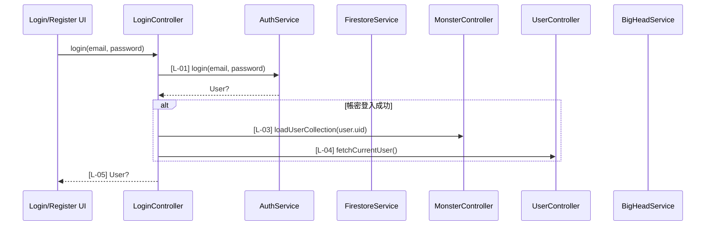
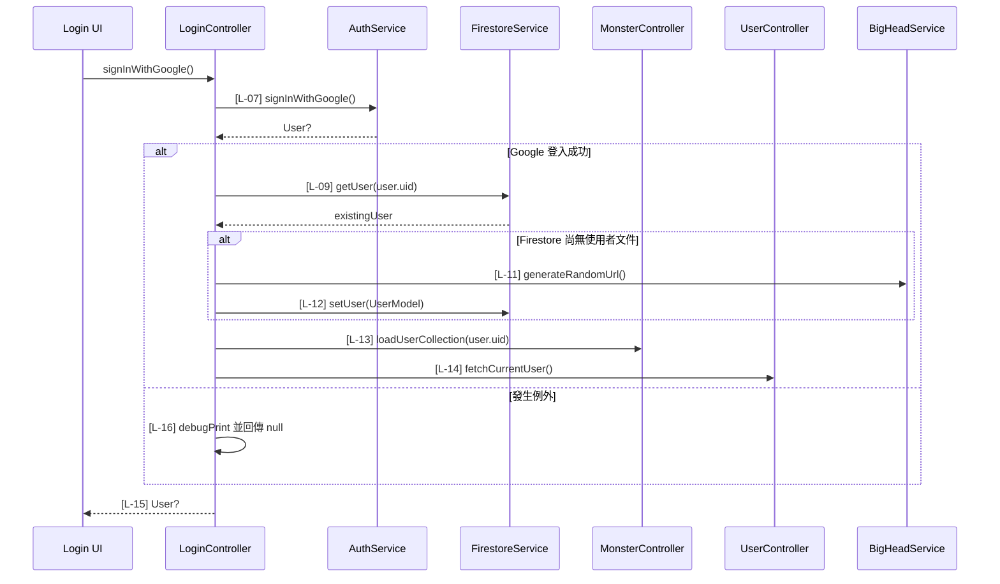
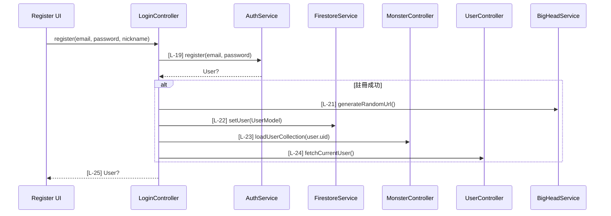
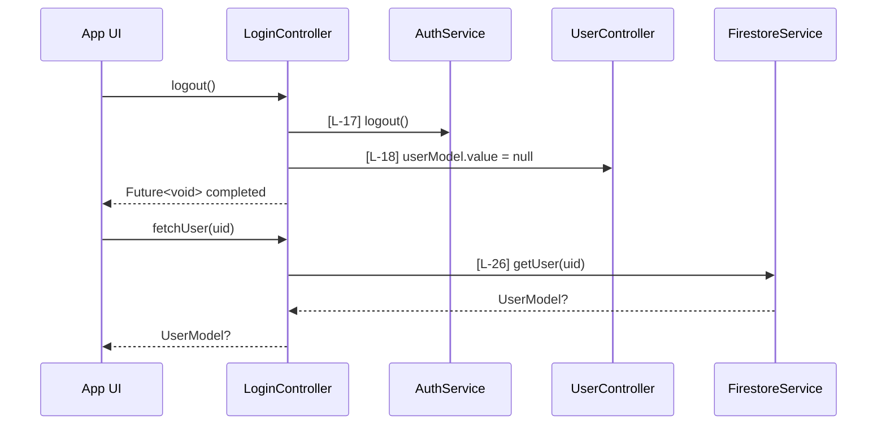

# login_controller.dart 邏輯追蹤表

## Task 0: 檔案用途與使用方式

### 0-1. 檔案簡介

`login_controller.dart` 是登入、Google 登入、登出、註冊與使用者資料查詢的流程協調器。它負責呼叫 `AuthService` 完成認證，並在認證成功後同步載入怪獸收藏與目前使用者資料。它也會在新使用者註冊或第一次 Google 登入時建立 Firestore 使用者文件與隨機頭像。此檔案不負責 UI 顯示、表單驗證、Firebase SDK 細節或 Firestore 底層查詢實作，通常由登入頁、註冊頁或需要查詢使用者資料的 UI/controller 呼叫。

### 0-2. 檔案類型判斷

主要類型：C. 狀態管理檔案 Controller / Provider / Bloc / ViewModel

次要類型：D. API / Service / Repository 協調檔案，因為它委派 `AuthService` 與 `FirestoreService` 執行外部資料來源操作。

### 使用方式或呼叫方式

此 controller 依賴 GetX 註冊好的 `MonsterController` 與 `UserController`。使用前需確保兩者已經透過 `Get.put`、`Get.lazyPut` 或其他 GetX 註冊方式建立，否則 `Get.find` 會在初始化時失敗。

```dart
final loginController = LoginController();

final user = await loginController.login(email, password);
if (user != null) {
  // 登入成功，使用者收藏與目前使用者資料已載入
}
```

### 狀態表

| 狀態名稱 | 型別 | 初始值 | 改變時機 | UI 用途 |
|---|---|---|---|---|
| `monsterController` | `MonsterController` | 由 `Get.find<MonsterController>()` 取得 | 登入、Google 登入、註冊成功後呼叫 `loadUserCollection` | 讓 UI 顯示使用者已擁有的怪獸收藏 |
| `userController.userModel.value` | `UserModel?` | 由 `UserController` 管理 | 登入、Google 登入、註冊成功後重新抓取；登出後設為 null | 讓 UI 判斷目前登入者資料與登出狀態 |

### 方法表

| 方法名稱 | 作用 | 輸入 | 輸出 | 是否需要 await | 可能錯誤 |
|---|---|---|---|---|---|
| `login` | 使用 email/password 登入並載入登入後資料 | `email: String`、`password: String` | `Future<User?>` | 是 | 認證失敗、網路錯誤、GetX controller 未註冊、收藏或使用者資料載入失敗 |
| `signInWithGoogle` | 啟動 Google 登入，必要時建立 Firestore 使用者文件 | 無 | `Future<User?>` | 是 | Google 登入取消、認證失敗、Firestore 讀寫失敗；此方法會 catch 並回傳 null |
| `logout` | 登出並清空目前使用者資料 | 無 | `Future<void>` | 是 | 登出服務失敗 |
| `register` | 使用 email/password 註冊，建立 Firestore 使用者文件並載入登入後資料 | `email: String`、`password: String`、`nickname: String` | `Future<User?>` | 是 | 註冊失敗、Firestore 寫入失敗、收藏或使用者資料載入失敗 |
| `fetchUser` | 依 uid 查詢 Firestore 使用者資料 | `uid: String` | `Future<UserModel?>` | 是 | Firestore 查詢失敗、使用者不存在 |

## 目前版本邏輯對照表

<table>
  <thead>
    <tr>
      <th>ID</th>
      <th>目的標籤</th>
      <th>邏輯描述</th>
      <th>函數為單位</th>
    </tr>
  </thead>
  <tbody>
    <tr>
      <td>[L-01]</td>
      <td>目的[帳密認證]</td>
      <td>在 <code>login</code> 中使用 <code>email</code> 與 <code>password</code>[皆來自函數參數] 呼叫 <code>_authService.login</code>[來自私有服務欄位]，等待 Firebase 帳密登入結果。</td>
      <td rowspan="5">【兼用函數】(Hybrid)<br>Input: <code>email: String</code>，登入信箱；<code>password: String</code>，登入密碼。<br>Process: 委派 AuthService 執行登入；若取得 User，依序載入怪獸收藏與目前使用者資料。<br>Output: <code>Future&lt;User?&gt;</code>，成功回傳 Firebase User，失敗或未登入回傳 null。</td>
    </tr>
    <tr>
      <td>[L-02]</td>
      <td>目的[成功狀態分支]</td>
      <td>檢查 <code>user</code>[區域變數，來自 AuthService 登入結果] 是否不為 null，只有登入成功才執行登入後資料同步。</td>
    </tr>
    <tr>
      <td>[L-03]</td>
      <td>目的[收藏資料同步]</td>
      <td>使用 <code>user.uid</code>[來自 Firebase User] 呼叫 <code>monsterController.loadUserCollection</code>[來自 GetX MonsterController]，等待使用者怪獸收藏載入完成。</td>
    </tr>
    <tr>
      <td>[L-04]</td>
      <td>目的[使用者狀態更新]</td>
      <td>呼叫 <code>userController.fetchCurrentUser</code>[來自 GetX UserController]，等待目前登入者的 Firestore 資料同步到 controller 狀態。</td>
    </tr>
    <tr>
      <td>[L-05]</td>
      <td>目的[登入結果回傳]</td>
      <td>回傳 <code>user</code>[區域變數，來自 AuthService 登入結果]，讓呼叫端判斷登入是否成功。</td>
    </tr>
    <tr>
      <td>[L-06]</td>
      <td>目的[例外保護]</td>
      <td>在 <code>signInWithGoogle</code> 中進入 <code>try</code> 區塊並輸出 debug 訊息，保護 Google 登入與 Firestore 同步流程的非同步錯誤。</td>
      <td rowspan="11">【兼用函數】(Hybrid)<br>Input: 無。<br>Process: 啟動 Google 登入；若成功取得 User，檢查 Firestore 是否已有使用者文件；新使用者建立隨機頭像與 UserModel；最後載入怪獸收藏與目前使用者資料；任何例外會被捕獲並記錄。<br>Output: <code>Future&lt;User?&gt;</code>，成功回傳 Firebase User，登入取消或流程失敗回傳 null。</td>
    </tr>
    <tr>
      <td>[L-07]</td>
      <td>目的[第三方認證]</td>
      <td>呼叫 <code>_authService.signInWithGoogle</code>[來自私有服務欄位] 並等待 Google 認證結果寫入 <code>user</code>[區域變數]。</td>
    </tr>
    <tr>
      <td>[L-08]</td>
      <td>目的[成功狀態分支]</td>
      <td>檢查 <code>user</code>[區域變數，來自 Google 登入結果] 是否不為 null，避免登入取消或失敗時繼續存取 <code>user.uid</code>。</td>
    </tr>
    <tr>
      <td>[L-09]</td>
      <td>目的[既有資料檢查]</td>
      <td>使用 <code>user.uid</code>[來自 Firebase User] 呼叫 <code>_firestoreService.getUser</code>[來自私有服務欄位]，查詢 Firestore 是否已有對應使用者文件並存入 <code>existingUser</code>[區域變數]。</td>
    </tr>
    <tr>
      <td>[L-10]</td>
      <td>目的[新使用者分支]</td>
      <td>檢查 <code>existingUser</code>[區域變數，來自 Firestore 查詢結果] 是否為 null，只有首次登入的 Google 使用者才建立 Firestore 文件。</td>
    </tr>
    <tr>
      <td>[L-11]</td>
      <td>目的[預設頭像建立]</td>
      <td>呼叫 <code>BigHeadService.generateRandomUrl</code>[來自 BigHeadService] 產生 <code>photoUrl</code>[區域變數]，強制使用系統產生的 SVG 頭像。</td>
    </tr>
    <tr>
      <td>[L-12]</td>
      <td>目的[使用者資料建立]</td>
      <td>呼叫 <code>_firestoreService.setUser</code>[來自私有服務欄位]，以 <code>user.uid</code>、<code>user.email ?? ""</code>、<code>user.displayName ?? "冒險者"</code>[皆來自 Firebase User 與 fallback 常數] 和 <code>photoUrl</code>[區域變數] 建立 <code>UserModel</code>。</td>
    </tr>
    <tr>
      <td>[L-13]</td>
      <td>目的[收藏資料同步]</td>
      <td>Google 登入成功後使用 <code>user.uid</code>[來自 Firebase User] 呼叫 <code>monsterController.loadUserCollection</code>[來自 GetX MonsterController]，等待收藏資料載入完成。</td>
    </tr>
    <tr>
      <td>[L-14]</td>
      <td>目的[使用者狀態更新]</td>
      <td>呼叫 <code>userController.fetchCurrentUser</code>[來自 GetX UserController]，將目前使用者資料同步到全域狀態。</td>
    </tr>
    <tr>
      <td>[L-15]</td>
      <td>目的[登入結果回傳]</td>
      <td>回傳 <code>user</code>[區域變數，來自 Google 登入結果]，供呼叫端判斷是否繼續導頁。</td>
    </tr>
    <tr>
      <td>[L-16]</td>
      <td>目的[異常捕獲]</td>
      <td>捕獲 <code>e</code>[catch 區域變數]，使用 <code>debugPrint</code>[來自 Flutter foundation] 記錄失敗原因並回傳 null，避免例外向 UI 擴散。</td>
    </tr>
    <tr>
      <td>[L-17]</td>
      <td>目的[登出認證]</td>
      <td>在 <code>logout</code> 中呼叫 <code>_authService.logout</code>[來自私有服務欄位] 並等待 Firebase 登出完成。</td>
      <td rowspan="2">【功能函數】(Action Performer)<br>Purpose: 登出/狀態清除。<br>Action: 委派 AuthService 執行登出；登出完成後清空 UserController 中的目前使用者資料。</td>
    </tr>
    <tr>
      <td>[L-18]</td>
      <td>目的[使用者狀態清除]</td>
      <td>將 <code>userController.userModel.value</code>[來自 GetX UserController reactive 狀態] 設為 null，讓 UI 進入未登入狀態。</td>
    </tr>
    <tr>
      <td>[L-19]</td>
      <td>目的[帳號註冊]</td>
      <td>在 <code>register</code> 中使用 <code>email</code> 與 <code>password</code>[皆來自函數參數] 呼叫 <code>_authService.register</code>[來自私有服務欄位]，等待 Firebase 註冊結果。</td>
      <td rowspan="7">【兼用函數】(Hybrid)<br>Input: <code>email: String</code>，註冊信箱；<code>password: String</code>，註冊密碼；<code>nickname: String</code>，使用者暱稱。<br>Process: 委派 AuthService 建立帳號；若成功取得 User，產生隨機頭像並建立 Firestore 使用者文件；最後載入怪獸收藏與目前使用者資料。<br>Output: <code>Future&lt;User?&gt;</code>，成功回傳 Firebase User，註冊失敗回傳 null 或由 AuthService 拋出錯誤。</td>
    </tr>
    <tr>
      <td>[L-20]</td>
      <td>目的[成功狀態分支]</td>
      <td>檢查 <code>user</code>[區域變數，來自 AuthService 註冊結果] 是否不為 null，只有註冊成功才建立 Firestore 使用者資料。</td>
    </tr>
    <tr>
      <td>[L-21]</td>
      <td>目的[預設頭像建立]</td>
      <td>呼叫 <code>BigHeadService.generateRandomUrl</code>[來自 BigHeadService] 產生 <code>randomAvatar</code>[區域變數]，作為新註冊帳號頭像。</td>
    </tr>
    <tr>
      <td>[L-22]</td>
      <td>目的[使用者資料建立]</td>
      <td>呼叫 <code>_firestoreService.setUser</code>[來自私有服務欄位]，以 <code>user.uid</code>、<code>user.email ?? email</code>[來自 Firebase User 與函數參數 fallback]、<code>nickname</code>[函數參數] 與 <code>randomAvatar</code>[區域變數] 建立 Firestore 使用者文件。</td>
    </tr>
    <tr>
      <td>[L-23]</td>
      <td>目的[收藏資料同步]</td>
      <td>註冊成功後使用 <code>user.uid</code>[來自 Firebase User] 呼叫 <code>monsterController.loadUserCollection</code>[來自 GetX MonsterController]，等待收藏資料載入完成。</td>
    </tr>
    <tr>
      <td>[L-24]</td>
      <td>目的[使用者狀態更新]</td>
      <td>呼叫 <code>userController.fetchCurrentUser</code>[來自 GetX UserController]，將剛建立的使用者資料同步到全域狀態。</td>
    </tr>
    <tr>
      <td>[L-25]</td>
      <td>目的[註冊結果回傳]</td>
      <td>回傳 <code>user</code>[區域變數，來自 AuthService 註冊結果]，讓呼叫端判斷是否進入登入後流程。</td>
    </tr>
    <tr>
      <td>[L-26]</td>
      <td>目的[使用者查詢]</td>
      <td>在 <code>fetchUser</code> 中使用 <code>uid</code>[函數參數] 呼叫 <code>_firestoreService.getUser</code>[來自私有服務欄位]，等待並回傳 Firestore 中的 <code>UserModel?</code>。</td>
      <td>【回傳函數】(Data Transformer)<br>Input: <code>uid: String</code>，Firebase 使用者唯一識別碼。<br>Process: 將 uid 委派給 FirestoreService 查詢使用者文件。<br>Output: <code>Future&lt;UserModel?&gt;</code>，存在則回傳使用者模型，不存在則回傳 null。</td>
    </tr>
  </tbody>
</table>

## 視覺化結構圖

此檔案沒有 Widget Tree。

## Task 3: 場景時序圖









## Task 4: 測資建議表

| ID | 建議測試極端值或狀態 |
|---|---|
| [L-01] | `email` 為不存在帳號、`password` 為錯誤密碼 |
| [L-02] | `_authService.login` 回傳 null |
| [L-03] | 登入成功但 `loadUserCollection` 遇到空收藏或 Firestore 無收藏資料 |
| [L-04] | `fetchCurrentUser` 查不到目前使用者文件 |
| [L-05] | 登入成功與登入失敗各測一次回傳值 |
| [L-06] | Google 登入流程中任一非同步步驟拋出例外 |
| [L-07] | 使用者取消 Google 登入，確認回傳 null |
| [L-08] | `_authService.signInWithGoogle` 回傳 null，不應查 Firestore |
| [L-09] | Firestore 已存在該 uid 使用者文件 |
| [L-10] | Firestore 回傳 null，確認進入新使用者建立流程 |
| [L-11] | 頭像服務回傳有效 SVG URL 字串 |
| [L-12] | Google 帳號 `email` 或 `displayName` 為 null，確認 fallback 值正確 |
| [L-13] | Google 登入成功但收藏為空清單 |
| [L-14] | Google 登入後 `fetchCurrentUser` 延遲回應 |
| [L-15] | Google 登入成功、取消、例外三種狀態的回傳值 |
| [L-16] | 模擬 Firestore 寫入失敗，確認 catch 後回傳 null |
| [L-17] | 已登入與未登入狀態下呼叫登出 |
| [L-18] | 登出後確認 `userController.userModel.value` 為 null |
| [L-19] | `email` 格式錯誤、弱密碼、已註冊信箱 |
| [L-20] | `_authService.register` 回傳 null，不應建立 Firestore 文件 |
| [L-21] | 註冊時頭像服務產生有效 URL |
| [L-22] | Firebase User 的 `email` 為 null，確認使用函數參數 `email` fallback |
| [L-23] | 註冊成功後收藏資料尚未存在 |
| [L-24] | 註冊成功後立即查詢目前使用者資料 |
| [L-25] | 註冊成功與失敗各測一次回傳值 |
| [L-26] | 傳入空字串 uid、不存在 uid、存在 uid |
