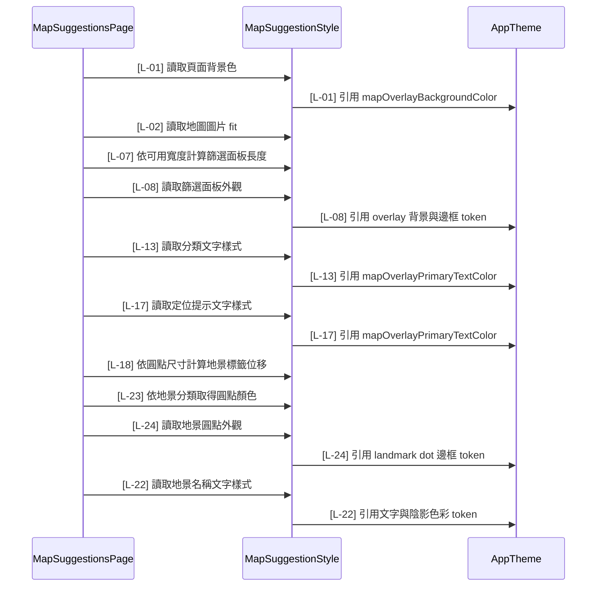

# map_suggestion_style.dart 邏輯追蹤表

## Task 0: 檔案用途與使用方式

### 0-1. 檔案簡介

`map_suggestion_style.dart` 集中管理 `MapSuggestionsPage` 使用的 UI 樣式常數與簡單尺寸 helper。它負責提供頁面背景、地圖圖片 fit、定位標示尺寸、篩選面板外觀、訊息文字樣式與地景標籤樣式，其中色彩會橋接到 `AppTheme` 的全域語意 token，並針對「裝置藝術」分類提供藍色地景圓點。它不負責 GPS 權限、座標換算、地景資料載入、widget 狀態更新或全域主題 token 的原始定義。通常由 `map_suggestions.dart` 直接引用，並由 `app_theme.dart` 提供底層色彩基準。

### 0-2. 檔案類型判斷

主要類型：B. 可重用 Widget 檔案 Reusable Widget / Component 的樣式輔助檔  
次要類型：E. Model / Data Class 檔案，因為此檔以靜態欄位集中提供結構化樣式資料。

### 使用方式或呼叫方式

呼叫端不需要建立 `MapSuggestionStyle` 實例，直接透過 class 靜態成員讀取樣式。若需要依畫面寬度計算篩選面板長度，呼叫 `filterPanelLength` 並傳入目前可用寬度。若要調整地圖建議頁的共用色彩，優先修改 `AppTheme` 中的 `mapOverlay*` 或 `mapLandmark*` token，再由本檔自動套用；文字樣式本身仍由 `MapSuggestionStyle` 管理，避免在 `AppTheme` 新增地圖頁專用字體設定。

```dart
Scaffold(
  backgroundColor: MapSuggestionStyle.pageBackgroundColor,
);

final panelLength = MapSuggestionStyle.filterPanelLength(
  constraints.maxWidth,
);
```

### 樣式成員表

| 成員名稱 | 型別 | 是否可為 null | 作用 | 注意事項 |
|---|---|---|---|---|
| `pageBackgroundColor` | `Color` | 否 | 地圖頁背景色 | 來源為 `AppTheme.mapOverlayBackgroundColor`，由 `MapSuggestionsPage` 的 `Scaffold` 使用 |
| `mapImageFit` | `BoxFit` | 否 | 地圖圖片顯示方式 | 需維持 contain，避免地圖被裁切 |
| `markerSize` | `double` | 否 | 目前位置圖片尺寸 | 同時用於寬高與中心偏移 |
| `landmarkDotSize` | `double` | 否 | 地景圓點尺寸 | 同時用於圓點寬高與標籤位移 |
| `filterPanelInset` | `double` | 否 | 篩選面板距離畫面邊界的定位值 | 由 `Positioned` 使用 |
| `filterPanelWidthRatio` | `double` | 否 | 篩選面板寬度比例 | 由 `filterPanelLength` 使用 |
| `filterPanelLength` | `double Function(double)` | 否 | 將可用寬度換算為面板長度 | 傳入值應為目前 layout 寬度 |
| `filterPanelDecoration` | `BoxDecoration` | 否 | 篩選面板外觀 | 色彩來源為 `AppTheme.mapOverlayBackgroundColor` 與 `AppTheme.mapOverlayBorderColor`；使用 getter 避免非常數 decoration 限制 |
| `filterTileDense` | `bool` | 否 | checkbox 選項密度 | 傳給 `CheckboxListTile` |
| `filterTileControlAffinity` | `ListTileControlAffinity` | 否 | checkbox 位置 | 傳給 `CheckboxListTile` |
| `filterTileActiveColor` | `Color` | 否 | checkbox 啟用色 | 來源為 `AppTheme.mapOverlayPrimaryTextColor`，傳給 `CheckboxListTile` |
| `filterTileCheckColor` | `Color` | 否 | checkbox 勾選圖示色 | 來源為 `AppTheme.mapOverlayCheckColor`，傳給 `CheckboxListTile` |
| `filterOptionTextStyle` | `TextStyle` | 否 | 篩選分類文字樣式 | 文字顏色來源為 `AppTheme.mapOverlayPrimaryTextColor`，傳給分類名稱 `Text` |
| `loadMessagePadding` | `EdgeInsets` | 否 | 地景載入訊息外距 | 傳給 `Padding` |
| `loadMessageAlignment` | `Alignment` | 否 | 地景載入訊息對齊 | 傳給 `Align` |
| `loadMessageTextStyle` | `TextStyle` | 否 | 地景載入訊息文字樣式 | 文字顏色來源為 `AppTheme.mapOverlaySecondaryTextColor`，傳給錯誤訊息 `Text` |
| `locationMessageTextStyle` | `TextStyle` | 否 | 定位提示文字樣式 | 文字顏色來源為 `AppTheme.mapOverlayPrimaryTextColor`，傳給定位提示 `Text` |
| `landmarkLabelOffset` | `Offset Function(double)` | 否 | 依圓點尺寸計算標籤中心偏移 | 傳入 dot size 後回傳負半徑 offset |
| `landmarkLabelAxisSize` | `MainAxisSize` | 否 | 地景標籤橫向容器尺寸策略 | 傳給 `Row` |
| `installationArtDotColor` | `Color` | 否 | 裝置藝術圓點顏色 | 使用藍色，供 `landmarkDotColor` 判斷分類時套用 |
| `landmarkDotColor` | `Color Function(String)` | 否 | 依地景分類取得圓點顏色 | `category` 為 `裝置藝術` 時回傳藍色，其他分類回傳 `AppTheme.mapLandmarkDotColor` |
| `landmarkDotDecoration` | `BoxDecoration Function(String)` | 否 | 地景圓點外觀 | 填色來源為 `landmarkDotColor(category)`，邊框色來源為 `AppTheme.mapLandmarkDotBorderColor` |
| `landmarkLabelSpacing` | `double` | 否 | 地景圓點與文字距離 | 傳給 `SizedBox` |
| `landmarkNameTextStyle` | `TextStyle` | 否 | 地景名稱文字樣式 | 文字與陰影顏色來源為 `AppTheme.mapOverlayPrimaryTextColor` 與 `AppTheme.mapLandmarkTextShadowColor`，傳給地景名稱 `Text` |

## Task 1: 邏輯對照表

| ID | 目的標籤 | 邏輯描述 | 函數為單位 |
|---|---|---|---|
| [L-01] | 目的[主題橋接] | 宣告 `pageBackgroundColor`[來自 `MapSuggestionStyle` 靜態常數]，引用 `AppTheme.mapOverlayBackgroundColor`[來自 `AppTheme` 靜態常數] 提供地圖頁背景色。 | 【回傳函數】(Data Transformer)<br>Input: 無。<br>Process: 集中保存地圖頁共用樣式常數，讓 view 檔只引用命名樣式；色彩由 `AppTheme` 提供全域語意來源，文字樣式由本檔沿用原本設定。<br>Output: `MapSuggestionStyle` 靜態樣式集合。 |
| [L-02] | 目的[圖片適配] | 宣告 `mapImageFit`[來自 `MapSuggestionStyle` 靜態常數]，指定地圖圖片使用 contain 顯示。 | 同 [L-01]。 |
| [L-03] | 目的[標示尺寸] | 宣告 `markerSize`[來自 `MapSuggestionStyle` 靜態常數]，提供目前位置圖片寬高與中心偏移基準。 | 同 [L-01]。 |
| [L-04] | 目的[標示尺寸] | 宣告 `landmarkDotSize`[來自 `MapSuggestionStyle` 靜態常數]，提供地景圓點寬高與位移基準。 | 同 [L-01]。 |
| [L-05] | 目的[面板定位] | 宣告 `filterPanelInset`[來自 `MapSuggestionStyle` 靜態常數]，控制篩選面板距離畫面邊界的位置。 | 同 [L-01]。 |
| [L-06] | 目的[比例設定] | 宣告 `filterPanelWidthRatio`[來自 `MapSuggestionStyle` 靜態常數]，作為面板寬度與可用寬度的比例。 | 同 [L-01]。 |
| [L-07] | 目的[尺寸計算] | `filterPanelLength` 使用 `availableWidth`[來自函數參數] 乘上 `filterPanelWidthRatio`[靜態常數]，回傳面板長度。 | 【回傳函數】(Data Transformer)<br>Input: `availableWidth: double`，目前 layout 可用寬度。<br>Process: 依固定比例換算篩選面板寬高基準。<br>Output: `double`，面板長度。 |
| [L-08] | 目的[主題橋接] | `filterPanelDecoration`[來自 `MapSuggestionStyle` 靜態 getter] 引用 `AppTheme.mapOverlayBackgroundColor` 與 `AppTheme.mapOverlayBorderColor`[皆來自 `AppTheme` 靜態常數] 建立篩選面板外觀。 | 【回傳函數】(Data Transformer)<br>Input: 無。<br>Process: 建立 `BoxDecoration`，並從 `AppTheme` 取得面板背景與邊框色，再套用圓角樣式。<br>Output: `BoxDecoration`，篩選面板外觀設定。 |
| [L-09] | 目的[選項密度] | 宣告 `filterTileDense`[來自 `MapSuggestionStyle` 靜態常數]，讓 checkbox 選項使用緊湊顯示。 | 同 [L-01]。 |
| [L-10] | 目的[選項排列] | 宣告 `filterTileControlAffinity`[來自 `MapSuggestionStyle` 靜態常數]，控制 checkbox 位於選項前方。 | 同 [L-01]。 |
| [L-11] | 目的[主題橋接] | 宣告 `filterTileActiveColor`[來自 `MapSuggestionStyle` 靜態常數]，引用 `AppTheme.mapOverlayPrimaryTextColor`[來自 `AppTheme` 靜態常數] 提供 checkbox 啟用色。 | 同 [L-01]。 |
| [L-12] | 目的[主題橋接] | 宣告 `filterTileCheckColor`[來自 `MapSuggestionStyle` 靜態常數]，引用 `AppTheme.mapOverlayCheckColor`[來自 `AppTheme` 靜態常數] 提供 checkbox 勾選符號色。 | 同 [L-01]。 |
| [L-13] | 目的[主題橋接] | 宣告 `filterOptionTextStyle`[來自 `MapSuggestionStyle` 靜態常數]，引用 `AppTheme.mapOverlayPrimaryTextColor`[來自 `AppTheme` 靜態常數] 作為篩選分類文字顏色。 | 同 [L-01]。 |
| [L-14] | 目的[訊息間距] | 宣告 `loadMessagePadding`[來自 `MapSuggestionStyle` 靜態常數]，提供地景載入訊息外距。 | 同 [L-01]。 |
| [L-15] | 目的[訊息對齊] | 宣告 `loadMessageAlignment`[來自 `MapSuggestionStyle` 靜態常數]，提供地景載入訊息對齊位置。 | 同 [L-01]。 |
| [L-16] | 目的[主題橋接] | 宣告 `loadMessageTextStyle`[來自 `MapSuggestionStyle` 靜態常數]，引用 `AppTheme.mapOverlaySecondaryTextColor`[來自 `AppTheme` 靜態常數] 作為地景載入訊息文字顏色。 | 同 [L-01]。 |
| [L-17] | 目的[主題橋接] | 宣告 `locationMessageTextStyle`[來自 `MapSuggestionStyle` 靜態常數]，引用 `AppTheme.mapOverlayPrimaryTextColor`[來自 `AppTheme` 靜態常數] 作為定位提示文字顏色。 | 同 [L-01]。 |
| [L-18] | 目的[位移計算] | `landmarkLabelOffset` 使用 `dotSize`[來自函數參數] 計算負半徑位移，使地景圓點中心對齊座標。 | 【回傳函數】(Data Transformer)<br>Input: `dotSize: double`，地景圓點尺寸。<br>Process: 將尺寸除以 2 並轉成負向 X/Y 位移。<br>Output: `Offset`，地景標籤位移值。 |
| [L-19] | 目的[容器尺寸] | 宣告 `landmarkLabelAxisSize`[來自 `MapSuggestionStyle` 靜態常數]，讓地景標籤橫向容器只佔內容所需空間。 | 同 [L-01]。 |
| [L-20] | 目的[分類視覺] | 宣告 `installationArtDotColor`[來自 `MapSuggestionStyle` 靜態常數]，提供「裝置藝術」地景使用的藍色圓點。 | 同 [L-01]。 |
| [L-21] | 目的[標籤間距] | 宣告 `landmarkLabelSpacing`[來自 `MapSuggestionStyle` 靜態常數]，提供地景圓點與名稱文字之間的距離。 | 同 [L-01]。 |
| [L-22] | 目的[主題橋接] | 宣告 `landmarkNameTextStyle`[來自 `MapSuggestionStyle` 靜態常數]，引用 `AppTheme.mapOverlayPrimaryTextColor` 與 `AppTheme.mapLandmarkTextShadowColor`[皆來自 `AppTheme` 靜態常數] 作為地景名稱文字與陰影顏色。 | 同 [L-01]。 |
| [L-23] | 目的[分類視覺] | `landmarkDotColor` 使用 `category`[來自函數參數] 判斷是否為 `裝置藝術`；若是則回傳 `installationArtDotColor`[靜態常數]，否則回傳 `AppTheme.mapLandmarkDotColor`[靜態常數]。 | 【回傳函數】(Data Transformer)<br>Input: `category: String`，地景分類名稱。<br>Process: 依分類名稱選擇藍色或預設圓點色。<br>Output: `Color`，該分類應使用的地景圓點顏色。 |
| [L-24] | 目的[主題橋接] | `landmarkDotDecoration`[來自 `MapSuggestionStyle` 靜態函數] 使用 `category`[來自函數參數] 呼叫 `landmarkDotColor`，並引用 `AppTheme.mapLandmarkDotBorderColor`[靜態常數] 建立地景圓點外觀。 | 【回傳函數】(Data Transformer)<br>Input: `category: String`，地景分類名稱。<br>Process: 建立 `BoxDecoration`，依分類決定填色，再套用圓形與邊框樣式。<br>Output: `BoxDecoration`，地景圓點外觀設定。 |

## 視覺化結構圖

此檔案沒有 Widget Tree。

## Task 3: 函數為單位對照表

| 函數名稱 | 目的標籤 | 包含範圍 | 函數功能介紹 |
|---|---|---|---|
| `MapSuggestionStyle` 靜態樣式集合 | 目的[主題橋接] | [L-01] ~ [L-06], [L-09] ~ [L-17], [L-19] ~ [L-22] | 【回傳函數】(Data Transformer)<br>Input: 無。<br>Process: 將地圖建議頁會用到的固定尺寸、排列策略與樣式 token 集中命名；其中色彩透過 `AppTheme` 取得全域語意來源，文字樣式不在 `AppTheme` 新增專用字體設定。<br>Output: `MapSuggestionStyle` 靜態常數集合，供 `MapSuggestionsPage` 讀取。 |
| `filterPanelLength` | 目的[尺寸計算] | [L-07] | 【回傳函數】(Data Transformer)<br>Input: `availableWidth: double`，目前 layout 可用寬度。<br>Process: 使用 `availableWidth`[來自函數參數] 乘上 `filterPanelWidthRatio`[來自 `MapSuggestionStyle` 靜態常數]，換算篩選面板長度。<br>Output: `double`，篩選面板長度。 |
| `filterPanelDecoration` | 目的[主題橋接] | [L-08] | 【回傳函數】(Data Transformer)<br>Input: 無。<br>Process: 從 `AppTheme` 取得地圖 overlay 背景與邊框色，建立篩選面板使用的 `BoxDecoration`。<br>Output: `BoxDecoration`，篩選面板外觀設定。 |
| `landmarkLabelOffset` | 目的[位移計算] | [L-18] | 【回傳函數】(Data Transformer)<br>Input: `dotSize: double`，地景圓點尺寸。<br>Process: 將 `dotSize`[來自函數參數] 除以 2 後轉為負向 X/Y 位移，使圓點中心對齊圖片座標。<br>Output: `Offset`，地景標籤位移值。 |
| `landmarkDotColor` | 目的[分類視覺] | [L-23] | 【回傳函數】(Data Transformer)<br>Input: `category: String`，地景分類名稱。<br>Process: 判斷分類是否為 `裝置藝術`，是則使用藍色圓點，否則使用預設地景圓點色。<br>Output: `Color`，地景圓點填色。 |
| `landmarkDotDecoration` | 目的[主題橋接] | [L-24] | 【回傳函數】(Data Transformer)<br>Input: `category: String`，地景分類名稱。<br>Process: 呼叫 `landmarkDotColor` 取得分類填色，並從 `AppTheme` 取得地景圓點邊框色，建立地景圓點使用的 `BoxDecoration`。<br>Output: `BoxDecoration`，地景圓點外觀設定。 |

## Task 4: 場景時序圖



## Task 5: 測資建議表

| ID | 建議測試極端值或狀態 |
|---|---|
| [L-01] | 將 `AppTheme.mapOverlayBackgroundColor` 調整為亮色後，確認 `MapSuggestionStyle.pageBackgroundColor` 會同步反映且地圖邊界仍有足夠對比。 |
| [L-02] | 地圖圖片比例與畫面比例不同，確認 contain 不裁切。 |
| [L-03] | 目前位置圖片尺寸在小螢幕仍不遮蔽過多地圖。 |
| [L-04] | 地景圓點尺寸在地圖縮小時仍能辨識。 |
| [L-05] | 極小橫向寬度下篩選面板仍位於畫面內。 |
| [L-06] | 可用寬度很小或很大，確認比例值產生合理面板尺寸。 |
| [L-07] | `availableWidth` 為 0、300、3000，確認回傳值等於三分之一。 |
| [L-08] | 將 `AppTheme.mapOverlayBackgroundColor` 與 `AppTheme.mapOverlayBorderColor` 改為高亮或低對比色，確認面板仍能區分內容區域。 |
| [L-09] | 分類項目很多時，確認緊湊選項能減少高度占用。 |
| [L-10] | checkbox 位置在長分類名稱下仍易於掃描。 |
| [L-11] | 將 `AppTheme.mapOverlayPrimaryTextColor` 改為低亮度色，確認勾選分類後 active color 是否明確可見。 |
| [L-12] | 將 `AppTheme.mapOverlayCheckColor` 改為接近 active color，確認勾選符號是否仍有足夠對比。 |
| [L-13] | 分類名稱很長且文字顏色套用 `AppTheme.mapOverlayPrimaryTextColor` 後，文字仍可讀。 |
| [L-14] | 顯示載入錯誤訊息時，外距不讓文字貼住面板邊界。 |
| [L-15] | 載入訊息為多行時仍從左側對齊。 |
| [L-16] | 錯誤訊息在面板背景上套用 `AppTheme.mapOverlaySecondaryTextColor` 後是否可讀。 |
| [L-17] | GPS 未開啟或無權限提示套用 `AppTheme.mapOverlayPrimaryTextColor` 後是否可讀。 |
| [L-18] | `dotSize` 為 0、10、40 時，確認 offset 等於負半徑。 |
| [L-19] | 地景名稱很短與很長時，Row 仍只佔內容寬度。 |
| [L-20] | 顯示 `裝置藝術` 分類地景，確認圓點為藍色。 |
| [L-21] | 地景圓點與文字距離不重疊也不過遠。 |
| [L-22] | 地景名稱很長且套用 `AppTheme.mapOverlayPrimaryTextColor` 與 `AppTheme.mapLandmarkTextShadowColor` 後，文字陰影仍能提升可讀性。 |
| [L-23] | `category` 分別傳入 `裝置藝術`、`中大十景`、空字串，確認顏色分支正確。 |
| [L-24] | 將 `AppTheme.mapLandmarkDotBorderColor` 改為高亮或低對比色，確認不同分類圓點仍可辨識。 |
