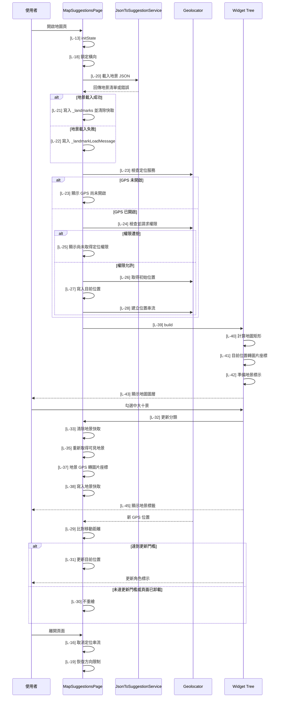

# map_suggestions.dart 邏輯追蹤表

## Task 0: 檔案用途與使用方式

### 0-1. 檔案簡介

`map_suggestions.dart` 是校園地圖建議頁面，負責顯示校園圖片地圖、目前 GPS 位置標示，以及可勾選顯示的固定地景標籤。它會處理頁面方向鎖定、定位權限流程、GPS 座標轉圖片座標、地景資料載入與篩選狀態。它不負責解析單筆 JSON 欄位格式，該工作由 `JsonToSuggestionService` 處理；也不負責維護 UI 樣式常數，樣式集中在 `MapSuggestionStyle`。通常由其他頁面透過 `Navigator` 進入此頁。

### 0-2. 檔案類型判斷

主要類型：A. 頁面檔案 Page / Screen  
次要類型：B. 可重用 Widget 檔案 Reusable Widget / Component，因為同檔包含 `_LandmarkFilterPanel` 與 `_LandmarkLabel` 私有元件。

### 使用方式或呼叫方式

此頁面不需要建構子參數，呼叫端可直接 push `MapSuggestionsPage`。使用前需確認定位權限設定已完成，`geolocator` 可在目標平台運作，且 `pubspec.yaml` 已宣告地圖圖片、角色圖片與 `assets/json/locations/` 相關資源。畫面顏色、文字樣式、面板外觀、標示尺寸等由 `map_suggestion_style.dart` 提供；此頁面不會回傳資料給上一頁。

```dart
Navigator.push(
  context,
  MaterialPageRoute(
    builder: (_) => const MapSuggestionsPage(),
  ),
);
```

### 公開方法表

| 方法名稱 | 作用 | 輸入 | 輸出 | 是否需要 await | 可能錯誤 |
|---|---|---|---|---|---|
| `calculateContainedMapRect` | 計算圖片以 contain 規則放入容器時的實際矩形 | `containerSize: Size`、`imageSize: Size` | `Rect` | 否 | 尺寸為空時回傳 `Rect.zero` |
| `gpsToImageOffset` | 將 GPS 經緯度換算成圖片內座標 | `latitude: double`、`longitude: double`、`imageSize: Size` | `Offset` | 否 | 超出校園 GPS 邊界時會 clamp 到圖片邊界 |

## Task 1: 邏輯對照表

| ID | 目的標籤 | 邏輯描述 | 函數為單位 |
|---|---|---|---|
| [L-01] | 目的[資源路徑] | 宣告 `map_path`[來自 `MapSuggestionsVariables` 靜態常數]，指定地圖圖片 asset 路徑。 | 【回傳函數】(Data Transformer)<br>Input: 無。<br>Process: 集中宣告地圖圖片、目前位置圖片、地圖原始尺寸、GPS 邊界、分類名稱與 JSON 路徑；純 UI 樣式常數改由 `MapSuggestionStyle` 提供。<br>Output: `MapSuggestionsVariables` 靜態常數集合。 |
| [L-02] | 目的[資源路徑] | 宣告 `position_char`[來自 `MapSuggestionsVariables` 靜態常數]，指定目前位置角色圖片 asset 路徑。 | 同 [L-01]。 |
| [L-03] | 目的[圖片基準] | 宣告 `mapImageSize`[來自 `MapSuggestionsVariables` 靜態常數]，作為 GPS 座標換算與圖片 contain 計算的原始地圖尺寸。 | 同 [L-01]。 |
| [L-04] | 目的[GPS 邊界] | 宣告 `southwestLatitude`[來自 `MapSuggestionsVariables` 靜態常數]，表示地圖左下角緯度。 | 同 [L-01]。 |
| [L-05] | 目的[GPS 邊界] | 宣告 `southwestLongitude`[來自 `MapSuggestionsVariables` 靜態常數]，表示地圖左下角經度。 | 同 [L-01]。 |
| [L-06] | 目的[GPS 邊界] | 宣告 `northeastLatitude`[來自 `MapSuggestionsVariables` 靜態常數]，表示地圖右上角緯度。 | 同 [L-01]。 |
| [L-07] | 目的[GPS 邊界] | 宣告 `northeastLongitude`[來自 `MapSuggestionsVariables` 靜態常數]，表示地圖右上角經度。 | 同 [L-01]。 |
| [L-08] | 目的[樣式引用] | 在目前位置 `Positioned`[Widget] 中讀取 `markerSize`[來自 `MapSuggestionStyle` 靜態常數]，控制角色圖片定位偏移與顯示尺寸。 | 同 [L-39]。 |
| [L-09] | 目的[效能優化] | 宣告 `locationUpdateMeters`[來自 `MapSuggestionsVariables` 靜態常數]，作為 GPS 位置更新的最小移動距離門檻。 | 同 [L-01]。 |
| [L-10] | 目的[分類名稱] | 宣告 `ncuTenViewsCategory`[來自 `MapSuggestionsVariables` 靜態常數]，作為篩選面板分類名稱與地景 `category` 比對值。 | 同 [L-01]。 |
| [L-11] | 目的[資料來源] | 宣告 `locationJsonPaths`[來自 `MapSuggestionsVariables` 靜態常數]，提供地景 service 載入的 JSON asset 路徑清單。 | 同 [L-01]。 |
| [L-12] | 目的[樣式引用] | 在 `_LandmarkLabel.build` 中讀取 `landmarkDotSize`[來自 `MapSuggestionStyle` 靜態常數]，作為地景標籤位移與圓點尺寸基準。 | 同 [L-45]。 |
| [L-13] | 目的[方向控制] | 在 `initState`[State 生命週期函數] 呼叫 `_forceLandscape`[State 方法]，頁面初始化時鎖定橫向。 | 【功能函數】(Action Performer)<br>Purpose: 頁面初始化。<br>Action: 呼叫父類初始化；鎖定橫向；載入地景 JSON；啟動定位權限與位置監聽流程。 |
| [L-14] | 目的[資料載入] | 在 `initState`[State 生命週期函數] 呼叫 `_loadLandscapeLocations`[State 方法]，非同步載入固定地景資料。 | 同 [L-13]。 |
| [L-15] | 目的[定位啟動] | 在 `initState`[State 生命週期函數] 呼叫 `_startLocationTracking`[State 方法]，啟動定位服務檢查與 GPS 串流。 | 同 [L-13]。 |
| [L-16] | 目的[資源釋放] | 在 `dispose`[State 生命週期函數] 取消 `_positionSubscription`[State 欄位]，避免離開頁面後繼續接收位置串流。 | 【功能函數】(Action Performer)<br>Purpose: 生命週期收尾。<br>Action: 取消 GPS 串流訂閱；恢復裝置可用方向；呼叫父類 dispose。 |
| [L-17] | 目的[方向恢復] | 在 `dispose`[State 生命週期函數] 呼叫 `_restoreOrientation`[State 方法]，離開頁面時解除橫向限制。 | 同 [L-16]。 |
| [L-18] | 目的[方向控制] | 呼叫 `SystemChrome.setPreferredOrientations`[Flutter services API]，傳入 landscapeLeft 與 landscapeRight。 | 【功能函數】(Action Performer)<br>Purpose: 橫向鎖定。<br>Action: 要求系統只允許左右橫向，讓地圖頁符合橫向地圖檢視。 |
| [L-19] | 目的[方向恢復] | 呼叫 `SystemChrome.setPreferredOrientations`[Flutter services API]，傳入 `DeviceOrientation.values`[Flutter enum values]。 | 【功能函數】(Action Performer)<br>Purpose: 方向恢復。<br>Action: 解除頁面方向限制，避免影響其他頁面。 |
| [L-20] | 目的[資料載入] | 在 `_loadLandscapeLocations` 中呼叫 `_suggestionService.loadLocations`[State 欄位 service]，以 `locationJsonPaths`[靜態常數] 取得 `loadedLandmarks`[區域變數]。 | 【功能函數】(Action Performer)<br>Purpose: 地景載入與錯誤回饋。<br>Action: 委派 `JsonToSuggestionService` 讀取與解析 JSON；成功時寫入地景狀態並清除快取；失敗時保存錯誤訊息供面板顯示。 |
| [L-21] | 目的[狀態更新] | 載入成功且 `mounted`[State 生命週期屬性] 為 true 後，透過 `setState` 寫入 `_landmarks`[State 欄位]、清空 `_landmarkLoadMessage`[State 欄位] 並清除快取。 | 同 [L-20]。 |
| [L-22] | 目的[異常捕獲] | 捕獲 `error`[catch 變數] 後，確認 `mounted`[State 生命週期屬性]，再透過 `setState` 寫入 `_landmarkLoadMessage`[State 欄位] 並清除快取。 | 同 [L-20]。 |
| [L-23] | 目的[服務檢查] | 在 `_startLocationTracking` 中呼叫 `Geolocator.isLocationServiceEnabled`[Geolocator API] 取得 `serviceEnabled`[區域變數]；未開啟時寫入 `_locationMessage`[State 欄位] 後返回。 | 【功能函數】(Action Performer)<br>Purpose: 定位初始化與權限處理。<br>Action: 檢查定位服務；檢查與請求權限；無權限時顯示提示；有權限時取得初始位置並建立 GPS 串流。 |
| [L-24] | 目的[權限請求] | 使用 `permission`[區域變數] 保存 `Geolocator.checkPermission`[Geolocator API] 結果，若為 denied 則呼叫 `Geolocator.requestPermission`[Geolocator API]。 | 同 [L-23]。 |
| [L-25] | 目的[權限防護] | 檢查 `permission`[區域變數] 是否為 denied 或 deniedForever；若無定位權限則寫入 `_locationMessage`[State 欄位] 後返回。 | 同 [L-23]。 |
| [L-26] | 目的[初始定位] | 呼叫 `Geolocator.getCurrentPosition`[Geolocator API] 取得 `initialPosition`[區域變數]，並使用導航等級精度設定。 | 同 [L-23]。 |
| [L-27] | 目的[狀態更新] | 確認 `mounted`[State 生命週期屬性] 後，透過 `setState` 將 `initialPosition`[區域變數] 寫入 `_currentPosition`[State 欄位]，並設定 `_isLocationReady`[State 欄位] 與 `_locationMessage`[State 欄位]。 | 同 [L-23]。 |
| [L-28] | 目的[串流監聽] | 呼叫 `Geolocator.getPositionStream`[Geolocator API] 建立位置串流，並將訂閱保存到 `_positionSubscription`[State 欄位]。 | 同 [L-23]。 |
| [L-29] | 目的[更新判斷] | 在 `_handlePositionUpdate` 中使用 `previousPosition`[區域變數]、`position`[函數參數] 與 `locationUpdateMeters`[靜態常數] 計算是否達到更新門檻。 | 【功能函數】(Action Performer)<br>Purpose: 定位更新與效能保護。<br>Action: 比對新舊 GPS 距離；未達門檻或頁面已卸載時停止；達門檻才更新目前位置。 |
| [L-30] | 目的[重繪防護] | 若 `shouldUpdate`[區域變數] 為 false 或 `mounted`[State 生命週期屬性] 為 false，直接返回避免不必要重繪。 | 同 [L-29]。 |
| [L-31] | 目的[狀態更新] | 透過 `setState` 將 `position`[函數參數] 寫入 `_currentPosition`[State 欄位]，並更新定位就緒狀態與提示。 | 同 [L-29]。 |
| [L-32] | 目的[篩選更新] | 在 `_toggleCategory` 中接收 `category`[函數參數] 與 `value`[函數參數]，更新 `_selectedCategories`[State 欄位] 並清除快取。 | 【功能函數】(Action Performer)<br>Purpose: 勾選狀態更新。<br>Action: 接收 checkbox 變更；寫入分類是否顯示；清除地景 marker 快取使下次 build 重新計算。 |
| [L-33] | 目的[快取重置] | 在 `_clearLandmarkMarkerCache` 中清空 `_cachedLandmarkMapSize`、`_cachedSelectedCategoryKey` 與 `_cachedLandmarkMarkers`[皆來自 State 欄位]。 | 【功能函數】(Action Performer)<br>Purpose: 快取失效。<br>Action: 清除舊地景點位與快取鍵，避免分類、尺寸或資料變更後沿用舊座標。 |
| [L-34] | 目的[快取鍵產生] | 在 `_selectedCategoryKey` 中從 `_selectedCategories`[State 欄位] 取出已勾選分類，排序後用 `|` 串成快取鍵。 | 【回傳函數】(Data Transformer)<br>Input: 無，使用 `_selectedCategories: Map<String, bool>`[State 欄位]。<br>Process: 過濾已勾選項目、取出分類名稱、排序並串接。<br>Output: `String`，代表目前分類選取狀態的快取鍵。 |
| [L-35] | 目的[快取命中] | 在 `_visibleLandmarkMarkers` 中比較 `_cachedLandmarkMapSize`、`_cachedSelectedCategoryKey`[State 欄位] 與目前 `mapSize`[函數參數]、`selectedCategoryKey`[區域變數]；命中時回傳 `_cachedLandmarkMarkers`[State 欄位]。 | 【回傳函數】(Data Transformer)<br>Input: `mapSize: Size`，目前地圖實際顯示尺寸。<br>Process: 先檢查快取；未命中時依已選分類篩選地景，將 GPS 轉成圖片座標，最後寫入快取。<br>Output: `List<_LandmarkMarker>`，目前畫面需顯示的固定地景標示。 |
| [L-36] | 目的[分類集合] | 從 `_selectedCategories`[State 欄位] 建立 `selectedCategories`[區域變數]，只保留值為 true 的分類。 | 同 [L-35]。 |
| [L-37] | 目的[固定座標計算] | 篩選 `_landmarks`[State 欄位] 中 `category` 符合 `selectedCategories`[區域變數] 的資料，並呼叫 `gpsToImageOffset` 將每筆地景 GPS 轉成圖片座標。 | 同 [L-35]。 |
| [L-38] | 目的[快取寫入] | 將 `mapSize`[函數參數]、`selectedCategoryKey`[區域變數] 與 `markers`[區域變數] 寫入 State 快取欄位，並回傳 `markers`。 | 同 [L-35]。 |
| [L-39] | 目的[UI 建構] | 在 `build` 中回傳 `Scaffold`[Widget] 作為頁面根節點，並建立安全區域與尺寸計算容器；Widget 結構見 [Map Widget Tree](#map-widget-tree)。 | 【Build 函數 / Widget 返回函數】(UI Tree)<br>Input: `context: BuildContext`，目前 widget 樹位置。<br>Process: 依 LayoutBuilder 約束計算地圖顯示矩形；將目前 GPS 與固定地景轉為圖片座標；組合地圖、角色標示、地景標籤、篩選面板與定位提示；樣式值從 `MapSuggestionStyle` 讀取。 |
| [L-40] | 目的[圖片適配] | 呼叫 `calculateContainedMapRect`[頂層函數]，使用 `constraints.biggest`[LayoutBuilder 約束] 與 `mapImageSize`[靜態常數] 取得 `fittedMap`[區域變數]。 | 同 [L-39]。 |
| [L-41] | 目的[目前位置轉換] | 若 `_currentPosition`[State 欄位] 不為 null，呼叫 `gpsToImageOffset` 取得 `markerOffset`[區域變數]；否則保持 null。 | 同 [L-39]。 |
| [L-42] | 目的[地景標示準備] | 呼叫 `_visibleLandmarkMarkers`[State 方法] 取得 `landmarkMarkers`[區域變數]，並用 `constraints.maxWidth`[LayoutBuilder 約束] 呼叫 `filterPanelLength`[來自 `MapSuggestionStyle`] 計算 `panelLength`[區域變數]。 | 同 [L-39]。 |
| [L-43] | 目的[圖層堆疊] | 回傳 `Stack`[Widget]，依序放入地圖圖片、目前位置、地景標籤、篩選面板與定位提示。 | 同 [L-39]。 |
| [L-44] | 目的[篩選面板 UI] | 在 `_LandmarkFilterPanel.build` 中使用 `selectedCategories`、`loadMessage`、`onCategoryChanged`[皆來自建構子] 建立 checkbox 清單與錯誤訊息，並引用面板樣式[來自 `MapSuggestionStyle`]；Widget 結構見 [Filter Panel Widget Tree](#filter-panel-widget-tree)。 | 【Build 函數 / Widget 返回函數】(UI Tree)<br>Input: `maxPanelHeight: double`、`selectedCategories: Map<String, bool>`、`loadMessage: String?`、`onCategoryChanged: void Function(String, bool?)`[皆來自建構子]。<br>Process: 依分類 map 產生勾選選項；當 checkbox 變更時呼叫父層 callback；若載入訊息存在則顯示提示；所有視覺樣式由 `MapSuggestionStyle` 提供。 |
| [L-45] | 目的[地景標籤 UI] | 在 `_LandmarkLabel.build` 中使用 `marker`[來自建構子] 建立地景圓點與地景名稱，並引用標籤樣式[來自 `MapSuggestionStyle`]；Widget 結構見 [Landmark Label Widget Tree](#landmark-label-widget-tree)。 | 【Build 函數 / Widget 返回函數】(UI Tree)<br>Input: `marker: _LandmarkMarker`[來自建構子]，包含地景模型與圖片座標。<br>Process: 將圓點中心對齊 marker 座標，並在旁邊顯示地景名稱；圓點、間距與文字樣式由 `MapSuggestionStyle` 提供。 |
| [L-46] | 目的[邊界檢查] | 在 `calculateContainedMapRect` 中檢查 `containerSize` 與 `imageSize`[皆來自函數參數] 是否為空，若為空則回傳 `Rect.zero`。 | 【回傳函數】(Data Transformer)<br>Input: `containerSize: Size`，可用畫面尺寸；`imageSize: Size`，圖片原始尺寸。<br>Process: 對空尺寸做防護；依 contain 規則取較小縮放比例；計算置中矩形。<br>Output: `Rect`，圖片實際顯示區域。 |
| [L-47] | 目的[縮放計算] | 使用 `widthScale`、`heightScale` 與 `scale`[區域變數] 計算圖片完整顯示所需縮放比例。 | 同 [L-46]。 |
| [L-48] | 目的[置中計算] | 根據 `scale`[區域變數] 算出 `fittedSize`、`left` 與 `top`[區域變數]，讓地圖在容器中置中。 | 同 [L-46]。 |
| [L-49] | 目的[矩形回傳] | 使用 `Offset(left, top)` 與 `fittedSize`[皆來自區域變數] 建立並回傳地圖顯示矩形。 | 同 [L-46]。 |
| [L-50] | 目的[比例換算] | 在 `gpsToImageOffset` 中使用 `latitude`、`longitude`、`imageSize`[皆來自函數參數] 與 GPS 邊界常數計算經度 X 比例與反向緯度 Y 比例。 | 【回傳函數】(Data Transformer)<br>Input: `latitude: double`、`longitude: double`、`imageSize: Size`，代表待轉換 GPS 與目標圖片尺寸。<br>Process: 將經度線性映射到 X 軸；將緯度反向映射到 Y 軸；比例限制在 0 到 1。<br>Output: `Offset`，標示中心在圖片內的位置。 |
| [L-51] | 目的[邊界限制] | 將 `longitudeRatio` 與 `latitudeRatio`[區域變數] clamp 到 0.0 到 1.0，避免超出圖片範圍。 | 同 [L-50]。 |
| [L-52] | 目的[座標回傳] | 使用 `safeLongitudeRatio`、`safeLatitudeRatio`[區域變數] 與 `imageSize`[函數參數] 回傳圖片座標 `Offset`。 | 同 [L-50]。 |

## 視覺化結構圖

### <a id="map-widget-tree"></a>Map Widget Tree

[Scaffold(頁面骨架)] // [L-39]  
└── [SafeArea(安全區域)]  
&nbsp;&nbsp;&nbsp;&nbsp;└── [LayoutBuilder(尺寸計算容器)] // [L-40]  
&nbsp;&nbsp;&nbsp;&nbsp;&nbsp;&nbsp;&nbsp;&nbsp;└── [Stack(堆疊容器)] // [L-43]  
&nbsp;&nbsp;&nbsp;&nbsp;&nbsp;&nbsp;&nbsp;&nbsp;&nbsp;&nbsp;&nbsp;&nbsp;├── [Positioned(地圖定位容器)]  
&nbsp;&nbsp;&nbsp;&nbsp;&nbsp;&nbsp;&nbsp;&nbsp;&nbsp;&nbsp;&nbsp;&nbsp;│   └── [Image(地圖圖片)]  
&nbsp;&nbsp;&nbsp;&nbsp;&nbsp;&nbsp;&nbsp;&nbsp;&nbsp;&nbsp;&nbsp;&nbsp;├── { IF: markerOffset != null } // [L-41]  
&nbsp;&nbsp;&nbsp;&nbsp;&nbsp;&nbsp;&nbsp;&nbsp;&nbsp;&nbsp;&nbsp;&nbsp;│   └── [Positioned(目前位置容器)]  
&nbsp;&nbsp;&nbsp;&nbsp;&nbsp;&nbsp;&nbsp;&nbsp;&nbsp;&nbsp;&nbsp;&nbsp;│       └── [Image(角色標示圖片)]  
&nbsp;&nbsp;&nbsp;&nbsp;&nbsp;&nbsp;&nbsp;&nbsp;&nbsp;&nbsp;&nbsp;&nbsp;├── { FOR: landmarkMarkers } // [L-42]  
&nbsp;&nbsp;&nbsp;&nbsp;&nbsp;&nbsp;&nbsp;&nbsp;&nbsp;&nbsp;&nbsp;&nbsp;│   └── [Positioned(地景標示容器)]  
&nbsp;&nbsp;&nbsp;&nbsp;&nbsp;&nbsp;&nbsp;&nbsp;&nbsp;&nbsp;&nbsp;&nbsp;│       └── [_LandmarkLabel(地景標籤)] // [L-45]  
&nbsp;&nbsp;&nbsp;&nbsp;&nbsp;&nbsp;&nbsp;&nbsp;&nbsp;&nbsp;&nbsp;&nbsp;├── [Positioned(篩選面板容器)]  
&nbsp;&nbsp;&nbsp;&nbsp;&nbsp;&nbsp;&nbsp;&nbsp;&nbsp;&nbsp;&nbsp;&nbsp;│   └── [_LandmarkFilterPanel(地景篩選面板)] // [L-44]  
&nbsp;&nbsp;&nbsp;&nbsp;&nbsp;&nbsp;&nbsp;&nbsp;&nbsp;&nbsp;&nbsp;&nbsp;└── { IF: !_isLocationReady && _locationMessage != null }  
&nbsp;&nbsp;&nbsp;&nbsp;&nbsp;&nbsp;&nbsp;&nbsp;&nbsp;&nbsp;&nbsp;&nbsp;&nbsp;&nbsp;&nbsp;&nbsp;└── [Center(置中容器)]  
&nbsp;&nbsp;&nbsp;&nbsp;&nbsp;&nbsp;&nbsp;&nbsp;&nbsp;&nbsp;&nbsp;&nbsp;&nbsp;&nbsp;&nbsp;&nbsp;&nbsp;&nbsp;&nbsp;&nbsp;└── [Text(定位提示文字)]

### <a id="filter-panel-widget-tree"></a>Filter Panel Widget Tree

[ConstrainedBox(尺寸限制容器)] // [L-44]  
└── [DecoratedBox(外觀容器)]  
&nbsp;&nbsp;&nbsp;&nbsp;└── [Column(垂直容器)]  
&nbsp;&nbsp;&nbsp;&nbsp;&nbsp;&nbsp;&nbsp;&nbsp;├── { FOR: selectedCategories.entries }  
&nbsp;&nbsp;&nbsp;&nbsp;&nbsp;&nbsp;&nbsp;&nbsp;│   └── [CheckboxListTile(勾選選項)]  
&nbsp;&nbsp;&nbsp;&nbsp;&nbsp;&nbsp;&nbsp;&nbsp;└── { IF: loadMessage != null }  
&nbsp;&nbsp;&nbsp;&nbsp;&nbsp;&nbsp;&nbsp;&nbsp;&nbsp;&nbsp;&nbsp;&nbsp;└── [Padding(間距容器)]  
&nbsp;&nbsp;&nbsp;&nbsp;&nbsp;&nbsp;&nbsp;&nbsp;&nbsp;&nbsp;&nbsp;&nbsp;&nbsp;&nbsp;&nbsp;&nbsp;└── [Align(對齊容器)]  
&nbsp;&nbsp;&nbsp;&nbsp;&nbsp;&nbsp;&nbsp;&nbsp;&nbsp;&nbsp;&nbsp;&nbsp;&nbsp;&nbsp;&nbsp;&nbsp;&nbsp;&nbsp;&nbsp;&nbsp;└── [Text(載入訊息文字)]

### <a id="landmark-label-widget-tree"></a>Landmark Label Widget Tree

[Transform(位移容器)] // [L-45]  
└── [Row(水平容器)]  
&nbsp;&nbsp;&nbsp;&nbsp;├── [Container(地景圓點)]  
&nbsp;&nbsp;&nbsp;&nbsp;├── [SizedBox(間距容器)]  
&nbsp;&nbsp;&nbsp;&nbsp;└── [Text(地景名稱文字)]

## Task 3: 場景時序圖



## Task 4: 測資建議表

| ID | 建議測試極端值或狀態 |
|---|---|
| [L-01] | 地圖 asset 路徑不存在，確認圖片載入錯誤會被測試捕捉。 |
| [L-02] | 角色圖片 asset 路徑不存在，確認目前位置圖示載入失敗情境。 |
| [L-03] | 使用極寬、極高與 `Size.zero` 容器測試 contain 計算。 |
| [L-04] | GPS 緯度等於 `southwestLatitude`，確認落在圖片底部。 |
| [L-05] | GPS 經度等於 `southwestLongitude`，確認落在圖片左側。 |
| [L-06] | GPS 緯度等於 `northeastLatitude`，確認落在圖片頂部。 |
| [L-07] | GPS 經度等於 `northeastLongitude`，確認落在圖片右側。 |
| [L-08] | `MapSuggestionStyle.markerSize` 在小螢幕是否仍能正確置中目前位置圖片。 |
| [L-09] | GPS 移動 1.9 公尺與 2.0 公尺，確認門檻前後行為。 |
| [L-10] | JSON `category` 為不存在分類，確認不顯示標籤。 |
| [L-11] | JSON asset 路徑不存在，確認 `_landmarkLoadMessage` 顯示錯誤。 |
| [L-12] | `MapSuggestionStyle.landmarkDotSize` 在小地圖上仍能以中心對齊地景座標。 |
| [L-13] | 直向裝置進入頁面，確認初始化會觸發方向鎖定。 |
| [L-14] | 地景 service 回傳空清單、正常清單與丟出例外。 |
| [L-15] | 首次開啟且尚未授權定位，確認會進入權限流程。 |
| [L-16] | 定位串流啟動後立即離開頁面，確認訂閱被取消。 |
| [L-17] | 離開後開啟直向頁面，確認方向限制已恢復。 |
| [L-18] | 裝置左右橫向旋轉，確認仍限制在橫向。 |
| [L-19] | dispose 後旋轉裝置，確認可回到系統允許方向。 |
| [L-20] | service 載入多個 JSON 路徑或回傳空清單。 |
| [L-21] | service 回傳多筆地景，確認 `_landmarks` 更新且快取清空。 |
| [L-22] | service 丟出 `FormatException`，確認錯誤訊息被保存。 |
| [L-23] | 系統定位服務關閉，確認顯示「GPS 尚未開啟」。 |
| [L-24] | 權限狀態為 denied，確認會呼叫請求權限流程。 |
| [L-25] | 權限狀態為 deniedForever，確認顯示無權限提示並返回。 |
| [L-26] | 初始定位逾時或平台回傳錯誤，確認測試可覆蓋例外風險。 |
| [L-27] | 初始位置在校園中心，確認狀態變成 ready 且訊息清空。 |
| [L-28] | 位置串流高頻更新，確認訂閱存在且由 `_handlePositionUpdate` 篩選。 |
| [L-29] | 新舊 GPS 完全相同，確認 `shouldUpdate` 為 false。 |
| [L-30] | 頁面已 dispose 後收到定位更新，確認不呼叫 `setState`。 |
| [L-31] | 新 GPS 超過 2 公尺，確認目前位置更新。 |
| [L-32] | 快速勾選與取消同一分類，確認 map 狀態跟隨最後值。 |
| [L-33] | 分類切換後檢查舊快取座標不再被沿用。 |
| [L-34] | 多分類同時勾選且輸入順序不同，確認快取鍵排序穩定。 |
| [L-35] | 地圖尺寸與分類未改變時重複呼叫，確認直接回傳快取。 |
| [L-36] | 未勾選任何分類，確認 selected set 為空。 |
| [L-37] | 地景座標超出校園 GPS 邊界，確認 offset 被 clamp。 |
| [L-38] | 地圖尺寸改變後，確認快取寫入新的 `mapSize`。 |
| [L-39] | 很小的橫向畫面，確認頁面仍建立 Scaffold。 |
| [L-40] | `LayoutBuilder` 提供 `Size.zero`，確認 `Rect.zero` 路徑。 |
| [L-41] | `_currentPosition` 為 null，確認不顯示角色標示。 |
| [L-42] | 地景清單為空與多筆，確認 marker 清單對應正確。 |
| [L-43] | 地景、角色與定位提示同時存在，確認圖層順序合理。 |
| [L-44] | `loadMessage` 為 null 與非 null，確認錯誤訊息條件顯示。 |
| [L-45] | 地景名稱很長，確認文字仍能顯示且圓點中心對齊。 |
| [L-46] | `containerSize` 或 `imageSize` 為空，確認回傳 `Rect.zero`。 |
| [L-47] | 容器比例等於圖片比例，確認 scale 一致。 |
| [L-48] | 容器比圖片寬或高很多，確認 left/top 正確置中。 |
| [L-49] | 檢查回傳 Rect 的 origin 與 size 是否符合 contain 結果。 |
| [L-50] | GPS 位於四個邊界角，確認比例換算正確。 |
| [L-51] | GPS 超出四個邊界，確認比例被限制在 0 到 1。 |
| [L-52] | `imageSize` 很小或很大，確認 Offset 按比例縮放。 |
