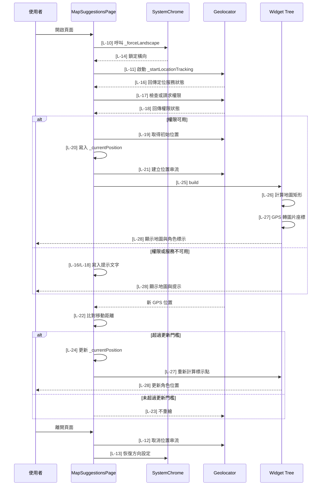

# map_suggestions.dart 邏輯追蹤表

## Task 0: 檔案用途與使用方式

### 0-1. 檔案簡介

`map_suggestions.dart` 負責顯示一張固定校園地圖圖片，並將使用者 GPS 座標轉換成圖片上的位置。它會在頁面開啟後強制切換為橫向，使用黑色背景保留圖片比例不足的空間，並在定位移動超過門檻時更新角色標示點。此檔案不負責路由註冊、不負責怪物資料，也不負責 Google Map 圖層。通常會由任務頁、測試入口或後續導覽流程透過 Navigator 開啟。

### 0-2. 檔案類型判斷

主要類型：A. 頁面檔案 Page / Screen  
次要類型：D. API / Service / Repository 檔案，因為頁面內部會呼叫 Geolocator 定位服務。

### 使用方式或呼叫方式

此頁面目前不需要建構子參數，呼叫端只要直接 push `MapSuggestionsPage` 即可。使用前需確認 App 已完成 `geolocator` 平台權限設定，否則頁面會顯示定位服務或權限提示。頁面進入時會鎖定橫向，離開時會恢復 `DeviceOrientation.values`。

```dart
Navigator.push(
  context,
  MaterialPageRoute(
    builder: (_) => const MapSuggestionsPage(),
  ),
);
```

### 公開函數表

| 方法名稱 | 作用 | 輸入 | 輸出 | 是否需要 await | 可能錯誤 |
|---|---|---|---|---|---|
| `calculateContainedMapRect` | 依容器尺寸與圖片原始尺寸計算完整顯示的地圖矩形 | `containerSize: Size`、`imageSize: Size` | `Rect` | 否 | 尺寸為空時回傳 `Rect.zero` |
| `gpsToImageOffset` | 將 GPS 經緯度轉換為地圖圖片內的座標 | `latitude: double`、`longitude: double`、`imageSize: Size` | `Offset` | 否 | 超出校園範圍時會 clamp 到圖片邊界 |

## 目前版本邏輯對照表

<table>
  <thead>
    <tr>
      <th>ID</th>
      <th>目的標籤</th>
      <th>邏輯描述</th>
      <th>函數為單位</th>
    </tr>
  </thead>
  <tbody>
    <tr>
      <td>[L-01]</td>
      <td>目的[資源路徑]</td>
      <td>宣告 <code>map_path</code>[來自 MapSuggestionsVariables 靜態常數]，指定固定地圖圖片資源。</td>
      <td rowspan="9">【回傳函數】(Data Transformer)<br>Input: 無。<br>Process: 集中宣告此頁面使用的圖片路徑、地圖原始尺寸、GPS 邊界與定位更新門檻。<br>Output: <code>MapSuggestionsVariables</code> 類別層級常數，供頁面與轉換函數共用。</td>
    </tr>
    <tr>
      <td>[L-02]</td>
      <td>目的[資源路徑]</td>
      <td>宣告 <code>position_char</code>[來自 MapSuggestionsVariables 靜態常數]，指定目前位置的角色標示圖片。</td>
    </tr>
    <tr>
      <td>[L-03]</td>
      <td>目的[圖片基準]</td>
      <td>宣告 <code>mapImageSize</code>[來自 MapSuggestionsVariables 靜態常數] 為 <code>2744 x 1568</code>，作為地圖縮放與座標換算的原始尺寸依據。</td>
    </tr>
    <tr>
      <td>[L-04]</td>
      <td>目的[GPS 邊界]</td>
      <td>宣告 <code>southwestLatitude</code>[來自 MapSuggestionsVariables 靜態常數]，代表圖片左下角對應的緯度。</td>
    </tr>
    <tr>
      <td>[L-05]</td>
      <td>目的[GPS 邊界]</td>
      <td>宣告 <code>southwestLongitude</code>[來自 MapSuggestionsVariables 靜態常數]，代表圖片左下角對應的經度。</td>
    </tr>
    <tr>
      <td>[L-06]</td>
      <td>目的[GPS 邊界]</td>
      <td>宣告 <code>northeastLatitude</code>[來自 MapSuggestionsVariables 靜態常數]，代表圖片右上角對應的緯度。</td>
    </tr>
    <tr>
      <td>[L-07]</td>
      <td>目的[GPS 邊界]</td>
      <td>宣告 <code>northeastLongitude</code>[來自 MapSuggestionsVariables 靜態常數]，代表圖片右上角對應的經度。</td>
    </tr>
    <tr>
      <td>[L-08]</td>
      <td>目的[標示尺寸]</td>
      <td>宣告 <code>markerSize</code>[來自 MapSuggestionsVariables 靜態常數]，作為角色標示圖片在畫面上的顯示尺寸。</td>
    </tr>
    <tr>
      <td>[L-09]</td>
      <td>目的[更新門檻]</td>
      <td>宣告 <code>locationUpdateMeters</code>[來自 MapSuggestionsVariables 靜態常數]，限制 GPS 移動至少 2 公尺才更新畫面位置。</td>
    </tr>
    <tr>
      <td>[L-10]</td>
      <td>目的[方向控制]</td>
      <td>在 <code>initState</code>[State 生命週期函數] 中呼叫 <code>_forceLandscape</code>[State 方法]，頁面開啟後切換為橫向。</td>
      <td rowspan="2">【功能函數】(Action Performer)<br>Purpose: 頁面初始化/定位啟動。<br>Action: 進入頁面後鎖定橫向，並啟動 GPS 權限檢查與定位監聽。</td>
    </tr>
    <tr>
      <td>[L-11]</td>
      <td>目的[定位啟動]</td>
      <td>在 <code>initState</code>[State 生命週期函數] 中呼叫 <code>_startLocationTracking</code>[State 方法]，開始檢查定位服務與監聽 GPS。</td>
    </tr>
    <tr>
      <td>[L-12]</td>
      <td>目的[資源釋放]</td>
      <td>在 <code>dispose</code>[State 生命週期函數] 中取消 <code>_positionSubscription</code>[State 欄位]，避免頁面離開後仍接收位置串流。</td>
      <td rowspan="2">【功能函數】(Action Performer)<br>Purpose: 生命週期收尾。<br>Action: 停止 GPS 串流訂閱，並恢復裝置可用方向設定。</td>
    </tr>
    <tr>
      <td>[L-13]</td>
      <td>目的[方向恢復]</td>
      <td>在 <code>dispose</code>[State 生命週期函數] 中呼叫 <code>_restoreOrientation</code>[State 方法]，離開頁面時恢復可用方向。</td>
    </tr>
    <tr>
      <td>[L-14]</td>
      <td>目的[方向控制]</td>
      <td>呼叫 <code>SystemChrome.setPreferredOrientations</code>[Flutter services API]，只允許 <code>landscapeLeft</code> 與 <code>landscapeRight</code>[區域常值]。</td>
      <td>【功能函數】(Action Performer)<br>Purpose: 橫向鎖定。<br>Action: 要求系統將頁面顯示方向限制在左右橫向。</td>
    </tr>
    <tr>
      <td>[L-15]</td>
      <td>目的[方向恢復]</td>
      <td>呼叫 <code>SystemChrome.setPreferredOrientations</code>[Flutter services API]，傳入 <code>DeviceOrientation.values</code>[Flutter enum values] 恢復全部方向。</td>
      <td>【功能函數】(Action Performer)<br>Purpose: 方向設定還原。<br>Action: 解除此頁面對橫向的限制，避免影響其他頁面。</td>
    </tr>
    <tr>
      <td>[L-16]</td>
      <td>目的[服務檢查]</td>
      <td>呼叫 <code>Geolocator.isLocationServiceEnabled</code>[Geolocator API] 取得 <code>serviceEnabled</code>[區域變數]；若定位服務關閉，更新 <code>_isLocationReady</code> 與 <code>_locationMessage</code>[State 欄位] 後返回。</td>
      <td rowspan="6">【功能函數】(Action Performer)<br>Purpose: 定位初始化/權限處理/串流監聽。<br>Action: 檢查 GPS 服務；檢查與請求權限；拒絕時顯示訊息；成功時取得初始位置並建立位置串流訂閱。</td>
    </tr>
    <tr>
      <td>[L-17]</td>
      <td>目的[權限請求]</td>
      <td>使用 <code>permission</code>[區域變數] 保存 <code>Geolocator.checkPermission</code>[Geolocator API] 結果；若為 denied 則呼叫 <code>requestPermission</code>[Geolocator API]。</td>
    </tr>
    <tr>
      <td>[L-18]</td>
      <td>目的[權限防護]</td>
      <td>檢查 <code>permission</code>[區域變數] 是否仍為 denied 或 deniedForever；若無權限，更新 <code>_isLocationReady</code> 與 <code>_locationMessage</code>[State 欄位] 後返回。</td>
    </tr>
    <tr>
      <td>[L-19]</td>
      <td>目的[初始定位]</td>
      <td>呼叫 <code>Geolocator.getCurrentPosition</code>[Geolocator API] 取得 <code>initialPosition</code>[區域變數]，精度使用 bestForNavigation。</td>
    </tr>
    <tr>
      <td>[L-20]</td>
      <td>目的[狀態更新]</td>
      <td>透過 setState 將 <code>initialPosition</code>[區域變數] 寫入 <code>_currentPosition</code>[State 欄位]，並清除定位提示。</td>
    </tr>
    <tr>
      <td>[L-21]</td>
      <td>目的[串流監聽]</td>
      <td>將 <code>Geolocator.getPositionStream</code>[Geolocator API] 的訂閱保存到 <code>_positionSubscription</code>[State 欄位]，後續位置更新交給 <code>_handlePositionUpdate</code>[State 方法]。</td>
    </tr>
    <tr>
      <td>[L-22]</td>
      <td>目的[更新判斷]</td>
      <td>使用 <code>previousPosition</code>[區域變數]、<code>position</code>[函數參數] 與 <code>locationUpdateMeters</code>[靜態常數] 計算是否移動超過門檻。</td>
      <td rowspan="3">【功能函數】(Action Performer)<br>Purpose: 定位更新/效能保護。<br>Action: 比對新舊 GPS 距離；未達門檻或頁面卸載時停止；達門檻時更新畫面狀態。</td>
    </tr>
    <tr>
      <td>[L-23]</td>
      <td>目的[重繪防護]</td>
      <td>若 <code>shouldUpdate</code>[區域變數] 為 false 或 <code>mounted</code>[State 生命週期屬性] 為 false，直接返回避免不必要 setState。</td>
    </tr>
    <tr>
      <td>[L-24]</td>
      <td>目的[狀態更新]</td>
      <td>透過 setState 將 <code>position</code>[函數參數] 寫入 <code>_currentPosition</code>[State 欄位]，觸發標示點重算與重繪。</td>
    </tr>
    <tr>
      <td>[L-25]</td>
      <td>目的[UI 建構]</td>
      <td>回傳黑底 <code>Scaffold</code>[Widget] 作為地圖頁根節點；結構見 <a href="#map-widget-tree">Map Widget Tree</a>。</td>
      <td rowspan="4">【Build 函數 / Widget 返回函數】(UI Tree)<br>Input: <code>context: BuildContext</code>，提供 Widget 建構環境。<br>Process: 根據 LayoutBuilder 的容器尺寸計算地圖完整顯示矩形；若已有 GPS 則轉成標示點座標；回傳地圖、角色標示與定位提示。Widget 結構見 <a href="#map-widget-tree">Map Widget Tree</a>。</td>
    </tr>
    <tr>
      <td>[L-26]</td>
      <td>目的[圖片適配]</td>
      <td>呼叫 <code>calculateContainedMapRect</code>[頂層函數]，用 <code>constraints.biggest</code>[LayoutBuilder 約束] 與 <code>mapImageSize</code>[靜態常數] 取得 <code>fittedMap</code>[區域變數]。</td>
    </tr>
    <tr>
      <td>[L-27]</td>
      <td>目的[座標轉換]</td>
      <td>若 <code>_currentPosition</code>[State 欄位] 不為 null，呼叫 <code>gpsToImageOffset</code>[頂層函數] 取得 <code>markerOffset</code>[區域變數]；否則保留 null。</td>
    </tr>
    <tr>
      <td>[L-28]</td>
      <td>目的[圖層堆疊]</td>
      <td>回傳 <code>Stack</code>[Widget]，依序放入地圖圖片、條件式角色標示與條件式定位提示。</td>
    </tr>
    <tr>
      <td>[L-29]</td>
      <td>目的[邊界檢查]</td>
      <td>檢查 <code>containerSize</code> 與 <code>imageSize</code>[皆來自函數參數] 是否為空；若是則回傳 <code>Rect.zero</code>。</td>
      <td rowspan="4">【回傳函數】(Data Transformer)<br>Input: <code>containerSize: Size</code> 代表可用畫面尺寸；<code>imageSize: Size</code> 代表地圖原始尺寸。<br>Process: 以 contain 規則取較小縮放比例，計算置中的地圖顯示矩形。<br>Output: <code>Rect</code>，代表地圖在畫面中的實際顯示位置與大小。</td>
    </tr>
    <tr>
      <td>[L-30]</td>
      <td>目的[縮放計算]</td>
      <td>使用 <code>widthScale</code>、<code>heightScale</code> 與 <code>scale</code>[區域變數] 計算完整顯示圖片所需的縮放比例。</td>
    </tr>
    <tr>
      <td>[L-31]</td>
      <td>目的[置中計算]</td>
      <td>根據 <code>scale</code>[區域變數] 取得 <code>fittedSize</code>，再計算 <code>left</code> 與 <code>top</code>[區域變數] 讓地圖置中。</td>
    </tr>
    <tr>
      <td>[L-32]</td>
      <td>目的[矩形回傳]</td>
      <td>回傳由 <code>Offset(left, top)</code> 與 <code>fittedSize</code>[皆來自區域變數] 組成的地圖顯示矩形。</td>
    </tr>
    <tr>
      <td>[L-33]</td>
      <td>目的[比例換算]</td>
      <td>使用 <code>latitude</code>、<code>longitude</code> 與 <code>imageSize</code>[皆來自函數參數]，搭配四個 GPS 邊界常數計算經度與緯度比例；緯度以北高南低反轉成圖片 Y 軸。</td>
      <td rowspan="3">【回傳函數】(Data Transformer)<br>Input: <code>latitude: double</code> 使用者緯度；<code>longitude: double</code> 使用者經度；<code>imageSize: Size</code> 目前地圖顯示尺寸。<br>Process: 將經度線性映射到 X 軸；將緯度反向線性映射到 Y 軸；超出邊界時限制在圖片範圍。<br>Output: <code>Offset</code>，代表標示點中心在圖片內的位置。</td>
    </tr>
    <tr>
      <td>[L-34]</td>
      <td>目的[邊界限制]</td>
      <td>將 <code>longitudeRatio</code> 與 <code>latitudeRatio</code>[區域變數] clamp 到 0 到 1，避免超出校園範圍時標示點離開圖片。</td>
    </tr>
    <tr>
      <td>[L-35]</td>
      <td>目的[座標回傳]</td>
      <td>用 <code>safeLongitudeRatio</code>、<code>safeLatitudeRatio</code>[區域變數] 與 <code>imageSize</code>[函數參數] 回傳圖片座標 <code>Offset</code>。</td>
    </tr>
  </tbody>
</table>

## 視覺化結構圖

### <a id="map-widget-tree"></a>Map Widget Tree

[Scaffold(頁面骨架)] // [L-25]  
└── [SafeArea(安全區域)]  
&nbsp;&nbsp;&nbsp;&nbsp;└── [LayoutBuilder(尺寸計算容器)] // [L-26]  
&nbsp;&nbsp;&nbsp;&nbsp;&nbsp;&nbsp;&nbsp;&nbsp;└── [Stack(堆疊容器)] // [L-28]  
&nbsp;&nbsp;&nbsp;&nbsp;&nbsp;&nbsp;&nbsp;&nbsp;&nbsp;&nbsp;&nbsp;&nbsp;├── [Positioned(地圖定位容器)]  
&nbsp;&nbsp;&nbsp;&nbsp;&nbsp;&nbsp;&nbsp;&nbsp;&nbsp;&nbsp;&nbsp;&nbsp;│   └── [Image(地圖圖片)]  
&nbsp;&nbsp;&nbsp;&nbsp;&nbsp;&nbsp;&nbsp;&nbsp;&nbsp;&nbsp;&nbsp;&nbsp;├── { IF: markerOffset != null } // [L-27]  
&nbsp;&nbsp;&nbsp;&nbsp;&nbsp;&nbsp;&nbsp;&nbsp;&nbsp;&nbsp;&nbsp;&nbsp;│   └── [Positioned(位置標示容器)]  
&nbsp;&nbsp;&nbsp;&nbsp;&nbsp;&nbsp;&nbsp;&nbsp;&nbsp;&nbsp;&nbsp;&nbsp;│       └── [Image(角色標示圖片)]  
&nbsp;&nbsp;&nbsp;&nbsp;&nbsp;&nbsp;&nbsp;&nbsp;&nbsp;&nbsp;&nbsp;&nbsp;└── { IF: !_isLocationReady && _locationMessage != null }  
&nbsp;&nbsp;&nbsp;&nbsp;&nbsp;&nbsp;&nbsp;&nbsp;&nbsp;&nbsp;&nbsp;&nbsp;&nbsp;&nbsp;&nbsp;&nbsp;└── [Center(置中容器)]  
&nbsp;&nbsp;&nbsp;&nbsp;&nbsp;&nbsp;&nbsp;&nbsp;&nbsp;&nbsp;&nbsp;&nbsp;&nbsp;&nbsp;&nbsp;&nbsp;&nbsp;&nbsp;&nbsp;&nbsp;└── [Text(文字)]

## Task 3: 場景時序圖



## Task 4: 測資建議表

| ID | 建議測試極端值或狀態 |
|---|---|
| [L-01] | 地圖 asset 不存在，確認 Image asset 錯誤能被開發環境偵測 |
| [L-02] | 標示 asset 不存在，確認角色圖未載入時易於追查 |
| [L-03] | 將容器設為極寬或極高，確認 `2744 x 1568` 比例仍完整顯示 |
| [L-04] | 緯度等於 `24.965184`，確認點落在圖片底邊 |
| [L-05] | 經度等於 `121.185000`，確認點落在圖片左邊 |
| [L-06] | 緯度等於 `24.971653`，確認點落在圖片頂邊 |
| [L-07] | 經度等於 `121.197487`，確認點落在圖片右邊 |
| [L-08] | 標示尺寸大於地圖高度，確認定位公式仍以中心點計算 |
| [L-09] | GPS 連續移動 1.9 公尺與 2.0 公尺，確認只有達門檻時更新 |
| [L-10] | 直向裝置進入頁面，確認轉為橫向 |
| [L-11] | 首次安裝 App 進入頁面，確認會開始權限流程 |
| [L-12] | 位置串流啟動後立刻離開頁面，確認訂閱取消 |
| [L-13] | 離開頁面後開啟其他頁，確認方向限制解除 |
| [L-14] | 裝置支援左右橫向，確認兩個方向都能使用 |
| [L-15] | 其他頁需要直向，確認離開本頁後可旋轉 |
| [L-16] | 關閉系統定位服務，確認顯示 GPS 尚未開啟 |
| [L-17] | 權限狀態為 denied，確認會請求權限 |
| [L-18] | 權限狀態為 deniedForever，確認顯示尚未取得定位權限 |
| [L-19] | GPS 初始定位延遲很久，確認頁面不崩潰 |
| [L-20] | 初始位置在校園中心，確認標示點出現 |
| [L-21] | 串流每秒回傳位置，確認訂閱能接收資料 |
| [L-22] | 新舊位置相同，確認 `shouldUpdate` 為 false |
| [L-23] | 頁面已 dispose 後收到位置，確認不呼叫 setState |
| [L-24] | 新位置移動超過 2 公尺，確認畫面重繪 |
| [L-25] | 螢幕尺寸很小，確認 Scaffold 可建立 |
| [L-26] | 容器為 `Size.zero`，確認回傳 `Rect.zero` |
| [L-27] | `_currentPosition` 為 null，確認不建立標示點 |
| [L-28] | 權限被拒，確認地圖仍顯示且提示置中 |
| [L-29] | `containerSize` 或 `imageSize` 為空，確認不除以零 |
| [L-30] | 容器比例與圖片比例完全相同，確認縮放比例正確 |
| [L-31] | 容器比圖片更寬，確認左右留黑且地圖置中 |
| [L-32] | 容器比圖片更高，確認上下留黑且地圖置中 |
| [L-33] | GPS 為左下角與右上角邊界，確認座標落在兩個角 |
| [L-34] | GPS 超出校園範圍，確認比例被限制在 0 到 1 |
| [L-35] | `imageSize` 為實際顯示尺寸，確認回傳 Offset 不超出圖片 |
