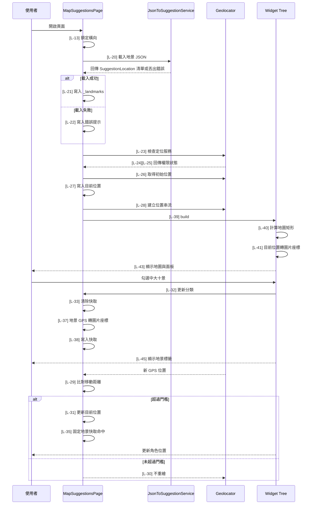

# map_suggestions.dart 邏輯追蹤表

## Task 0: 檔案用途與使用方式

### 0-1. 檔案簡介

`map_suggestions.dart` 是校園全景地圖頁，負責把固定地圖圖片完整最大化顯示在橫向畫面中，並將 GPS 座標轉換成圖片座標。它會顯示目前位置，也能透過左上角篩選面板顯示固定地景點位。目前面板支援「中大十景」，地景 JSON 解析已抽到 `JsonToSuggestionService`。此檔案不負責 JSON 欄位驗證、不負責主路由註冊，也不負責 Google Map 圖層。

### 0-2. 檔案類型判斷

主要類型：A. 頁面檔案 Page / Screen  
次要類型：B. 可重用 Widget 檔案 Reusable Widget / Component，因為內含 `_LandmarkFilterPanel` 與 `_LandmarkLabel`。

### 使用方式或呼叫方式

呼叫端可直接 push `MapSuggestionsPage`，不需傳入參數。使用前需確認 `geolocator` 權限設定已完成，且 `pubspec.yaml` 有宣告 `assets/json/locations/`。

```dart
Navigator.push(
  context,
  MaterialPageRoute(
    builder: (_) => const MapSuggestionsPage(),
  ),
);
```

### 公開函數表

| 方法名稱 | 作用 | 輸入 | 輸出 | 是否需要 await | 可能錯誤 |
|---|---|---|---|---|---|
| `calculateContainedMapRect` | 計算地圖圖片以 contain 規則顯示時的位置與尺寸 | `containerSize: Size`、`imageSize: Size` | `Rect` | 否 | 尺寸為空時回傳 `Rect.zero` |
| `gpsToImageOffset` | 將 GPS 座標轉成圖片座標 | `latitude: double`、`longitude: double`、`imageSize: Size` | `Offset` | 否 | 超出邊界時會 clamp 到圖片範圍 |

## 目前版本邏輯對照表

<table>
  <thead>
    <tr>
      <th>ID</th>
      <th>目的標籤</th>
      <th>邏輯描述</th>
      <th>函數為單位</th>
    </tr>
  </thead>
  <tbody>
    <tr><td>[L-01]</td><td>目的[資源路徑]</td><td>宣告 <code>map_path</code>[來自 MapSuggestionsVariables 靜態常數]，指定地圖圖片 asset。</td><td rowspan="12">【回傳函數】(Data Transformer)<br>Input: 無。<br>Process: 集中宣告地圖圖片、角色圖片、地圖尺寸、GPS 邊界、分類名稱、地景 JSON 路徑與點位顯示尺寸。<br>Output: <code>MapSuggestionsVariables</code> 靜態常數集合。</td></tr>
    <tr><td>[L-02]</td><td>目的[資源路徑]</td><td>宣告 <code>position_char</code>[來自 MapSuggestionsVariables 靜態常數]，指定目前位置角色圖片 asset。</td></tr>
    <tr><td>[L-03]</td><td>目的[圖片基準]</td><td>宣告 <code>mapImageSize</code>[來自 MapSuggestionsVariables 靜態常數]，以 2744 x 1568 作為地圖原始尺寸。</td></tr>
    <tr><td>[L-04]</td><td>目的[GPS 邊界]</td><td>宣告 <code>southwestLatitude</code>[來自 MapSuggestionsVariables 靜態常數]，代表圖片左下角緯度。</td></tr>
    <tr><td>[L-05]</td><td>目的[GPS 邊界]</td><td>宣告 <code>southwestLongitude</code>[來自 MapSuggestionsVariables 靜態常數]，代表圖片左下角經度。</td></tr>
    <tr><td>[L-06]</td><td>目的[GPS 邊界]</td><td>宣告 <code>northeastLatitude</code>[來自 MapSuggestionsVariables 靜態常數]，代表圖片右上角緯度。</td></tr>
    <tr><td>[L-07]</td><td>目的[GPS 邊界]</td><td>宣告 <code>northeastLongitude</code>[來自 MapSuggestionsVariables 靜態常數]，代表圖片右上角經度。</td></tr>
    <tr><td>[L-08]</td><td>目的[標示尺寸]</td><td>宣告 <code>markerSize</code>[來自 MapSuggestionsVariables 靜態常數]，控制目前位置角色圖大小。</td></tr>
    <tr><td>[L-09]</td><td>目的[更新門檻]</td><td>宣告 <code>locationUpdateMeters</code>[來自 MapSuggestionsVariables 靜態常數]，GPS 移動超過此公尺數才更新角色位置。</td></tr>
    <tr><td>[L-10]</td><td>目的[分類名稱]</td><td>宣告 <code>ncuTenViewsCategory</code>[來自 MapSuggestionsVariables 靜態常數]，作為「中大十景」勾選項與 JSON 種類比對值。</td></tr>
    <tr><td>[L-11]</td><td>目的[資料來源]</td><td>宣告 <code>locationJsonPaths</code>[來自 MapSuggestionsVariables 靜態常數]，提供 service 要載入的地景 JSON asset 清單。</td></tr>
    <tr><td>[L-12]</td><td>目的[標示尺寸]</td><td>宣告 <code>landmarkDotSize</code>[來自 MapSuggestionsVariables 靜態常數]，控制固定地景小圓點大小。</td></tr>

    <tr><td>[L-13]</td><td>目的[方向控制]</td><td>在 <code>initState</code>[State 生命週期函數] 呼叫 <code>_forceLandscape</code>[State 方法]，進入頁面後鎖定橫向。</td><td rowspan="3">【功能函數】(Action Performer)<br>Purpose: 頁面初始化。<br>Action: 鎖定橫向；載入固定地景資料；啟動 GPS 權限與位置監聽流程。</td></tr>
    <tr><td>[L-14]</td><td>目的[資料載入]</td><td>在 <code>initState</code>[State 生命週期函數] 呼叫 <code>_loadLandscapeLocations</code>[State 方法]，透過 service 載入地景。</td></tr>
    <tr><td>[L-15]</td><td>目的[定位啟動]</td><td>在 <code>initState</code>[State 生命週期函數] 呼叫 <code>_startLocationTracking</code>[State 方法]，啟動定位流程。</td></tr>

    <tr><td>[L-16]</td><td>目的[資源釋放]</td><td>在 <code>dispose</code>[State 生命週期函數] 取消 <code>_positionSubscription</code>[State 欄位]，避免離頁後仍接收 GPS 串流。</td><td rowspan="2">【功能函數】(Action Performer)<br>Purpose: 生命週期收尾。<br>Action: 停止位置串流；恢復裝置可用方向。</td></tr>
    <tr><td>[L-17]</td><td>目的[方向恢復]</td><td>在 <code>dispose</code>[State 生命週期函數] 呼叫 <code>_restoreOrientation</code>[State 方法]，離開頁面時解除橫向限制。</td></tr>

    <tr><td>[L-18]</td><td>目的[方向控制]</td><td>呼叫 <code>SystemChrome.setPreferredOrientations</code>[Flutter services API]，只允許 landscapeLeft 與 landscapeRight。</td><td>【功能函數】(Action Performer)<br>Purpose: 橫向鎖定。<br>Action: 要求系統將頁面方向限制為橫向。</td></tr>
    <tr><td>[L-19]</td><td>目的[方向恢復]</td><td>呼叫 <code>SystemChrome.setPreferredOrientations</code>[Flutter services API]，傳入 <code>DeviceOrientation.values</code>[Flutter enum values]。</td><td>【功能函數】(Action Performer)<br>Purpose: 方向恢復。<br>Action: 解除頁面方向限制，避免影響其他頁面。</td></tr>

    <tr><td>[L-20]</td><td>目的[資料載入]</td><td>呼叫 <code>_suggestionService.loadLocations</code>[State 欄位 service]，傳入 <code>locationJsonPaths</code>[靜態常數] 取得 <code>loadedLandmarks</code>[區域變數]。</td><td rowspan="3">【功能函數】(Action Performer)<br>Purpose: 地景載入/錯誤回饋。<br>Action: 委派 JsonToSuggestionService 讀取並解析 JSON；成功後寫入地景狀態並清除快取；失敗後顯示包含錯誤內容的提示。</td></tr>
    <tr><td>[L-21]</td><td>目的[狀態更新]</td><td>成功載入後透過 setState 將 <code>loadedLandmarks</code>[區域變數] 寫入 <code>_landmarks</code>[State 欄位]，並清除錯誤訊息與點位快取。</td></tr>
    <tr><td>[L-22]</td><td>目的[錯誤處理]</td><td>catch 錯誤後將 <code>error</code>[catch 變數] 寫入 <code>_landmarkLoadMessage</code>[State 欄位]，讓面板顯示明確失敗原因。</td></tr>

    <tr><td>[L-23]</td><td>目的[服務檢查]</td><td>呼叫 <code>Geolocator.isLocationServiceEnabled</code>[Geolocator API] 取得 <code>serviceEnabled</code>[區域變數]；服務未開啟時寫入提示並返回。</td><td rowspan="6">【功能函數】(Action Performer)<br>Purpose: 定位初始化/權限處理。<br>Action: 檢查定位服務與權限；必要時請求權限；成功時取得初始位置並建立串流。</td></tr>
    <tr><td>[L-24]</td><td>目的[權限請求]</td><td>使用 <code>permission</code>[區域變數] 保存 <code>Geolocator.checkPermission</code>[Geolocator API] 結果，denied 時請求權限。</td></tr>
    <tr><td>[L-25]</td><td>目的[權限防護]</td><td>檢查 <code>permission</code>[區域變數] 是否 denied 或 deniedForever；若無權限則寫入提示並返回。</td></tr>
    <tr><td>[L-26]</td><td>目的[初始定位]</td><td>呼叫 <code>Geolocator.getCurrentPosition</code>[Geolocator API] 取得 <code>initialPosition</code>[區域變數]。</td></tr>
    <tr><td>[L-27]</td><td>目的[狀態更新]</td><td>透過 setState 將 <code>initialPosition</code>[區域變數] 寫入 <code>_currentPosition</code>[State 欄位]，並清除定位提示。</td></tr>
    <tr><td>[L-28]</td><td>目的[串流監聽]</td><td>將 <code>Geolocator.getPositionStream</code>[Geolocator API] 訂閱保存到 <code>_positionSubscription</code>[State 欄位]。</td></tr>

    <tr><td>[L-29]</td><td>目的[更新判斷]</td><td>使用 <code>previousPosition</code>[區域變數]、<code>position</code>[函數參數] 與 <code>locationUpdateMeters</code>[靜態常數] 計算距離是否達更新門檻。</td><td rowspan="3">【功能函數】(Action Performer)<br>Purpose: 定位更新/效能保護。<br>Action: 比對新舊 GPS 距離；未達門檻或頁面卸載時停止；達門檻才更新目前位置。</td></tr>
    <tr><td>[L-30]</td><td>目的[重繪防護]</td><td>若 <code>shouldUpdate</code>[區域變數] 為 false 或 <code>mounted</code>[State 生命週期屬性] 為 false，直接返回。</td></tr>
    <tr><td>[L-31]</td><td>目的[狀態更新]</td><td>透過 setState 將 <code>position</code>[函數參數] 寫入 <code>_currentPosition</code>[State 欄位]。</td></tr>

    <tr><td>[L-32]</td><td>目的[篩選更新]</td><td>在 <code>_toggleCategory</code> 中更新 <code>_selectedCategories</code>[State 欄位] 指定分類的勾選值，並清除地景點位快取。</td><td>【功能函數】(Action Performer)<br>Purpose: 勾選狀態更新。<br>Action: 接收 checkbox 變更；更新分類狀態；讓地景點位重新計算。</td></tr>
    <tr><td>[L-33]</td><td>目的[快取重置]</td><td>清空 <code>_cachedLandmarkMapSize</code>、<code>_cachedSelectedCategoryKey</code> 與 <code>_cachedLandmarkMarkers</code>[State 欄位]。</td><td>【功能函數】(Action Performer)<br>Purpose: 快取失效。<br>Action: 清除舊地景點位，避免分類或資料變更後沿用舊座標。</td></tr>
    <tr><td>[L-34]</td><td>目的[快取鍵產生]</td><td>從 <code>_selectedCategories</code>[State 欄位] 取出已勾選分類、排序並串成字串。</td><td>【回傳函數】(Data Transformer)<br>Input: 無，使用 State 欄位 <code>_selectedCategories</code>。<br>Process: 過濾已勾選分類並排序。<br>Output: <code>String</code>，代表目前分類選取快取鍵。</td></tr>
    <tr><td>[L-35]</td><td>目的[快取命中]</td><td>在 <code>_visibleLandmarkMarkers</code> 中比較 <code>_cachedLandmarkMapSize</code>、<code>_cachedSelectedCategoryKey</code>[State 欄位] 與目前狀態，命中則直接回傳快取。</td><td rowspan="4">【回傳函數】(Data Transformer)<br>Input: <code>mapSize: Size</code>，目前地圖顯示尺寸。<br>Process: 若快取命中直接回傳；否則依分類篩選地景，並用 GPS 公式計算圖片座標。<br>Output: <code>List&lt;_LandmarkMarker&gt;</code>，目前要顯示的固定地景標示。</td></tr>
    <tr><td>[L-36]</td><td>目的[分類集合]</td><td>從 <code>_selectedCategories</code>[State 欄位] 建立 <code>selectedCategories</code>[區域變數]，只包含已勾選分類。</td></tr>
    <tr><td>[L-37]</td><td>目的[固定座標計算]</td><td>篩選 <code>_landmarks</code>[State 欄位] 中種類符合的資料，並呼叫 <code>gpsToImageOffset</code> 計算地景圖片座標。</td></tr>
    <tr><td>[L-38]</td><td>目的[快取寫入]</td><td>將 <code>mapSize</code>[函數參數]、<code>selectedCategoryKey</code> 與 <code>markers</code>[區域變數] 寫入 State 快取欄位。</td></tr>

    <tr><td>[L-39]</td><td>目的[UI 建構]</td><td>回傳黑底 <code>Scaffold</code>[Widget] 作為地圖頁根節點；結構見 <a href="#map-widget-tree">Map Widget Tree</a>。</td><td rowspan="5">【Build 函數 / Widget 返回函數】(UI Tree)<br>Input: <code>context: BuildContext</code>。<br>Process: 依容器尺寸計算地圖顯示矩形；將目前 GPS 與固定地景轉為圖片座標；建立地圖、角色標示、地景標籤、篩選面板與提示。Widget 結構見 <a href="#map-widget-tree">Map Widget Tree</a>。</td></tr>
    <tr><td>[L-40]</td><td>目的[圖片適配]</td><td>呼叫 <code>calculateContainedMapRect</code>[頂層函數]，用 <code>constraints.biggest</code>[LayoutBuilder 約束] 與 <code>mapImageSize</code>[靜態常數] 取得 <code>fittedMap</code>[區域變數]。</td></tr>
    <tr><td>[L-41]</td><td>目的[目前位置轉換]</td><td>若 <code>_currentPosition</code>[State 欄位] 不為 null，呼叫 <code>gpsToImageOffset</code> 取得 <code>markerOffset</code>[區域變數]。</td></tr>
    <tr><td>[L-42]</td><td>目的[地景標示準備]</td><td>呼叫 <code>_visibleLandmarkMarkers</code>[State 方法] 取得 <code>landmarkMarkers</code>[區域變數]，並用 <code>constraints.maxWidth</code>[LayoutBuilder 約束] 計算面板長度。</td></tr>
    <tr><td>[L-43]</td><td>目的[圖層堆疊]</td><td>回傳 <code>Stack</code>[Widget]，依序放入地圖、目前位置、地景標籤、篩選面板與定位提示。</td></tr>

    <tr><td>[L-44]</td><td>目的[篩選面板 UI]</td><td>在 <code>_LandmarkFilterPanel.build</code> 中依 <code>selectedCategories</code>[來自建構子] 建立 checkbox 清單，並依 <code>loadMessage</code>[來自建構子] 顯示錯誤。</td><td>【Build 函數 / Widget 返回函數】(UI Tree)<br>Input: <code>maxPanelHeight: double</code>、<code>selectedCategories: Map&lt;String, bool&gt;</code>、<code>loadMessage: String?</code>、<code>onCategoryChanged</code> callback。<br>Process: 建立可擴充分類面板；checkbox 變更時回呼父層。Widget 結構見 <a href="#filter-panel-widget-tree">Filter Panel Widget Tree</a>。</td></tr>
    <tr><td>[L-45]</td><td>目的[地景標籤 UI]</td><td>在 <code>_LandmarkLabel.build</code> 中使用 <code>marker</code>[來自建構子] 建立小圓點與地景名稱。</td><td>【Build 函數 / Widget 返回函數】(UI Tree)<br>Input: <code>marker: _LandmarkMarker</code>，包含地景模型與圖片座標。<br>Process: 將小圓點中心對齊座標，並在旁邊顯示地景文字。Widget 結構見 <a href="#landmark-label-widget-tree">Landmark Label Widget Tree</a>。</td></tr>

    <tr><td>[L-46]</td><td>目的[邊界檢查]</td><td>檢查 <code>containerSize</code> 與 <code>imageSize</code>[皆來自函數參數] 是否為空，空尺寸時回傳 <code>Rect.zero</code>。</td><td rowspan="4">【回傳函數】(Data Transformer)<br>Input: <code>containerSize: Size</code> 可用畫面尺寸；<code>imageSize: Size</code> 地圖原始尺寸。<br>Process: 用 contain 規則取較小縮放比例，計算置中矩形。<br>Output: <code>Rect</code>，地圖實際顯示矩形。</td></tr>
    <tr><td>[L-47]</td><td>目的[縮放計算]</td><td>用 <code>widthScale</code>、<code>heightScale</code> 與 <code>scale</code>[區域變數] 計算完整顯示圖片所需比例。</td></tr>
    <tr><td>[L-48]</td><td>目的[置中計算]</td><td>根據 <code>scale</code>[區域變數] 算出 <code>fittedSize</code>、<code>left</code> 與 <code>top</code>[區域變數]。</td></tr>
    <tr><td>[L-49]</td><td>目的[矩形回傳]</td><td>回傳由 <code>Offset(left, top)</code> 與 <code>fittedSize</code>[皆來自區域變數] 組成的地圖矩形。</td></tr>

    <tr><td>[L-50]</td><td>目的[比例換算]</td><td>用 <code>latitude</code>、<code>longitude</code>、<code>imageSize</code>[皆來自函數參數] 與 GPS 邊界常數計算經緯度比例，並將緯度反轉為圖片 Y 軸。</td><td rowspan="3">【回傳函數】(Data Transformer)<br>Input: <code>latitude: double</code>、<code>longitude: double</code>、<code>imageSize: Size</code>。<br>Process: 經度線性映射 X 軸；緯度反向映射 Y 軸；比例限制在 0 到 1。<br>Output: <code>Offset</code>，標示點中心在圖片內的位置。</td></tr>
    <tr><td>[L-51]</td><td>目的[邊界限制]</td><td>將 <code>longitudeRatio</code> 與 <code>latitudeRatio</code>[區域變數] clamp 到 0 到 1。</td></tr>
    <tr><td>[L-52]</td><td>目的[座標回傳]</td><td>用 <code>safeLongitudeRatio</code>、<code>safeLatitudeRatio</code>[區域變數] 與 <code>imageSize</code>[函數參數] 回傳 <code>Offset</code>。</td></tr>
  </tbody>
</table>

## 視覺化結構圖

### <a id="map-widget-tree"></a>Map Widget Tree

[Scaffold(頁面骨架)] // [L-39]  
└── [SafeArea(安全區域)]  
&nbsp;&nbsp;&nbsp;&nbsp;└── [LayoutBuilder(尺寸計算容器)] // [L-40]  
&nbsp;&nbsp;&nbsp;&nbsp;&nbsp;&nbsp;&nbsp;&nbsp;└── [Stack(堆疊容器)] // [L-43]  
&nbsp;&nbsp;&nbsp;&nbsp;&nbsp;&nbsp;&nbsp;&nbsp;&nbsp;&nbsp;&nbsp;&nbsp;├── [Positioned(地圖定位容器)]  
&nbsp;&nbsp;&nbsp;&nbsp;&nbsp;&nbsp;&nbsp;&nbsp;&nbsp;&nbsp;&nbsp;&nbsp;│   └── [Image(地圖圖片)]  
&nbsp;&nbsp;&nbsp;&nbsp;&nbsp;&nbsp;&nbsp;&nbsp;&nbsp;&nbsp;&nbsp;&nbsp;├── { IF: markerOffset != null } // [L-41]  
&nbsp;&nbsp;&nbsp;&nbsp;&nbsp;&nbsp;&nbsp;&nbsp;&nbsp;&nbsp;&nbsp;&nbsp;│   └── [Positioned(位置標示容器)]  
&nbsp;&nbsp;&nbsp;&nbsp;&nbsp;&nbsp;&nbsp;&nbsp;&nbsp;&nbsp;&nbsp;&nbsp;│       └── [Image(角色標示圖片)]  
&nbsp;&nbsp;&nbsp;&nbsp;&nbsp;&nbsp;&nbsp;&nbsp;&nbsp;&nbsp;&nbsp;&nbsp;├── { FOR: landmarkMarkers } // [L-42]  
&nbsp;&nbsp;&nbsp;&nbsp;&nbsp;&nbsp;&nbsp;&nbsp;&nbsp;&nbsp;&nbsp;&nbsp;│   └── [Positioned(地景標示容器)]  
&nbsp;&nbsp;&nbsp;&nbsp;&nbsp;&nbsp;&nbsp;&nbsp;&nbsp;&nbsp;&nbsp;&nbsp;│       └── [_LandmarkLabel(地景標籤)] // [L-45]  
&nbsp;&nbsp;&nbsp;&nbsp;&nbsp;&nbsp;&nbsp;&nbsp;&nbsp;&nbsp;&nbsp;&nbsp;├── [Positioned(篩選面板容器)]  
&nbsp;&nbsp;&nbsp;&nbsp;&nbsp;&nbsp;&nbsp;&nbsp;&nbsp;&nbsp;&nbsp;&nbsp;│   └── [_LandmarkFilterPanel(地景篩選面板)] // [L-44]  
&nbsp;&nbsp;&nbsp;&nbsp;&nbsp;&nbsp;&nbsp;&nbsp;&nbsp;&nbsp;&nbsp;&nbsp;└── { IF: !_isLocationReady && _locationMessage != null }  
&nbsp;&nbsp;&nbsp;&nbsp;&nbsp;&nbsp;&nbsp;&nbsp;&nbsp;&nbsp;&nbsp;&nbsp;&nbsp;&nbsp;&nbsp;&nbsp;└── [Center(置中容器)]  
&nbsp;&nbsp;&nbsp;&nbsp;&nbsp;&nbsp;&nbsp;&nbsp;&nbsp;&nbsp;&nbsp;&nbsp;&nbsp;&nbsp;&nbsp;&nbsp;&nbsp;&nbsp;&nbsp;&nbsp;└── [Text(文字)]

### <a id="filter-panel-widget-tree"></a>Filter Panel Widget Tree

[ConstrainedBox(尺寸限制容器)] // [L-44]  
└── [DecoratedBox(裝飾容器)]  
&nbsp;&nbsp;&nbsp;&nbsp;└── [Column(垂直容器)]  
&nbsp;&nbsp;&nbsp;&nbsp;&nbsp;&nbsp;&nbsp;&nbsp;├── { FOR: selectedCategories.entries }  
&nbsp;&nbsp;&nbsp;&nbsp;&nbsp;&nbsp;&nbsp;&nbsp;│   └── [CheckboxListTile(勾選選項)]  
&nbsp;&nbsp;&nbsp;&nbsp;&nbsp;&nbsp;&nbsp;&nbsp;└── { IF: loadMessage != null }  
&nbsp;&nbsp;&nbsp;&nbsp;&nbsp;&nbsp;&nbsp;&nbsp;&nbsp;&nbsp;&nbsp;&nbsp;└── [Padding(間距容器)]  
&nbsp;&nbsp;&nbsp;&nbsp;&nbsp;&nbsp;&nbsp;&nbsp;&nbsp;&nbsp;&nbsp;&nbsp;&nbsp;&nbsp;&nbsp;&nbsp;└── [Align(對齊容器)]  
&nbsp;&nbsp;&nbsp;&nbsp;&nbsp;&nbsp;&nbsp;&nbsp;&nbsp;&nbsp;&nbsp;&nbsp;&nbsp;&nbsp;&nbsp;&nbsp;&nbsp;&nbsp;&nbsp;&nbsp;└── [Text(文字)]

### <a id="landmark-label-widget-tree"></a>Landmark Label Widget Tree

[Transform(位移容器)] // [L-45]  
└── [Row(水平容器)]  
&nbsp;&nbsp;&nbsp;&nbsp;├── [Container(小圓點)]  
&nbsp;&nbsp;&nbsp;&nbsp;├── [SizedBox(間距容器)]  
&nbsp;&nbsp;&nbsp;&nbsp;└── [Text(地景名稱)]

## Task 3: 場景時序圖



## Task 4: 測資建議表

| ID | 建議測試極端值或狀態 |
|---|---|
| [L-01] | 地圖 asset 路徑錯誤 |
| [L-02] | 角色 asset 路徑錯誤 |
| [L-03] | 極寬或極高容器 |
| [L-04] | 緯度等於左下角緯度 |
| [L-05] | 經度等於左下角經度 |
| [L-06] | 緯度等於右上角緯度 |
| [L-07] | 經度等於右上角經度 |
| [L-08] | 角色圖尺寸過大 |
| [L-09] | GPS 移動 1.9 公尺與 2.0 公尺 |
| [L-10] | JSON 種類為不存在分類 |
| [L-11] | JSON asset 路徑不存在 |
| [L-12] | 地景圓點尺寸極大 |
| [L-13] | 直向裝置進入頁面 |
| [L-14] | JSON 載入延遲或失敗 |
| [L-15] | 首次開啟且尚未授權定位 |
| [L-16] | 定位串流啟動後立刻離開頁面 |
| [L-17] | 離開後開啟直向頁面 |
| [L-18] | 裝置左右橫向切換 |
| [L-19] | 離頁後旋轉裝置 |
| [L-20] | service 回傳空清單 |
| [L-21] | service 回傳 9 筆中大十景 |
| [L-22] | service 丟出 FormatException |
| [L-23] | 系統定位服務關閉 |
| [L-24] | 權限狀態為 denied |
| [L-25] | 權限狀態為 deniedForever |
| [L-26] | 初始定位逾時 |
| [L-27] | 初始位置在校園中心 |
| [L-28] | 位置串流高頻更新 |
| [L-29] | 新舊 GPS 相同 |
| [L-30] | 頁面已 dispose 後收到定位 |
| [L-31] | 新 GPS 超過更新門檻 |
| [L-32] | 快速勾選與取消分類 |
| [L-33] | 分類切換後檢查舊點位是否消失 |
| [L-34] | 多分類同時勾選 |
| [L-35] | GPS 更新但分類與尺寸未變 |
| [L-36] | 未勾選任何分類 |
| [L-37] | 地景座標超出校園邊界 |
| [L-38] | 地圖尺寸改變後重新快取 |
| [L-39] | 很小的橫向畫面 |
| [L-40] | LayoutBuilder 給 `Size.zero` |
| [L-41] | `_currentPosition` 為 null |
| [L-42] | 面板寬度約為畫面三分之一 |
| [L-43] | 地景、角色、提示同時存在 |
| [L-44] | `loadMessage` 不為 null |
| [L-45] | 地景名稱很長 |
| [L-46] | 容器或圖片尺寸為空 |
| [L-47] | 容器比例等於圖片比例 |
| [L-48] | 容器比圖片寬或高很多 |
| [L-49] | 矩形 left/top 是否置中 |
| [L-50] | GPS 為四個邊界角 |
| [L-51] | GPS 超出邊界 |
| [L-52] | 顯示尺寸非常小 |
