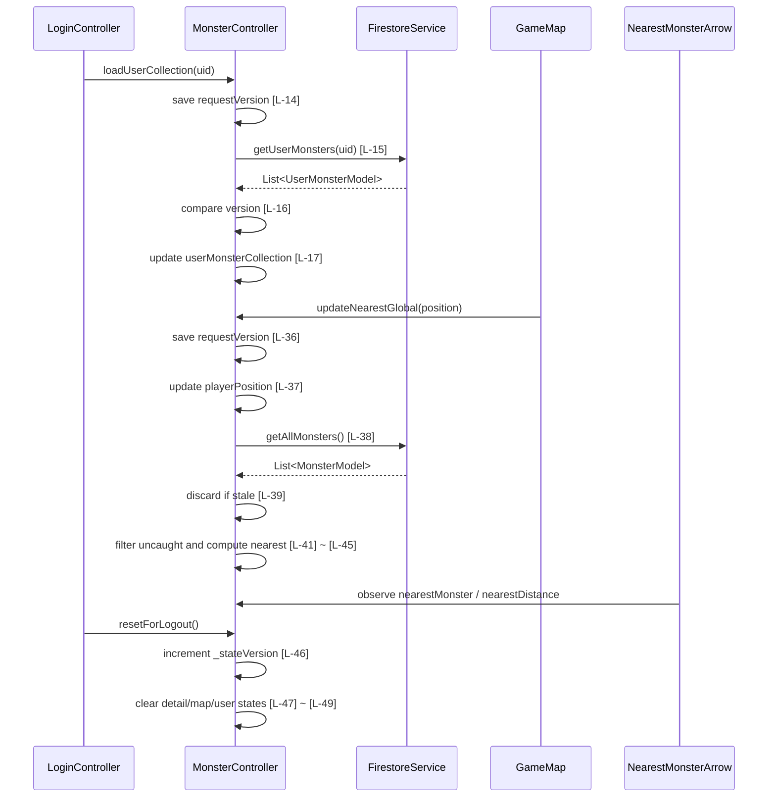

# monster_controller.dart 邏輯追蹤表

## Task 0: 檔案用途與使用方式

### 0-1. 檔案簡介

`monster_controller.dart` 是怪物、圖鑑、附近怪物與最近怪物箭頭狀態的 GetX controller。它負責協調 Firestore/MonsterService 查詢、捕捉後更新使用者收藏、計算地圖附近怪物與最近未捕捉怪物。它不負責 UI 繪製、Firebase Auth 登入流程或實際地圖元件渲染，這些由 view/widget 或其他 controller 處理。通常由登入流程、遊戲地圖、圖鑑與怪物詳情頁透過 `Get.find<MonsterController>()` 呼叫。

### 0-2. 檔案類型判斷

主要類型：C. 狀態管理檔案 Controller / Provider / Bloc / ViewModel

次要類型：D. API / Service / Repository 協調檔案，因為它會委派 `FirestoreService` 與 `MonsterService` 查詢資料與計算範圍。

### 使用方式或呼叫方式

此 controller 通常在 app 啟動時以 GetX 註冊：

```dart
Get.put(MonsterController());
```

UI 或其他 controller 可透過以下方式呼叫：

```dart
final monsterController = Get.find<MonsterController>();
await monsterController.loadUserCollection(uid);
monsterController.updateNearestGlobal(position);
```

登出時應呼叫 `resetForLogout()`，清除與上一個帳號綁定的怪物、位置、圖鑑與箭頭狀態，避免換帳號後顯示舊資料。

### 狀態表

| 狀態名稱 | 型別 | 初始值 | 改變時機 | UI 用途 |
|---|---|---|---|---|
| `monster` | `Rxn<MonsterModel>` | null | 載入怪物詳情時 | 顯示目前選取怪物 |
| `architecture` | `Rxn<ArchitectureModel>` | null | 載入怪物關聯建築時 | 顯示怪物對應建築資料 |
| `qa` | `Rxn<QAModel>` | null | 載入怪物關聯 QA 時 | 顯示題目或任務資料 |
| `nearbyMonsters` | `RxList<MonsterModel>` | 空清單 | 更新玩家位置附近怪物時、捕捉後、登出 reset | 顯示地圖上的可捕捉怪物 |
| `nearestMonster` | `Rxn<MonsterModel>` | null | 更新最近未捕捉怪物時、登出 reset | 顯示最近怪物箭頭 |
| `nearestDistance` | `RxnDouble` | null | 更新最近未捕捉怪物距離時、登出 reset | 顯示最近怪物距離 |
| `userMonsterCollection` | `RxList<UserMonsterModel>` | 空清單 | 登入載入圖鑑、捕捉怪物、登出 reset | 判斷怪物是否已捕捉 |
| `playerPosition` | `Rxn<Position>` | null | 地圖回報玩家位置時、登出 reset | 計算附近怪物與最近怪物箭頭 |
| `_stateVersion` | `int` | 0 | 登出 reset 時遞增 | 丟棄登出前尚未完成的非同步查詢結果 |

## 邏輯對照表

| ID | 目的標籤 | 邏輯描述 |
|---|---|---|
| [L-01] | 目的[目前怪物更新] | 將 `monsterModel` [來自函數參數] 寫入 `monster.value` [來自 GetX reactive 狀態]，供詳情 UI 讀取。 |
| [L-02] | 目的[QA 關聯載入] | 呼叫 `getQAByMonster(monsterModel)` [函數參數]，開始載入怪物關聯 QA。 |
| [L-03] | 目的[建築關聯載入] | 呼叫 `getArchitectureByMonster(monsterModel)` [函數參數]，開始載入怪物關聯建築。 |
| [L-04] | 目的[空參照檢查] | 檢查 `monsterModel.qaRef` [來自 MonsterModel] 是否為 null，避免查詢不存在的 QA 參照。 |
| [L-05] | 目的[QA 查詢] | 使用 `monsterModel.qaRef` [來自 MonsterModel] 查詢 Firestore 文件。 |
| [L-06] | 目的[QA 文件存在檢查] | 檢查 `doc.exists` [來自 Firestore 查詢結果]，只在文件存在時轉換資料。 |
| [L-07] | 目的[QA 狀態更新] | 將 `qaData` [區域變數，來自 QAModel.fromMap] 寫入 `qa.value` [GetX 狀態]。 |
| [L-08] | 目的[QA 錯誤處理] | 捕獲 `e` [catch 區域變數] 並輸出 debug 訊息，避免 QA 載入錯誤中斷 UI。 |
| [L-09] | 目的[空參照檢查] | 檢查 `monsterModel.architectureRef` [來自 MonsterModel] 是否為 null。 |
| [L-10] | 目的[建築查詢] | 使用 `monsterModel.architectureRef` [來自 MonsterModel] 查詢 Firestore 文件。 |
| [L-11] | 目的[建築文件存在檢查] | 檢查 `doc.exists` [來自 Firestore 查詢結果]，只在文件存在時轉換資料。 |
| [L-12] | 目的[建築狀態更新] | 將 `architectureData` [區域變數，來自 ArchitectureModel.fromMap] 寫入 `architecture.value` [GetX 狀態]。 |
| [L-13] | 目的[建築錯誤處理] | 捕獲 `e` [catch 區域變數] 並輸出 debug 訊息。 |
| [L-14] | 目的[非同步版本快照] | 將 `_stateVersion` [controller 私有欄位] 存入 `requestVersion` [區域變數]，供載入完成後比對。 |
| [L-15] | 目的[圖鑑查詢] | 使用 `userId` [函數參數] 呼叫 `_service.getUserMonsters` [FirestoreService] 取得使用者收藏。 |
| [L-16] | 目的[過期結果丟棄] | 比對 `requestVersion` [區域變數] 與 `_stateVersion` [私有欄位]，若登出 reset 已發生則不寫回舊資料。 |
| [L-17] | 目的[圖鑑狀態更新] | 將 `result` [區域變數，來自 FirestoreService] 寫入 `userMonsterCollection.value`。 |
| [L-18] | 目的[捕捉寫入] | 使用 `userId` 與 `userMonster` [皆來自函數參數] 呼叫 `_service.addUserMonster` 寫入 Firestore。 |
| [L-19] | 目的[捕捉後同步] | 捕捉寫入後重新呼叫 `loadUserCollection(userId)` [函數參數] 同步圖鑑。 |
| [L-20] | 目的[捕捉版本快照] | 捕捉流程開始時保存 `_stateVersion`，避免登出後繼續更新舊畫面狀態。 |
| [L-21] | 目的[捕捉模型建立] | 依 `monsterObj` [函數參數] 建立 `UserMonsterModel` [區域變數]。 |
| [L-22] | 目的[收藏新增] | 呼叫 `addUserMonster(userId, userMonster)` 將捕捉結果寫入使用者圖鑑。 |
| [L-23] | 目的[捕捉過期檢查] | 若捕捉期間 `_stateVersion` 改變，代表已登出 reset，直接回傳 false。 |
| [L-24] | 目的[捕捉後詳情同步] | 呼叫 `loadMonsterWithRelations(monsterObj)` 載入捕捉怪物關聯資料。 |
| [L-25] | 目的[地圖狀態移除] | 從 `nearbyMonsters` [GetX 清單] 移除已捕捉的怪物。 |
| [L-26] | 目的[捕捉錯誤處理] | 捕獲 `e` [catch 區域變數]，記錄錯誤並回傳 false。 |
| [L-27] | 目的[附近怪物版本快照] | 更新附近怪物前保存 `_stateVersion`。 |
| [L-28] | 目的[全怪物查詢] | 呼叫 `_service.getAllMonsters()` 取得全部怪物資料。 |
| [L-29] | 目的[附近怪物過期檢查] | 查詢完成後若版本已改變，丟棄登出前的查詢結果。 |
| [L-30] | 目的[附近怪物篩選] | 依 `userPosition` [函數參數]、`userMonsterCollection` [GetX 狀態] 與 `_monsterService.isWithinRange` 篩出附近且未捕捉怪物。 |
| [L-31] | 目的[測試資料資料庫入口] | 取得 `FirebaseFirestore.instance` [Firebase SDK]，用於建立假收藏資料。 |
| [L-32] | 目的[測試資料來源查詢] | 從 `monsters` collection 限量取得 9 筆怪物文件。 |
| [L-33] | 目的[測試資料迭代] | 逐筆處理 `snapshot.docs` [Firestore 查詢結果]。 |
| [L-34] | 目的[測試收藏模型建立] | 使用 `doc` 與 `monsterData` [迴圈區域變數] 建立 `UserMonsterModel`。 |
| [L-35] | 目的[測試收藏寫入] | 呼叫 `addUserMonster(uid, userMonster)` 將假資料加入使用者圖鑑。 |
| [L-36] | 目的[最近怪物版本快照] | 更新最近怪物前保存 `_stateVersion`。 |
| [L-37] | 目的[玩家位置更新] | 將 `userPosition` [函數參數] 寫入 `playerPosition.value`。 |
| [L-38] | 目的[最近怪物資料查詢] | 呼叫 `_service.getAllMonsters()` 取得可比較的全部怪物。 |
| [L-39] | 目的[最近怪物過期檢查] | 查詢完成後若版本已改變，丟棄登出前的最近怪物計算。 |
| [L-40] | 目的[空資料保護] | 若 `all` [區域變數] 為空，清空 `nearestMonster` 與 `nearestDistance`。 |
| [L-41] | 目的[未捕捉清單建立] | 以 `userMonsterCollection` [GetX 狀態] 排除已捕捉怪物，建立 `uncaught` [區域變數]。 |
| [L-42] | 目的[全捕捉保護] | 若 `uncaught` [區域變數] 為空，清空最近怪物與距離。 |
| [L-43] | 目的[最近距離計算] | 使用 `Geolocator.distanceBetween` 比較 `uncaught` 中每個怪物與 `userPosition` 的距離。 |
| [L-44] | 目的[最近怪物更新] | 將 `nearest` [區域變數] 寫入 `nearestMonster.value`。 |
| [L-45] | 目的[最近距離更新] | 使用 `Geolocator.distanceBetween` 計算並寫入 `nearestDistance.value`。 |
| [L-46] | 目的[登出版本遞增] | 在 `resetForLogout` 中遞增 `_stateVersion`，讓登出前尚未完成的非同步查詢無法寫回。 |
| [L-47] | 目的[詳情狀態清除] | 清空 `monster`、`architecture`、`qa` [皆為 GetX 狀態]。 |
| [L-48] | 目的[地圖箭頭狀態清除] | 清空 `nearbyMonsters`、`nearestMonster`、`nearestDistance` [地圖/箭頭狀態]。 |
| [L-49] | 目的[帳號綁定狀態清除] | 清空 `userMonsterCollection` 與 `playerPosition` [使用者收藏與位置狀態]，避免換帳號後殘留舊資料。 |

## 函數為單位對照表

| 函數名稱 | 目的標籤 | 包含範圍 | 函數功能介紹 |
|---|---|---|---|
| `loadMonsterWithRelations` | 目的[怪物詳情載入] | [L-01] ~ [L-03] | 【功能函數】(Action Performer)<br>Purpose: 狀態更新/關聯資料載入。<br>Action: 寫入目前怪物，並觸發 QA 與建築關聯資料載入。 |
| `getQAByMonster` | 目的[QA 查詢] | [L-04] ~ [L-08] | 【兼用函數】(Hybrid)<br>Input: `monsterModel: MonsterModel`，提供 QA 參照。<br>Process: 檢查參照、查詢 Firestore、轉換 QAModel、更新 reactive 狀態。<br>Output: `Future<QAModel?>`，成功回傳 QA，無資料或錯誤回傳 null。 |
| `getArchitectureByMonster` | 目的[建築查詢] | [L-09] ~ [L-13] | 【兼用函數】(Hybrid)<br>Input: `monsterModel: MonsterModel`，提供建築參照。<br>Process: 檢查參照、查詢 Firestore、轉換 ArchitectureModel、更新 reactive 狀態。<br>Output: `Future<ArchitectureModel?>`。 |
| `loadUserCollection` | 目的[圖鑑同步] | [L-14] ~ [L-17] | 【功能函數】(Action Performer)<br>Purpose: 使用者收藏載入/過期結果保護。<br>Action: 以 userId 查詢 Firestore；查詢回來後比對版本，只有未登出 reset 時才寫入收藏狀態。 |
| `addUserMonster` | 目的[捕捉寫入] | [L-18] ~ [L-19] | 【功能函數】(Action Performer)<br>Purpose: Firestore 寫入/圖鑑同步。<br>Action: 新增使用者怪物文件，接著重新載入使用者圖鑑。 |
| `captureMonster` | 目的[捕捉流程] | [L-20] ~ [L-26] | 【兼用函數】(Hybrid)<br>Input: `monsterObj: MonsterModel`，被捕捉怪物；`userId: String`，目前使用者。<br>Process: 建立 UserMonsterModel、寫入收藏、檢查版本、同步關聯資料、從附近怪物移除。<br>Output: `Future<bool>`，成功 true，失敗或過期 false。 |
| `updateNearbyMonsters` | 目的[附近怪物更新] | [L-27] ~ [L-30] | 【功能函數】(Action Performer)<br>Purpose: 地圖狀態更新/過期結果保護。<br>Action: 查詢全部怪物，比對版本後依位置範圍與已捕捉狀態篩選附近怪物。 |
| `seedUserMonsters` | 目的[測試資料建立] | [L-31] ~ [L-35] | 【功能函數】(Action Performer)<br>Purpose: 開發測試資料寫入。<br>Action: 從怪物集合抓取最多 9 筆，逐筆建立 UserMonsterModel 並加入指定 uid 的收藏。 |
| `updateNearestGlobal` | 目的[最近怪物箭頭更新] | [L-36] ~ [L-45] | 【功能函數】(Action Performer)<br>Purpose: 玩家位置更新/最近未捕捉怪物計算/箭頭資料更新。<br>Action: 寫入玩家位置、查詢怪物、丟棄過期結果、排除已捕捉怪物、計算最近怪物與距離。 |
| `resetForLogout` | 目的[登出狀態清除] | [L-46] ~ [L-49] | 【功能函數】(Action Performer)<br>Purpose: 登出重置/殘留狀態清除/非同步防護。<br>Action: 遞增版本號；清空怪物詳情、建築、QA、附近怪物、最近怪物、距離、使用者圖鑑與玩家位置。 |

## 視覺化結構圖

此檔案沒有 Widget Tree。狀態依賴如下：

[MonsterController (GetX 狀態管理)]  
└── [FirestoreService (資料查詢與寫入)]  
&nbsp;&nbsp;&nbsp;&nbsp;├── [Monster Relations (怪物關聯資料)] // [L-01] ~ [L-13]  
&nbsp;&nbsp;&nbsp;&nbsp;├── [User Collection (使用者圖鑑)] // [L-14] ~ [L-19]  
&nbsp;&nbsp;&nbsp;&nbsp;├── [Capture Flow (捕捉流程)] // [L-20] ~ [L-26]  
&nbsp;&nbsp;&nbsp;&nbsp;├── [Nearby Monsters (附近怪物)] // [L-27] ~ [L-30]  
&nbsp;&nbsp;&nbsp;&nbsp;├── [Seed Data (測試資料)] // [L-31] ~ [L-35]  
&nbsp;&nbsp;&nbsp;&nbsp;├── [Nearest Monster (最近怪物箭頭)] // [L-36] ~ [L-45]  
&nbsp;&nbsp;&nbsp;&nbsp;└── [Logout Reset (登出重置)] // [L-46] ~ [L-49]

## 場景時序圖



## 測資建議表

| ID | 測試狀態或極端值 | 預期結果 |
|---|---|---|
| [L-01] ~ [L-03] | 傳入有 QA 與建築參照的怪物 | `monster` 更新，QA 與建築載入流程被觸發 |
| [L-04] ~ [L-08] | `qaRef = null`、文件不存在、查詢拋錯各測一次 | null 時直接回傳；不存在不更新；錯誤被 catch |
| [L-09] ~ [L-13] | `architectureRef = null`、文件不存在、查詢拋錯各測一次 | null 時直接回傳；不存在不更新；錯誤被 catch |
| [L-14] ~ [L-17] | `loadUserCollection` 等待期間呼叫 `resetForLogout()` | 舊查詢完成後不會寫回 `userMonsterCollection` |
| [L-18] ~ [L-19] | 使用有效 `userId` 與 `UserMonsterModel` | Firestore 寫入後重新載入圖鑑 |
| [L-20] ~ [L-26] | 捕捉流程中途呼叫 `resetForLogout()` | 過期流程回傳 false，不更新附近怪物與詳情 |
| [L-27] ~ [L-30] | 附近怪物查詢中途登出 | 舊查詢結果不會寫回 `nearbyMonsters` |
| [L-31] ~ [L-35] | Firestore `monsters` 少於 9 筆或為空 | 只依實際查詢筆數建立測試收藏 |
| [L-36] ~ [L-45] | 全怪物為空、全部已捕捉、有多個未捕捉怪物 | 空或全捕捉會清空箭頭；多怪物時選最近的一隻 |
| [L-46] ~ [L-49] | 登出後立刻換帳號登入 | 舊帳號的箭頭、距離、附近怪物、位置與圖鑑快取被清空，不會殘留到新帳號 |
