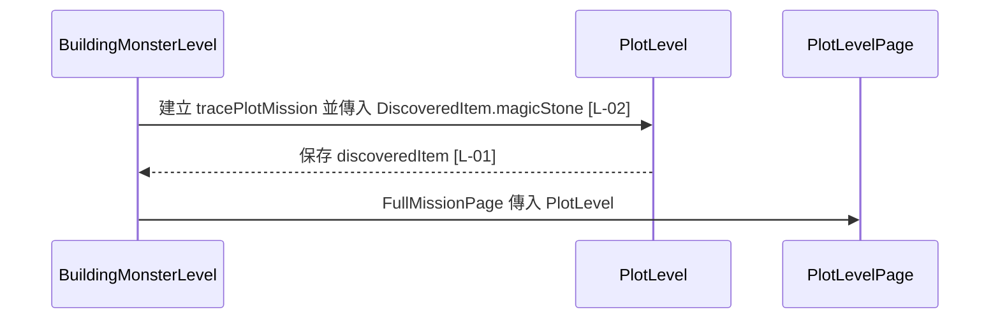

# plot_level.dart 邏輯追蹤表

## 目前版本邏輯對照表

<table>
  <thead>
    <tr>
      <th>ID</th>
      <th>目的標籤</th>
      <th>邏輯描述</th>
      <th>函數為單位</th>
    </tr>
  </thead>
  <tbody>
    <tr>
      <td>[L-01]</td>
      <td>目的[資料模型]</td>
      <td>宣告 <code>discoveredItem</code>[來自建構子輸入並保存為 final 欄位]，讓 Plot 結束後可以選擇性顯示發現物品彈窗；為 null 時維持原本直接前進流程。</td>
      <td rowspan="2">【回傳函數】(Data Transformer) Input: <code>type: String</code> 決定 Plot 背景與提示文字；<code>isPassed: bool</code> 控制是否自動略過劇情；<code>title: String</code> 顯示 Plot 標題；<code>description: String</code> 顯示 Plot 描述；<code>discoveredItem: DiscoveredItem?</code> 控制 Plot 後是否出現發現物品 overlay。 Process: 將呼叫端資料保存成不可變欄位，讓頁面層依欄位決定 UI 與流程。 Output: <code>PlotLevel</code>，供 <code>PlotLevelPage</code> 渲染 Plot 並接續任務。</td>
    </tr>
    <tr>
      <td>[L-02]</td>
      <td>目的[物件建構]</td>
      <td>透過建構子接收 Plot 顯示資料與可選的 <code>discoveredItem</code>[來自呼叫端]，建立劇情關卡資料。</td>
    </tr>
  </tbody>
</table>

## 場景時序圖

## 測資建議表

| ID | 測試時應輸入的極端值或狀態 |
| --- | --- |
| [L-01] | 傳入 <code>discoveredItem = null</code> 與 <code>DiscoveredItem.magicStone</code>，確認頁面流程分流。 |
| [L-02] | 建立 trace 與 battle 兩種 Plot，確認只有呼叫端傳入物品時才會在 Plot 後顯示 overlay。 |
