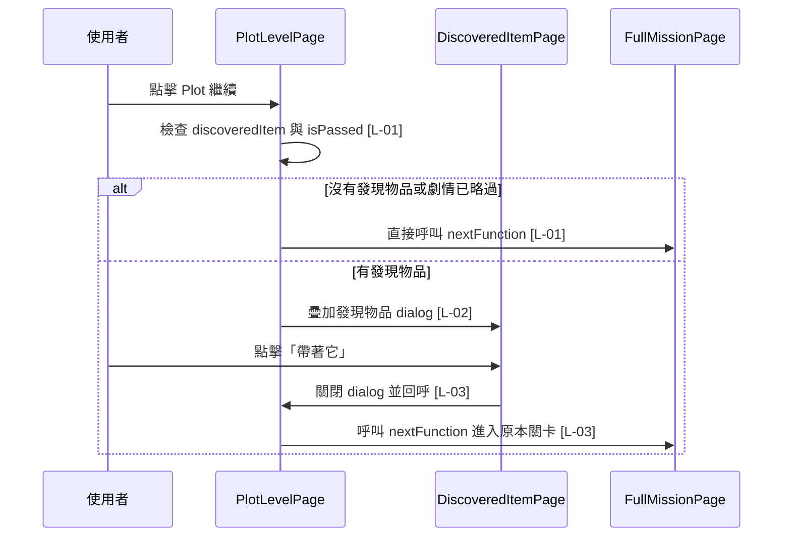

# plot_level_page.dart 邏輯追蹤表

## 目前版本邏輯對照表

<table>
  <thead>
    <tr>
      <th>ID</th>
      <th>目的標籤</th>
      <th>邏輯描述</th>
      <th>函數為單位</th>
    </tr>
  </thead>
  <tbody>
    <tr>
      <td>[L-01]</td>
      <td>目的[流程分流]</td>
      <td>讀取 <code>discoveredItem</code>[區域變數，來自 <code>widget.plotLevel.discoveredItem</code>] 與 <code>widget.plotLevel.isPassed</code>[來自建構子 plotLevel]；若沒有發現物品或劇情已略過，直接呼叫 <code>widget.nextFunction</code>[來自建構子 callback] 維持原本流程。</td>
      <td rowspan="3">【功能函數】(Action Performer) Purpose: [Plot 完成處理/Overlay/任務推進] Action: Plot 可繼續後先防止重複觸發；再檢查是否有發現物品資料；沒有資料或自動略過劇情時直接前進；有資料時顯示發現物品 dialog；使用者按下按鈕後關閉 dialog 並呼叫外部 nextFunction。</td>
    </tr>
    <tr>
      <td>[L-02]</td>
      <td>目的[物品 Overlay]</td>
      <td>在 <code>discoveredItem</code>[區域變數] 不為 null 且 Plot 未被略過時呼叫 <code>showGeneralDialog</code>[Flutter Dialog API]，將 <code>DiscoveredItemPage</code> 疊在 Plot 頁上方，讓「你找到了一塊魔法石」之後出現「發現道具」。</td>
    </tr>
    <tr>
      <td>[L-03]</td>
      <td>目的[彈窗收尾]</td>
      <td>發現物品按鈕觸發時，先使用 <code>Navigator.of(dialogContext).pop()</code>[Flutter 導航 API 與 dialogContext 區域參數] 關閉 dialog，再呼叫 <code>widget.nextFunction</code>[來自建構子 callback] 接回原本下一關。</td>
    </tr>
  </tbody>
</table>

## 場景時序圖

## 測資建議表

| ID | 測試時應輸入的極端值或狀態 |
| --- | --- |
| [L-01] | <code>discoveredItem = null</code> 或 <code>isPassed = true</code>，確認 Plot 完成後直接前進。 |
| [L-02] | <code>discoveredItem = DiscoveredItem.magicStone</code> 且 <code>isPassed = false</code>，確認發現道具彈窗出現。 |
| [L-03] | 點擊「帶著它」，確認 dialog 關閉後才進入原本的 <code>graphicsTextLevel</code>。 |
