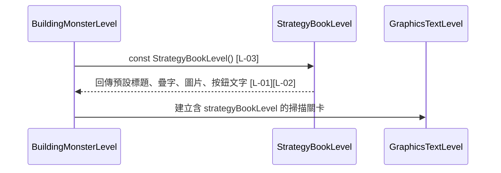

# strategy_book_level.dart 邏輯追蹤表

## 目前版本邏輯對照表

<table>
  <thead>
    <tr>
      <th>ID</th>
      <th>目的標籤</th>
      <th>邏輯描述</th>
      <th>函數為單位</th>
    </tr>
  </thead>
  <tbody>
    <tr>
      <td>[L-01]</td>
      <td>目的[預設資料]</td>
      <td>宣告 <code>defaultTitle</code>、<code>defaultNoteText</code>、<code>defaultButtonText</code>、<code>defaultImagePath</code>[皆來自 StrategyBookLevel 靜態常數]，提供攻略秘集彈窗的預設標題、圖片疊字、按鈕文字與圖片路徑。</td>
      <td>【回傳函數】(Data Transformer) Input: 無。 Process: 以靜態常數集中保存攻略秘集彈窗的預設顯示資料。 Output: <code>String</code> 靜態常數，供建構子預設值與彈窗 UI 使用。</td>
    </tr>
    <tr>
      <td>[L-02]</td>
      <td>目的[資料模型]</td>
      <td>宣告 <code>title</code>、<code>noteText</code>、<code>imagePath</code>、<code>buttonText</code>[皆來自建構子輸入並保存為 final 欄位]，作為攻略秘集彈窗顯示內容。</td>
      <td rowspan="2">【回傳函數】(Data Transformer) Input: <code>title: String</code> 顯示彈窗標題；<code>noteText: String</code> 顯示圖片上方疊字；<code>imagePath: String</code> 顯示攻略秘集圖片；<code>buttonText: String</code> 顯示繼續按鈕文字。 Process: 將呼叫端傳入值或預設常數保存成不可變欄位。 Output: <code>StrategyBookLevel</code>，供 <code>GraphicsTextLevel</code> 與 <code>StrategyBookLevelPage</code> 使用。</td>
    </tr>
    <tr>
      <td>[L-03]</td>
      <td>目的[物件建構]</td>
      <td>透過 const 建構子建立攻略秘集資料；若呼叫端沒有提供值，使用 <code>defaultTitle</code>、<code>defaultNoteText</code>、<code>defaultImagePath</code>、<code>defaultButtonText</code>[皆來自 StrategyBookLevel 靜態常數]。</td>
    </tr>
  </tbody>
</table>

## 場景時序圖

## 測資建議表

| ID | 測試時應輸入的極端值或狀態 |
| --- | --- |
| [L-01] | 將預設圖片路徑指向不存在 asset，確認頁面端 fallback 可處理。 |
| [L-02] | 傳入超長 <code>noteText</code> 或空字串 <code>buttonText</code>，確認資料模型可保存原值。 |
| [L-03] | 使用完全不帶參數的 <code>const StrategyBookLevel()</code>，確認四個欄位都等於預設常數。 |
